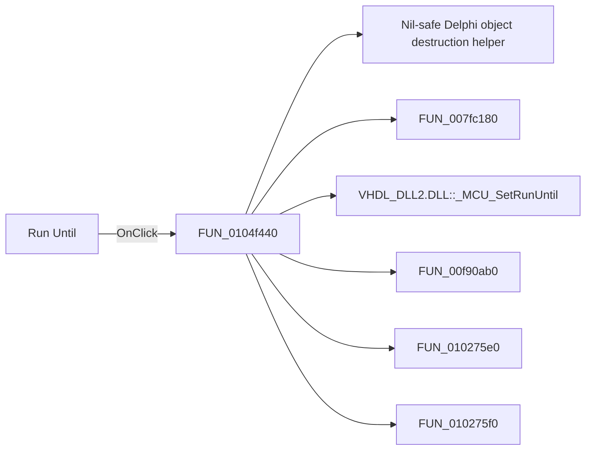

# Run Until

> Analysis status: Pending individual source review.

## Control

| Property | Recovered value |
| --- | --- |
| Form | FlowChartMainForm |
| Component path | FlowChartMainForm.MainMenu.mnDebug.mnRunUntil |
| Control class | TMenuItem |
| Caption | Run Until |
| Hint | Not present in the recovered resource. |
| Text | Not present in the recovered resource. |
| Handler name | mnRunUntilClick |
| Handler address | 0104f440 |
| Graph node | `resource:dfm:FlowChartMainForm/FlowChartMainForm.MainMenu.mnDebug.mnRunUntil` |
| Handler node | `function:0104f440` |
| Graph layer | UI |

## What happens when clicked

Pending individual analysis. An agent must read the recovered handler source and its relevant callees before it replaces this text.

## Click flow

## Handler evidence

- Source: [DecompiledSources/Tina16/functions/000000000104F440__FUN_0104f440.c](../../../DecompiledSources/Tina16/functions/000000000104F440__FUN_0104f440.c)
- Recovered role: Not present in the recovered resource.
- Current graph summary: Handles 1 Delphi UI event: FlowChartMainForm.MainMenu.mnDebug.mnRunUntil.OnClick.
- Current graph behavior: Not present in the recovered resource.
- Current graph evidence: Not present in the recovered resource.
- Complexity: complex
- Distinct outgoing calls: 8

## Direct calls

- `function:00410f20` — Nil-safe Delphi object destruction helper
- `function:007fc180` — FUN_007fc180
- `function:00e03c20` — Calls the VHDL_DLL2.DLL export _MCU_SetRunUntil.
- `function:00f90ab0` — FUN_00f90ab0
- `function:010275e0` — FUN_010275e0
- `function:010275f0` — FUN_010275f0
- `function:01052a70` — Handles 2 Delphi UI events: FlowChartMainForm.pnToolbar.sbRun.OnClick, FlowChartMainForm.MainMenu.mnDebug.mnRun.OnClick.
- `function:015f6540` — FUN_015f6540

## Resource evidence

- Kind: Not present in the recovered resource.
- Modal result: Not present in the recovered resource.
- Checked state: Not present in the recovered resource.
- List items: Not present in the recovered resource.
- Image reference: Not present in the recovered resource.
- Extracted glyph: None.

## Nearby label candidates

Nearby labels are layout candidates only. They are not proof of behavior.

- No same-parent label candidate is available.

## Analysis limits

- Do not infer behavior from the control class, caption, hint, glyph, or nearby label alone.
- Do not replace the pending status until the handler source and relevant call path provide enough evidence.
