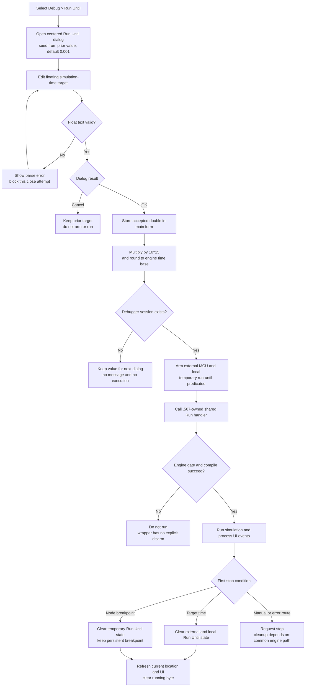

# Run Until

> Analysis status: Complete. The recovered command, Run Until dialog, MCU arm calls, shared Run path, execution loop, and stop predicates support this explanation.

## Control

| Property | Recovered value |
| --- | --- |
| Form | FlowChartMainForm |
| Component path | FlowChartMainForm.MainMenu.mnDebug.mnRunUntil |
| Control class | TMenuItem |
| Caption | Run Until |
| Handler name | mnRunUntilClick |
| Handler address | 0104f440 |
| Graph node | `resource:dfm:FlowChartMainForm/FlowChartMainForm.MainMenu.mnDebug.mnRunUntil` |
| Handler node | `function:0104f440` |
| Graph layer | UI |

## Target selection

`FUN_0104f440` creates the centered modal `TRunUntil` dialog and initializes its value from `FlowChartMainForm` field `+0x948`. The main form initializes that field to `0.001` when it is created. A previous accepted Run Until value replaces it and becomes the next dialog value.

The dialog contains one `TFloatEdit` labelled `Run Until:`. This is a simulation-time value, not a flowchart node, source line, or breakpoint choice. On Show, the dialog copies its stored double to the edit. On OK, it reads the edit's double back into the dialog field.

If the float edit reports a parse error, the dialog shows that error once, marks the current close attempt as invalid, and its `OnCloseQuery` blocks that close attempt. The recovered dialog has no explicit lower or upper range check. Zero and negative parsed values are not rejected in this path.

Cancel leaves the main form's previous `+0x948` value unchanged and does not arm or start execution. After `mrOK`, the wrapper copies the dialog value into `+0x948` before it checks whether a debugger session exists.

## Arming the temporary stop condition

The accepted double is passed to `FUN_015f6540`, which multiplies it by `10^15` and rounds it to the integer time base used by the MCU engine. This is consistent with converting seconds to femtosecond ticks. The Run Until label itself does not display a unit, so the recovered UI does not independently name `s` or `fs`.

When the debug-session object at form offset `+0x9D8` is non-null, the wrapper arms two matching stop conditions:

1. `_MCU_SetRunUntil` receives the MCU context at `+0x970`, the converted target, and enable value `1`.
2. `FUN_00f90ab0` stores enable value `1` and the same target in the local debugger session at offsets `+0x33FA` and `+0x34F0`.

The local execution predicate later compares the current MCU status time with the stored target and reports reached when current time is greater than or equal to the target.

This is temporary run state. It does not add, remove, or toggle a persistent flowchart-node breakpoint. The separate Toggle Breakpoint command changes a selected node's breakpoint flag. Existing node breakpoints remain active and can stop Run Until before its time target.

If the debugger-session pointer is null, the accepted value still becomes the next `+0x948` dialog value, but the command does not arm the MCU, start Run, or show a no-session message.

## Compile and Run preconditions

After both stop conditions are armed, the wrapper calls the same shared Run handler used by the toolbar Run button and the Debug > Run menu item. Bead `.507` owns that common handler.

The shared Run path applies its existing engine-state gate. It then checks the flowchart model's changed flag. If the model is changed, it runs the compile/rebuild path and clears the changed flag only after a successful compile. A compile-error byte on the main form prevents execution from starting.

When the gates pass, the Run handler:

- marks the form's running byte at `+0x8EB`;
- clears the stop-request byte at `+0x6C4`;
- configures the session for Run rather than Step;
- enables MCU debug mode and clears the MCU aborted state;
- enters the common simulation execution path;
- processes UI messages while synchronous execution is active;
- updates the current flowchart location and debugger display when execution stops;
- clears the main-form running byte before normal return.

The Run Until wrapper does not compile or create a debugger session before it arms the target. It relies on the shared Run handler for compile and state checks.

## Stop and cleanup behavior

The recovered synchronous execution loop checks both ordinary breakpoints and the local run-until predicate after simulation steps:

- If an enabled flowchart breakpoint is reached first, the loop disables the MCU Run Until condition with target `0` and enable `0`, clears the local run-until target and flag, and stops.
- If current simulation time reaches or passes the run-until target, it performs the same external and local clear and stops.
- A separate status-update path also clears both temporary conditions when it observes an end or breakpoint state.

After the loop, the common path refreshes the selected location and visible debugger state. It does not remove the persistent node breakpoint that caused an earlier stop.

The Trace Stop handler sets the MCU aborted state and the debugger stop request, but its recovered direct path does not itself call `_MCU_SetRunUntil(..., 0, 0)` or clear the local run-until fields. Later common engine cleanup can do this, but the final temporary state after every asynchronous stop route is not proven by these functions alone.

## Errors and partial state

- Invalid floating-point text is handled inside the modal dialog and does not reach the wrapper's accepted branch.
- The accepted value has no explicit positivity, current-time, simulation-end, overflow, or finite-value check in this command. The conversion and MCU engine own those limits.
- `_MCU_SetRunUntil` has no returned status in the recovered call. The wrapper assumes that the external arm operation succeeds.
- The external MCU target is set before the local session target, and both are set before the shared Run preconditions and compilation. There is no `try/finally` cleanup in the wrapper.
- If the shared Run state gate returns early, compilation fails, or execution exits through an internal-error path before a normal stop predicate clears the target, this wrapper contains no compensating clear. The source can therefore leave the selected main-form value and an armed local or external temporary target after a partial failure. A compile routine can rebuild engine state, so the exact external state after a compile failure is not established.
- The execution loop can report `TINA: Internal error in the HDL engine`. That exit does not perform the same explicit Run Until clear in the shown branch.
- The wrapper shows no success message, timeout message, or run-until-specific error message after acceptance.

## UI state and persistence

- Cancel changes no main-form target, run flag, breakpoint, MCU state, project state, or file.
- OK stores the selected double in the live `FlowChartMainForm` even when no debug session is available. The next Run Until dialog reuses it.
- The main-form creation path resets the default to `0.001`. No recovered INI, registry, flowchart serializer, recent-value list, or project-file write stores the target.
- Arming Run Until does not change the flowchart document, dirty state, undo state, or persistent breakpoint set.
- The common Run path can compile a changed flowchart and refresh its current-location display. Those are shared Run effects, not separate changes made by this menu wrapper.

## Click flow

## Source evidence

- Run Until menu handler: [FUN_0104f440](../../../DecompiledSources/Tina16/functions/000000000104F440__FUN_0104f440.c)
- Run Until dialog value setter and getter: [FUN_010275e0](../../../DecompiledSources/Tina16/functions/00000000010275E0__FUN_010275e0.c) and [FUN_010275f0](../../../DecompiledSources/Tina16/functions/00000000010275F0__FUN_010275f0.c)
- Dialog Show, OK, parse error, and close guard: [FUN_01027560](../../../DecompiledSources/Tina16/functions/0000000001027560__FUN_01027560.c), [FUN_01027600](../../../DecompiledSources/Tina16/functions/0000000001027600__FUN_01027600.c), [FUN_01027510](../../../DecompiledSources/Tina16/functions/0000000001027510__FUN_01027510.c), and [FUN_01027530](../../../DecompiledSources/Tina16/functions/0000000001027530__FUN_01027530.c)
- Default `0.001` main-form value: [FUN_0104fe00](../../../DecompiledSources/Tina16/functions/000000000104FE00__FUN_0104fe00.c)
- Floating-time conversion: [FUN_015f6540](../../../DecompiledSources/Tina16/functions/00000000015F6540__FUN_015f6540.c)
- Local debugger run-until state setter: [FUN_00f90ab0](../../../DecompiledSources/Tina16/functions/0000000000F90AB0__FUN_00f90ab0.c)
- Shared Run command, owned by `.507`: [FUN_01052a70](../../../DecompiledSources/Tina16/functions/0000000001052A70__FUN_01052a70.c)
- Compile entry and compile-error flag: [FUN_01053ee0](../../../DecompiledSources/Tina16/functions/0000000001053EE0__FUN_01053ee0.c) and [FUN_01053ed0](../../../DecompiledSources/Tina16/functions/0000000001053ED0__FUN_01053ed0.c)
- Simulation loop and explicit temporary-target clears: [FUN_00f8daa0](../../../DecompiledSources/Tina16/functions/0000000000F8DAA0__FUN_00f8daa0.c)
- Local target-time predicate: [FUN_00f8df50](../../../DecompiledSources/Tina16/functions/0000000000F8DF50__FUN_00f8df50.c)
- Status-stop cleanup: [FUN_00f8e540](../../../DecompiledSources/Tina16/functions/0000000000F8E540__FUN_00f8e540.c)
- Trace Stop and abort request, owned by `.511`: [FUN_01052d50](../../../DecompiledSources/Tina16/functions/0000000001052D50__FUN_01052d50.c) and [FUN_00f8e020](../../../DecompiledSources/Tina16/functions/0000000000F8E020__FUN_00f8e020.c)
- Separate persistent breakpoint command, owned by `.510`: [FUN_01052da0](../../../DecompiledSources/Tina16/functions/0000000001052DA0__FUN_01052da0.c)
- Recovered menu and Run Until dialog resources: [ui-evidence.json](../../../DecompiledSources/Tina16/resources/dfm/ui-evidence.json)

## Analysis limits and ownership

- The external `_MCU_SetRunUntil` implementation is in `VHDL_DLL2.DLL`. The recovered caller proves its arguments and clear calls, but not the library's internal scheduling algorithm or error reporting.
- Multiplication by `10^15` proves the integer time scale. The dialog label does not print a unit, so seconds-to-femtoseconds is a context-supported interpretation rather than a displayed unit contract.
- The wrapper does not inspect the current simulation time before arming. Behavior for a target at or before the current time is owned by the MCU engine and the next local predicate check.
- `.508` owns the unique wrapper `FUN_0104f440` and RunUntil-specific value accessors `FUN_010275e0` and `FUN_010275f0`. Broad conversion, local-session, compilation, execution, breakpoint, and stop helpers remain evidence-only under `.507` and `.509`–`.511` coordination.
