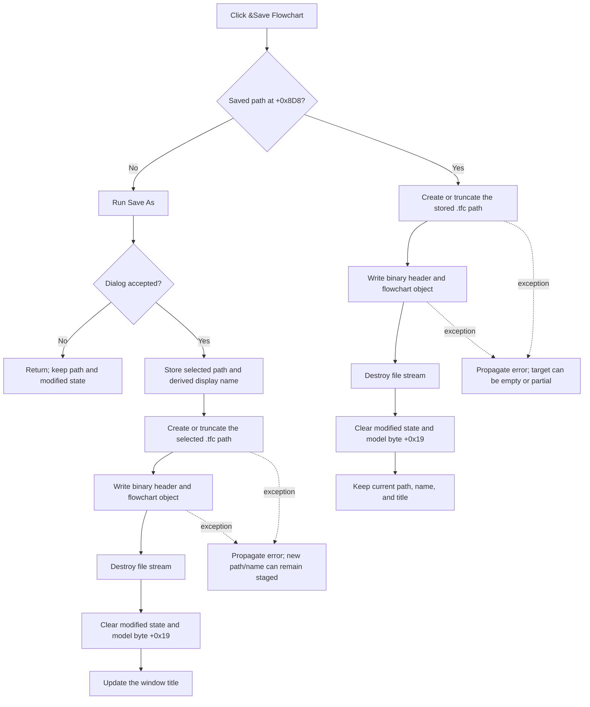

# &Save Flowchart

> Analysis status: Complete. The recovered handler and its save, stream, and state-update paths establish the behavior below.

## Control

| Property | Recovered value |
| --- | --- |
| Form | FlowChartMainForm |
| Component path | FlowChartMainForm.MainMenu.mnFile.mnSave |
| Control class | TMenuItem |
| Caption | &Save Flowchart |
| Hint | Not present in the recovered resource. |
| Text | Not present in the recovered resource. |
| Handler name | mnSaveClick |
| Handler address | 0104f270 |
| Graph node | `resource:dfm:FlowChartMainForm/FlowChartMainForm.MainMenu.mnFile.mnSave` |
| Handler node | `function:0104f270` |
| Graph layer | UI |

## What happens when clicked

`FUN_0104f270` is the common Save coordinator. The form field at offset `+0x8D8` is the saved full-path field. Form creation and New clear this field, so a null field is the unsaved-document sentinel.

- If `+0x8D8` is null, the handler delegates to the Save As handler `FUN_0104f2e0`. Save As shows the configured `TSaveDialog`. Cancel returns without a file write and leaves the modified state unchanged. Acceptance stores the selected full path, derives the display name, and then runs the same binary writer. Save As owns this dialog and title-update path.
- If `+0x8D8` contains a path, the handler opens that exact path with stream mode `0xFF00`. The recovered file-stream constructor treats this mode as create, so an existing file is truncated or replaced without a prompt in this handler.
- The handler calls `FUN_01050620` to write the current flowchart. After the call returns, it destroys the stream, clears the model's modified state through `FUN_01053e80`, and clears the distinct model status byte at `+0x19` through `FUN_00f629b0`.

The direct Save path does not change the stored path or display name and does not update the window title. The existing title therefore stays valid. The Save As path updates the title after a successful write. Neither path contains a recovered recent-file-list update.

## Click flow

## File format and persistence

The serializer writes a binary TFC stream, not a text document. It writes two raw four-byte header values first: a global format/version value and a value read from the current model. It then calls the contained flowchart object's stream writer.

Current string records are written as a four-byte character count followed by two bytes per character. On this Windows build, these bytes are UTF-16LE code units. The matching reader also contains an older single-byte-string compatibility path, but the current writer uses the two-byte representation. Numeric and object data remain binary stream records.

Successful Save persists the complete current flowchart to the stored path. It then clears modified byte `+0x18`, mirrors that value to the optional secondary editor/debug view, and clears model byte `+0x19`. The recovered code proves that `+0x19` is separate from the modified flag and is also cleared by the build/generation path, but it does not recover the original Delphi field name.

## Cancel, overwrite, and error behavior

- Cancel is possible only through the delegated Save As path. It is a normal no-op for file, path, title, and modified state.
- Direct Save does not show an overwrite dialog. Stream mode `0xFF00` creates or truncates the stored target before serialization.
- The handler does not use a temporary file, backup, atomic rename, retry, or rollback.
- File creation and serialization have no local exception handler in the recovered path. An exception propagates to the caller. Because the target is opened first, an existing file can be left empty or partly written.
- State flags are cleared only after serialization returns and the stream is destroyed. A write failure therefore leaves the modified and `+0x19` state uncleared.
- On the delegated Save As path, the selected path and display name are assigned before file creation. If creation or writing then fails, those fields can retain the new values even though persistence failed; the title update is not reached.

## Handler evidence

- Handler source: [FUN_0104f270](../../../DecompiledSources/Tina16/functions/000000000104F270__FUN_0104f270.c)
- Save As source: [FUN_0104f2e0](../../../DecompiledSources/Tina16/functions/000000000104F2E0__FUN_0104f2e0.c)
- Binary writer source: [FUN_01050620](../../../DecompiledSources/Tina16/functions/0000000001050620__FUN_01050620.c)
- Modified-state synchronizer: [FUN_01053e80](../../../DecompiledSources/Tina16/functions/0000000001053E80__FUN_01053e80.c)
- File-stream constructor: [FUN_004b9860](../../../DecompiledSources/Tina16/functions/00000000004B9860__FUN_004b9860.c)
- Current Unicode string writer: [FUN_00f608e0](../../../DecompiledSources/Tina16/functions/0000000000F608E0__FUN_00f608e0.c)
- Length-prefixed two-byte string writer: [FUN_01b20e90](../../../DecompiledSources/Tina16/functions/0000000001B20E90__FUN_01b20e90.c)
- Recovered role: Current flowchart save coordinator
- Complexity: complex
- Distinct outgoing calls: 6

## Direct calls and ownership

- `function:0104f2e0` — Save As dialog, accepted-path staging, write, and title update. The Save As control analysis owns its annotation.
- `function:01050620` — Binary TFC stream writer. The Save As control analysis owns its annotation.
- `function:01053e80` — Modified-state synchronizer; cited as shared evidence.
- `function:004b9860` — Delphi file-stream constructor wrapper; cited as framework evidence.
- `function:00410f20` — Nil-safe Delphi object destruction helper.
- `function:00f629b0` — Stores the separate model status byte at `+0x19`.

The toolbar Save handler `FUN_0104f120` is a one-call wrapper around this coordinator, so the toolbar and menu use the same persistence behavior.

## Resource evidence

- The `TMenuItem` caption is `&Save Flowchart`.
- The menu resource has no recovered hint, text, image, shortcut, checked state, or modal result.
- The form configures its Save dialog with `TINA Flowchart file (*.tfc)|*.tfc` and an Examples directory. These settings belong to the delegated Save As path, not to direct Save.

## Analysis limits

- The original Delphi names of form fields `+0x8D8`, model byte `+0x18`, and model byte `+0x19` are not present in the recovered source. Their roles above come from their writers, readers, and repeated callers.
- The inner flowchart object serializer is virtual. Its full record schema is outside this control analysis.
- No local recovery code establishes how the application-level exception handler presents file-system errors to the user.
