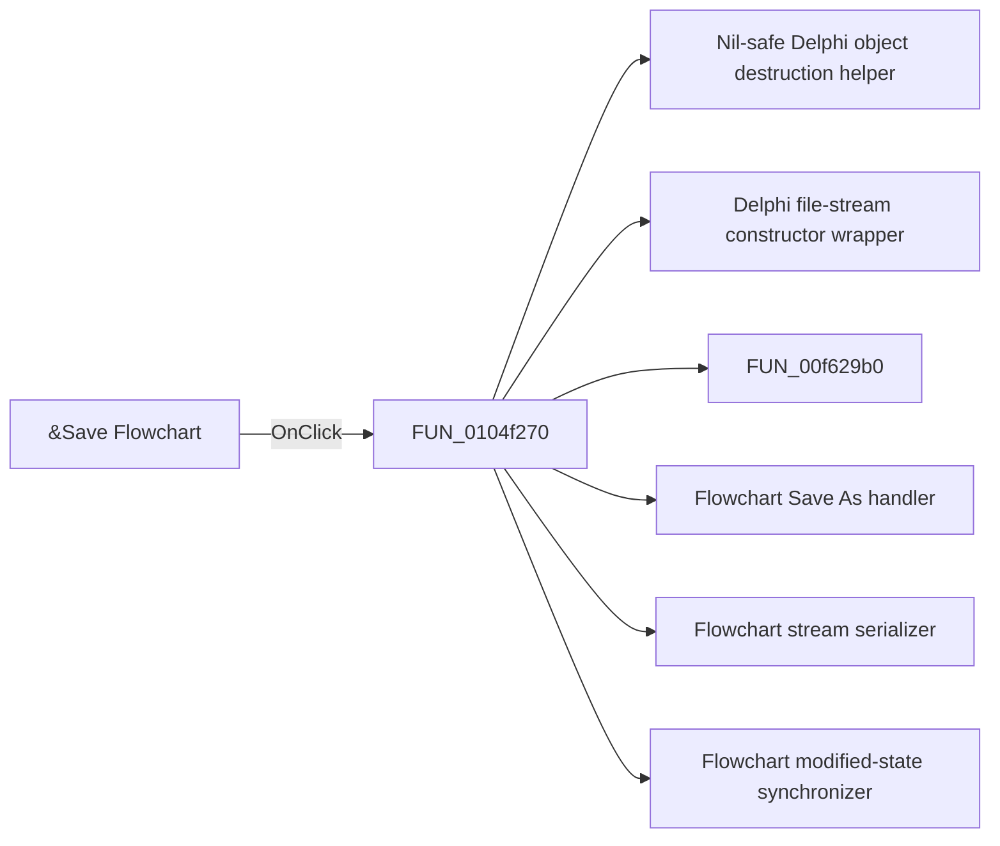

# &Save Flowchart

> Analysis status: Pending individual source review.

## Control

| Property | Recovered value |
| --- | --- |
| Form | FlowChartMainForm |
| Component path | FlowChartMainForm.MainMenu.mnFile.mnSave |
| Control class | TMenuItem |
| Caption | &Save Flowchart |
| Hint | Not present in the recovered resource. |
| Text | Not present in the recovered resource. |
| Handler name | mnSaveClick |
| Handler address | 0104f270 |
| Graph node | `resource:dfm:FlowChartMainForm/FlowChartMainForm.MainMenu.mnFile.mnSave` |
| Handler node | `function:0104f270` |
| Graph layer | UI |

## What happens when clicked

Pending individual analysis. An agent must read the recovered handler source and its relevant callees before it replaces this text.

## Click flow

## Handler evidence

- Source: [DecompiledSources/Tina16/functions/000000000104F270__FUN_0104f270.c](../../../DecompiledSources/Tina16/functions/000000000104F270__FUN_0104f270.c)
- Recovered role: Current flowchart save coordinator
- Current graph summary: Runs Save As when no path exists. Otherwise, creates or replaces the assigned file, serializes the flowchart, and clears its modified state. Handles 1 Delphi UI event: FlowChartMainForm.MainMenu.mnFile.mnSave.OnClick.
- Current graph behavior: Runs Save As when no path exists. Otherwise, creates or replaces the assigned file, serializes the flowchart, and clears its modified state.
- Current graph evidence: The Save Flowchart menu binds here. It tests the saved-path field, calls Save As when empty, otherwise creates a file stream, calls FUN_01050620, frees the stream, and clears modified state.
- Complexity: complex
- Distinct outgoing calls: 6

## Direct calls

- `function:00410f20` — Nil-safe Delphi object destruction helper
- `function:004b9860` — Delphi file-stream constructor wrapper
- `function:00f629b0` — FUN_00f629b0
- `function:0104f2e0` — Flowchart Save As handler
- `function:01050620` — Flowchart stream serializer
- `function:01053e80` — Flowchart modified-state synchronizer

## Resource evidence

- Kind: Not present in the recovered resource.
- Modal result: Not present in the recovered resource.
- Checked state: Not present in the recovered resource.
- List items: Not present in the recovered resource.
- Image reference: Not present in the recovered resource.
- Extracted glyph: None.

## Nearby label candidates

Nearby labels are layout candidates only. They are not proof of behavior.

- No same-parent label candidate is available.

## Analysis limits

- Do not infer behavior from the control class, caption, hint, glyph, or nearby label alone.
- Do not replace the pending status until the handler source and relevant call path provide enough evidence.
