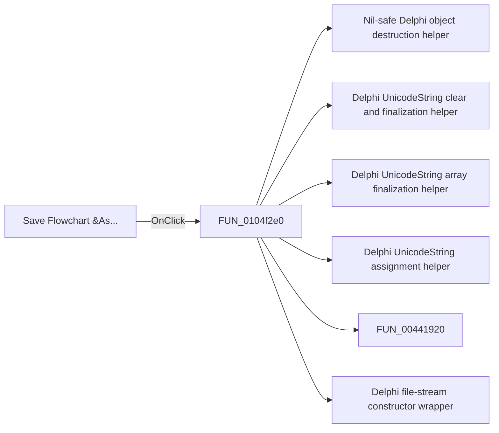

# Save Flowchart &As...

> Analysis status: Pending individual source review.

## Control

| Property | Recovered value |
| --- | --- |
| Form | FlowChartMainForm |
| Component path | FlowChartMainForm.MainMenu.mnFile.mnSaveAs |
| Control class | TMenuItem |
| Caption | Save Flowchart &As... |
| Hint | Not present in the recovered resource. |
| Text | Not present in the recovered resource. |
| Handler name | mnSaveAsClick |
| Handler address | 0104f2e0 |
| Graph node | `resource:dfm:FlowChartMainForm/FlowChartMainForm.MainMenu.mnFile.mnSaveAs` |
| Handler node | `function:0104f2e0` |
| Graph layer | UI |

## What happens when clicked

Pending individual analysis. An agent must read the recovered handler source and its relevant callees before it replaces this text.

## Click flow

## Handler evidence

- Source: [DecompiledSources/Tina16/functions/000000000104F2E0__FUN_0104f2e0.c](../../../DecompiledSources/Tina16/functions/000000000104F2E0__FUN_0104f2e0.c)
- Recovered role: Flowchart Save As handler
- Current graph summary: Shows the save dialog and, on acceptance, stores the selected path and display name, writes the flowchart, clears modified state, and updates the window title. Handles 1 Delphi UI event: FlowChartMainForm.MainMenu.mnFile.mnSaveAs.OnClick.
- Current graph behavior: Shows the save dialog and, on acceptance, stores the selected path and display name, writes the flowchart, clears modified state, and updates the window title.
- Current graph evidence: Save Flowchart As binds here. The function executes the save dialog, reads its file name, updates both name fields, uses the shared serializer, and calls the title updater.
- Complexity: complex
- Distinct outgoing calls: 12

## Direct calls

- `function:00410f20` — Nil-safe Delphi object destruction helper
- `function:00414480` — Delphi UnicodeString clear and finalization helper
- `function:00414560` — Delphi UnicodeString array finalization helper
- `function:00414ad0` — Delphi UnicodeString assignment helper
- `function:00441920` — FUN_00441920
- `function:004b9860` — Delphi file-stream constructor wrapper
- `function:00724270` — FUN_00724270
- `function:00f60ce0` — FUN_00f60ce0
- `function:00f629b0` — FUN_00f629b0
- `function:01050620` — Flowchart stream serializer
- `function:01051360` — Flowchart editor window-title updater
- `function:01053e80` — Flowchart modified-state synchronizer

## Resource evidence

- Kind: Not present in the recovered resource.
- Modal result: Not present in the recovered resource.
- Checked state: Not present in the recovered resource.
- List items: Not present in the recovered resource.
- Image reference: Not present in the recovered resource.
- Extracted glyph: None.

## Nearby label candidates

Nearby labels are layout candidates only. They are not proof of behavior.

- No same-parent label candidate is available.

## Analysis limits

- Do not infer behavior from the control class, caption, hint, glyph, or nearby label alone.
- Do not replace the pending status until the handler source and relevant call path provide enough evidence.
