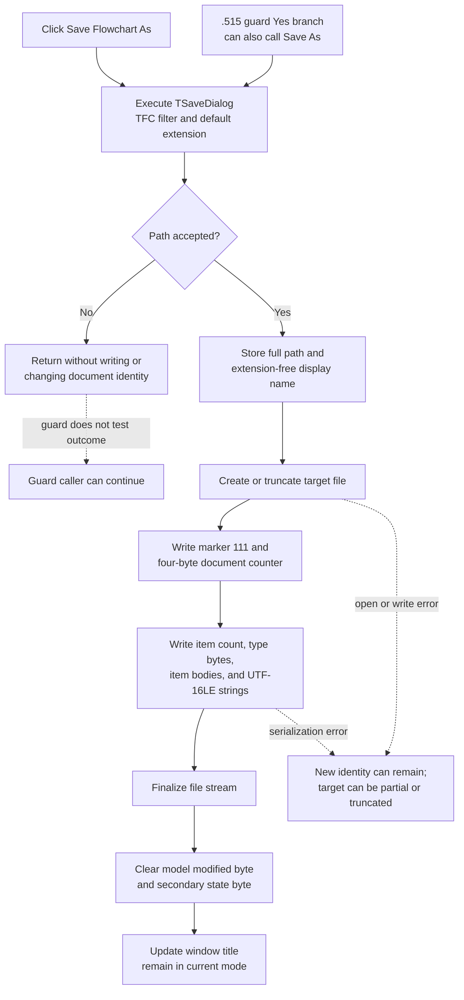

# Save Flowchart As

> Analysis status: Complete. The recovered menu handler, dialog initialization, file-stream writer, item serializer, string encoding helper, title updater, modified-state helpers, normal Save route, and unsaved-change guard support this explanation.

## Control

| Property | Recovered value |
| --- | --- |
| Form | `FlowChartMainForm` (`TFlowChartMainForm`) |
| Component path | `FlowChartMainForm.MainMenu.mnFile.mnSaveAs` |
| Control class | `TMenuItem` |
| Caption | `Save Flowchart &As...` |
| Hint | Not present in the recovered resource. |
| Handler name | `mnSaveAsClick` |
| Handler address | `0104f2e0` |
| Graph node | `resource:dfm:FlowChartMainForm/FlowChartMainForm.MainMenu.mnFile.mnSaveAs` |
| Handler node | `function:0104f2e0` |
| Graph layer | UI |

The menu item has no recovered glyph, image, action, checked state, or built-in modal result. Its behavior comes from its explicit `OnClick` handler.

## Save dialog and cancellation

[`FUN_0104f2e0`](../../../DecompiledSources/Tina16/functions/000000000104F2E0__FUN_0104f2e0.c) executes the `TSaveDialog` at form field `+0x710`. Form initialization configures this dialog with:

- filter `TINA Flowchart file (*.tfc)|*.tfc`;
- default extension `tfc`;
- an empty initial file name; and
- the application `Examples` directory when it exists, otherwise `Edison5\Examples`.

The dialog's default extension can add `.tfc` when the user omits an extension. The click handler does not append or validate the extension after the dialog returns. The recovered DFM and initialization path do not establish an explicit overwrite-prompt option. After acceptance, the file-stream path uses create semantics and can replace and truncate an existing file.

If the user cancels or closes the dialog, `Execute` returns false. The handler then only finalizes local strings. It does not change the form's stored path or display name, write a file, clear modified state, update the title, or change the current flowchart.

## Accepted path and document identity

On acceptance, the handler reads the dialog's complete `FileName` and performs these state changes before it opens the output stream:

1. It stores the complete selected path at form offset `+0x8d8`.
2. It extracts the final file-name segment from that path.
3. It removes the extension and stores the resulting display name at form offset `+0x8d0`.

The handler does not change context byte `+0x8e8` or the editor/debugger mode field at `+0x918`. After the write succeeds, [`FUN_01051360`](../../../DecompiledSources/Tina16/functions/0000000001051360__FUN_01051360.c) updates the window caption. In normal Flowchart Editor mode, it uses the new display name and current MCU family. Its debugger-mode branch uses a debugger-derived name instead. Save As does not switch between these modes.

No recovered call adds the path to an application recent-file list or writes it to an INI file or registry. The live `TSaveDialog` can retain its accepted file name for a later dialog use, but that is dialog-instance state, not proven durable recent-file persistence.

## TFC binary serialization

The handler creates a Delphi file stream for the stored path with create semantics and calls the shared writer [`FUN_01050620`](../../../DecompiledSources/Tina16/functions/0000000001050620__FUN_01050620.c). The output is a custom binary TFC stream, not XML, JSON, or a text file.

The writer emits this top-level sequence:

1. a four-byte format marker with value `111` (`0x0000006f`);
2. the model's four-byte next-item ID or document counter from model offset `+0x30`; and
3. the contained flowchart object's virtual serialization.

The contained list writer [`FUN_00f75660`](../../../DecompiledSources/Tina16/functions/0000000000F75660__FUN_00f75660.c) writes a four-byte item count. For each item, it writes a one-byte type code and calls that item's type-specific writer. Those writers use raw fixed-width numeric and flag fields and the shared string path.

For a serialized string, [`FUN_01b20e90`](../../../DecompiledSources/Tina16/functions/0000000001B20E90__FUN_01b20e90.c) writes a four-byte count of UTF-16 code units and then exactly two bytes for each unit. Thus, strings in this Win64 stream use UTF-16 little-endian data without a text BOM or a terminating null. There is no text line-ending setting for the binary document.

The inverse `.516` reader consumes two four-byte header values and then dispatches the remaining data to the contained flowchart object's virtual loader. It does not prove a signature rejection step; this article records marker `111` as the value emitted by the writer, not as a reader-enforced validation rule.

## Successful state update

The handler destroys the stream after the serializer returns. It then performs three in-memory updates in order:

1. [`FUN_01053e80`](../../../DecompiledSources/Tina16/functions/0000000001053E80__FUN_01053e80.c) clears the model modified byte at `+0x18`. If the optional debugger/editor object at form offset `+0x9d8` exists, it clears the corresponding state there too.
2. [`FUN_00f629b0`](../../../DecompiledSources/Tina16/functions/0000000000F629B0__FUN_00f629b0.c) clears the model byte at `+0x19`. Its semantic Delphi name is not recovered, so this article does not invent one.
3. The title updater applies the new document identity to the window caption.

The handler does not change flowchart items, rebuild the editor view, redraw the document, change the active mode, or return a success value. The persisted output and the two cleared model-state bytes are the success boundary.

## Relationship to Save and the unsaved-change guard

The `.517` normal Save handler owns the current-document route. If stored path `+0x8d8` is empty, normal Save calls this Save As handler. If a path exists, normal Save writes directly to that path through the same `.519`-owned stream writer and does not update the display name or title.

The `.515` modified-document guard can also call Save As after the user selects **Yes**. The guard does not inspect a success result because Save As has no return value. Therefore, if the user cancels the Save As dialog from that guard, the guard still permits the caller, such as New Flowchart, to continue and replace the unsaved document. A direct click on **Save Flowchart As** has no later replacement action and is a clean no-op when canceled.

## Overwrite, errors, and partial state

- The handler has no explicit overwrite confirmation, backup, temporary-file write, atomic rename, exception handler, or rollback.
- The create-mode stream can truncate an existing target before serialization completes. Any common-dialog overwrite question depends on dialog configuration that the recovered DFM and initialization path do not establish.
- Path and display name are stored before file creation. If stream construction fails, the form already points at the new path and name, while the old title and modified state can remain.
- If serialization fails, the target can be empty, truncated, or partly written. The new path and name remain stored, but the modified bytes are not yet cleared and the title is not yet updated.
- The complete-write helper retries short writes and raises if a write returns an error or makes no progress. The Save As handler has no local recovery for that exception.
- The sequence is not transactional. A later failure during stream finalization, modified-state clearing, or title formatting can leave a successfully written file with only part of the in-memory success state applied.
- The handler does not restore a replaced target or the old document identity after any failure. Delphi's outer exception handling receives the exception.

## Click flow

## Evidence and ownership

- [Save As handler `FUN_0104f2e0`](../../../DecompiledSources/Tina16/functions/000000000104F2E0__FUN_0104f2e0.c) proves the dialog guard, path/name assignment, create-mode stream, serialization, state clearing, and title-update order.
- [Flowchart form initialization `FUN_0104fe00`](../../../DecompiledSources/Tina16/functions/000000000104FE00__FUN_0104fe00.c) assigns the TFC filter, `tfc` default extension, Examples directory, and empty dialog file name.
- [TFC stream writer `FUN_01050620`](../../../DecompiledSources/Tina16/functions/0000000001050620__FUN_01050620.c) writes the marker, document counter, and contained flowchart object.
- [Flowchart item-list writer `FUN_00f75660`](../../../DecompiledSources/Tina16/functions/0000000000F75660__FUN_00f75660.c) proves the count, type-byte, and per-item dispatch format.
- [Common item writer `FUN_00f6f9c0`](../../../DecompiledSources/Tina16/functions/0000000000F6F9C0__FUN_00f6f9c0.c) and the recovered type-specific writers prove the mixture of raw fields and strings.
- [String wrapper `FUN_00f608e0`](../../../DecompiledSources/Tina16/functions/0000000000F608E0__FUN_00f608e0.c) and [UTF-16 stream writer `FUN_01b20e90`](../../../DecompiledSources/Tina16/functions/0000000001B20E90__FUN_01b20e90.c) prove the four-byte length and two-byte code-unit representation.
- [Complete-write helper `FUN_004b89e0`](../../../DecompiledSources/Tina16/functions/00000000004B89E0__FUN_004b89e0.c) proves short-write retry and exception behavior.
- [Normal Save `FUN_0104f270`](../../../DecompiledSources/Tina16/functions/000000000104F270__FUN_0104f270.c) and [modified-document guard `FUN_01053000`](../../../DecompiledSources/Tina16/functions/0000000001053000__FUN_01053000.c) establish the shared caller behavior.
- [Recovered UI evidence](../../../DecompiledSources/Tina16/resources/dfm/ui-evidence.json) supplies the menu component, caption, class, event name, handler, and Save dialog resources.

This Bead owns the Save As handler `FUN_0104f2e0`, the shared TFC writer `FUN_01050620`, and the conflict-free binary UTF-16 string writer `FUN_01b20e90`. `.517` owns the normal Save coordinator. `.515` owns the unsaved-change guard. `.516` owns the inverse file-load coordinator and TFC reader. Generic stream, title, modified-state, item-list, and type-specific item writers are evidence-only here.
