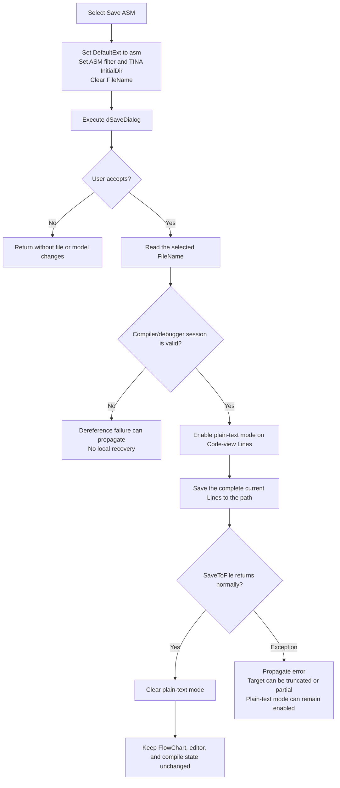

# Export the FlowChart code view as an ASM file

## Control

| Property | Recovered value |
| --- | --- |
| Form | FlowChartMainForm |
| Component path | FlowChartMainForm.MainMenu.mnFile.mnSaveASM |
| Control class | TMenuItem |
| Caption | Save &ASM |
| Handler name | sbSaveASMClick |
| Handler address | 01053720 |
| Graph node | `resource:dfm:FlowChartMainForm/FlowChartMainForm.MainMenu.mnFile.mnSaveASM` |
| Handler node | `function:01053720` |
| Graph layer | UI |

## What happens when selected

`Save ASM` exports the complete, current line collection of the FlowChart MCU Code view. It does not generate or compile source as part of this click.

The handler configures the form's `dSaveDialog` before each execution. It sets `DefaultExt` to `asm`, sets the filter to `ASM File|*.asm`, sets `InitialDir` to the shared TINA application directory, and clears `FileName`. It then executes the dialog. Cancel stops the path before any file access. After acceptance, the handler gets the selected filename and passes it with the current MCU session to the ASM writer.

The writer sets the Code view's rich-edit line object to plain-text mode and calls its one-argument `SaveToFile` method. A normal return clears plain-text mode again. The exported file contains the editor lines as they exist at click time. The writer does not add a header, rebuild the FlowChart, run the assembler, or include the HEX image, listing stream, diagnostic list, register values, or memory display.

## Source and compiler prerequisites

The normal FlowChart MCU launch path creates the compiler/debugger session at form field `+0x9d8` before the form becomes interactive. It connects that session to the active `TMyRichEdit` Code view. Session initialization selects an `.asm` or `.lst` source path from its compiler mode and loads that file into the editor. If the selected program file does not exist, it clears the editor and inserts `<no program>`.

Other FlowChart commands can replace or compile those editor lines. The recovered assembler path can first write the lines to its internal `.asm` path and call `_compile_asm`; success creates a new MCU program, while failure adds an `Error: ... in line ...` message and selects the failing line. `Save ASM` calls none of this logic. Therefore:

- it can export source that the user changed after the last compile;
- it does not prove that the source is current with the FlowChart;
- it does not prove that the source assembles;
- it can export the literal `<no program>` placeholder if that is the current Code view content;
- it requires a valid compiler/debugger session, but has no handler-local null or state guard.

The session setup and surrounding UI state are responsible for making this command available at a valid time. If the accepted branch ran with a null or invalid session, the recovered writer would dereference it.

## Dialog path, format, and encoding

- The handler resets the dialog for every click. It does not reuse the previous selected filename or directory as an application document path.
- `DefaultExt = asm` lets the save dialog apply the extension when its normal rules require it. The handler does not append `.asm` itself.
- The accepted path comes directly from `dSaveDialog.FileName`. There is no explicit empty-path check after acceptance.
- Plain-text mode prevents the rich edit from writing RTF data.
- `SaveToFile` receives no encoding argument. The recovered `TStrings` save chain uses the line collection's current or default encoding and can write its encoding preamble. The click does not select a code page, Unicode format, BOM policy, or line-ending convention.
- The handler has no file-existence test or overwrite branch. Any overwrite confirmation comes from the save dialog or native file-dialog behavior; the recovered DFM does not prove its effective option set.

## State and persistence

A successful export creates or replaces only the selected external file. It does not change the FlowChart filename, project path, form caption, compiler mode, generated-code state, diagnostic list, MCU program, editor text, selection, caret, or modified state. It does not write a project setting, INI value, registry value, or recent-file entry.

The native dialog can retain its internal result until the next click, but the handler then clears `FileName` and restores `InitialDir` from the shared TINA directory. Thus, the selected output does not become an in-place Save target. The separate `Save Flowchart` commands own the FlowChart document, while `Save HEX` and `Save LST` use different output paths and serializers.

## Selection flow

## Cancellation and failure behavior

- Cancel occurs after the dialog fields were reset, but before the session writer is called. It creates no output and does not change the editor or FlowChart model.
- There is no temporary-file-then-rename transaction, backup, rollback, or delete-on-failure path. The underlying `TStrings` path creates or truncates the destination before it completes the write. A later error can leave an empty or partial file.
- The ASM writer has no recovered `try/finally` around the write. If `SaveToFile` raises, its following plain-text reset does not execute on this path.
- Neither the handler nor the writer catches an error or adds a compiler diagnostic. A higher-level VCL exception handler, if present, is outside this recovered path.
- Repeated selections reopen a dialog that is reset to the TINA directory and an empty filename. Each accepted execution writes the Code view's then-current lines.

## Evidence

- [Save ASM handler `FUN_01053720`](../../../DecompiledSources/Tina16/functions/0000000001053720__FUN_01053720.c) sets the `asm` default extension, ASM filter, initial directory, and empty filename; it gates the writer on the dialog result.
- [ASM editor writer `FUN_00f8fa10`](../../../DecompiledSources/Tina16/functions/0000000000F8FA10__FUN_00f8fa10.c) enables plain-text mode, saves the compiler session's Code-view Lines, and clears that mode only after a normal save return.
- [Compiler/debugger session setup `FUN_01051c30`](../../../DecompiledSources/Tina16/functions/0000000001051C30__FUN_01051c30.c) creates the session at form field `+0x9d8`, connects the active editor and related panels, and starts the code preparation path.
- [Program-source loader `FUN_00f8b5f0`](../../../DecompiledSources/Tina16/functions/0000000000F8B5F0__FUN_00f8b5f0.c) selects `.asm` or `.lst` by compiler mode and loads it, or installs `<no program>` when the file is absent.
- [Assembler path `FUN_00f8c160`](../../../DecompiledSources/Tina16/functions/0000000000F8C160__FUN_00f8c160.c) shows the separate internal ASM write, `_compile_asm` call, success state, and error-message path that this export does not invoke.
- [Plain-text mode setter `FUN_006eae90`](../../../DecompiledSources/Tina16/functions/00000000006EAE90__FUN_006eae90.c) changes the serialization flag on the rich-edit line object.
- [One-argument string-list save `FUN_004b4900`](../../../DecompiledSources/Tina16/functions/00000000004B4900__FUN_004b4900.c) forwards the line collection's current encoding, and [stream writer `FUN_004b49c0`](../../../DecompiledSources/Tina16/functions/00000000004B49C0__FUN_004b49c0.c) writes the optional encoding preamble and encoded line payload.
- [Dialog initial-directory setter `FUN_00724420`](../../../DecompiledSources/Tina16/functions/0000000000724420__FUN_00724420.c) stores the shared TINA directory after normalizing its trailing separator.
- [Dialog filename setter `FUN_00724380`](../../../DecompiledSources/Tina16/functions/0000000000724380__FUN_00724380.c) writes the empty initial filename, and [filename getter `FUN_00724270`](../../../DecompiledSources/Tina16/functions/0000000000724270__FUN_00724270.c) returns the accepted path.
- [Recovered Delphi resource evidence](../../../DecompiledSources/Tina16/resources/dfm/ui-evidence.json) binds `Save &ASM` to `sbSaveASMClick` and identifies `dSaveDialog`, the FlowChart and Code pages, and their rich-edit Code views.

## Direct calls

- `FUN_015fc650` copies the shared TINA application directory for `InitialDir`.
- `FUN_00724420`, `FUN_00724380`, and `FUN_00724270` set the initial directory, clear the starting filename, and read the accepted filename.
- `FUN_00f8fa10` owns the plain-text editor export.
- The save-dialog execution and line object's `SaveToFile` are recovered virtual calls and do not appear as named direct-call edges.

## Analysis limits

- The handler does not expose the live value of the editor's current/default encoding, so the exact output bytes, BOM, and line endings are not proven.
- The recovered DFM does not preserve an explicit `Options` value for `dSaveDialog`, so overwrite-prompt behavior is not guaranteed here.
- The code establishes that the editor can load or receive assembly text and that a separate path compiles it. It does not establish which earlier FlowChart transformation produced every line in a specific live session.
- The decompiler does not recover a handler-local check that relates the current editor revision to the last successful compile.
