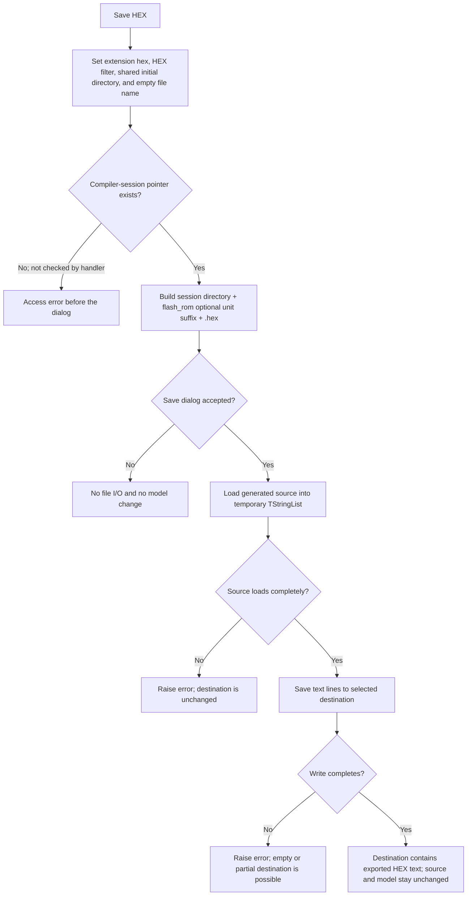

# Save generated HEX file

> Analysis status: Complete. This command copies an existing FlowChart compiler artifact. It does not compile the flowchart or create HEX records itself.

## Control

| Property | Recovered value |
| --- | --- |
| Form | `FlowChartMainForm` |
| Component path | `FlowChartMainForm.MainMenu.mnFile.mnSaveHEX` |
| Control class | `TMenuItem` |
| Caption | `Save &HEX` |
| Handler | `sbSaveHEXClick` at `01053880` |
| Graph nodes | `resource:dfm:FlowChartMainForm/FlowChartMainForm.MainMenu.mnFile.mnSaveHEX`, `function:01053880` |
| Image evidence | No image reference or extracted glyph. |

## Export source and prerequisite state

The handler reads the compiler-session object at form offset `+0x9d8`. Form initialization sets this pointer to null. The FlowChart debugger setup path later creates the object and gives it an output directory. The handler has no null check, compile command, compile-status check, or freshness check. It therefore requires an initialized compiler session before the click.

The source path is built from three compiler values:

1. `FUN_00f8f540` copies the compiler output directory from compiler offset `+0x3508`.
2. `FUN_00f8bba0` selects the artifact base name. Compiler type code `0x20` produces `flash_rom`. Other codes produce `flash_rom_` followed by the current compiler unit identifier from `+0x3440`.
3. The handler appends `.hex`.

The compiler wrapper uses the same directory and base-name state for related generated files and calls the delayed `VHDL_DLL2.DLL` `_compile_asm` entry point. That wrapper stores a success byte, but Save HEX does not read it. The click exports whatever text file exists at the calculated `.hex` path. If a failed or older compilation leaves a file there, this handler has no source check that can distinguish it from a current result. The recovered application code does not expose the external compiler's HEX-record writer, so the source does not prove a more specific HEX dialect.

## Save dialog

Before it opens the form-owned `TSaveDialog`, the handler sets these values on every click:

| Dialog value | Value |
| --- | --- |
| Default extension | `hex` (`DAT_01053a40` in the recovered runtime image) |
| Filter | `Hex File|*.hex` |
| Initial directory | The shared TINA application directory returned by `FUN_015fc650` |
| File name | Empty |

The command does not propose `flash_rom.hex` as the destination name. `FUN_00724380` explicitly clears the dialog file name before `Execute`. It also does not use the compiler output directory as the initial destination directory.

Cancel stops the operation before any source or destination file is opened. The temporary string list is destroyed, and the compiler and flowchart state stay unchanged.

## Accepted export

After dialog acceptance, the handler uses a new `TStringList` in this order:

1. `LoadFromFile` loads the calculated compiler `.hex` source.
2. `FUN_00724270` reads the selected destination path from the Save dialog.
3. `SaveToFile` writes the loaded lines to that destination.

This is a text load and save, not a raw byte copy. Neither call supplies an encoding. The VCL selects the load and save encoding and line representation, so byte-for-byte identity with the compiler file is not proven. The handler does not inspect, parse, validate, or change the HEX lines.

The complete source load occurs before `SaveToFile` opens the destination. A missing, locked, or unreadable compiler artifact therefore raises an error without changing the chosen destination. A destination write can create or truncate the file before it fails, so an empty or partial destination is possible. There is no temporary destination, atomic replacement, retry, local exception handler, or rollback.

The handler has no explicit overwrite test. The recovered DFM evidence does not include Save-dialog option flags, so it does not prove whether the dialog displays an overwrite confirmation. After acceptance, `SaveToFile` can replace an existing destination.

## UI and persistence effects

The click changes the Save dialog's extension, filter, initial directory, and current file name. It does not change the compiler output, selected device or unit, flowchart document, editor, debugger, dirty state, current project path, or generated-program model. The selected destination remains only in the dialog component until a later invocation clears it again.

The exported file is the only durable output proved by this handler. The command does not add it to the flowchart project, recent files, preferences, or another settings store.

## Control flow

## Evidence

- [Save HEX handler](../../../DecompiledSources/Tina16/functions/0000000001053880__FUN_01053880.c) proves the dialog setup, source-path construction, accepted-result gate, and `TStringList` load/save order.
- [Compiler output-directory accessor](../../../DecompiledSources/Tina16/functions/0000000000F8F540__FUN_00f8f540.c) copies the directory used in the source path.
- [Compiler artifact-name builder](../../../DecompiledSources/Tina16/functions/0000000000F8BBA0__FUN_00f8bba0.c) proves the `flash_rom` and `flash_rom_<unit>` branches.
- [Compiler-session setup](../../../DecompiledSources/Tina16/functions/0000000001051C30__FUN_01051c30.c) creates the object stored at `+0x9d8` and passes its output directory to the compiler initializer.
- [Compiler initializer](../../../DecompiledSources/Tina16/functions/0000000000F8FAA0__FUN_00f8faa0.c) stores that output directory at compiler offset `+0x3508`.
- [Assembly compiler wrapper](../../../DecompiledSources/Tina16/functions/0000000000F8C160__FUN_00f8c160.c) uses the same artifact-name state, calls the external assembler, and records success or failure without changing this handler's unchecked export path.
- [File-name getter](../../../DecompiledSources/Tina16/functions/0000000000724270__FUN_00724270.c), [file-name setter](../../../DecompiledSources/Tina16/functions/0000000000724380__FUN_00724380.c), and [initial-directory setter](../../../DecompiledSources/Tina16/functions/0000000000724420__FUN_00724420.c) establish the Save-dialog field roles.
- [UI evidence](../../../DecompiledSources/Tina16/resources/dfm/ui-evidence.json) supplies the menu caption, control class, hierarchy, and event binding.

## Analysis limits and shared ownership

- The external assembler implementation is not recovered, so this article does not claim an Intel HEX record format from the `.hex` extension alone.
- The DFM extractor does not preserve the Save dialog's option set. An overwrite prompt is therefore unknown.
- TIARA-diz.6.7.520 owns `FUN_01053880`, `FUN_00f8f540`, and `FUN_00f8bba0`. TIARA-diz.6.7.521 cites the two shared artifact accessors for Save LST. TIARA-diz.6.7.518 uses a separate compiler ASM export method.
