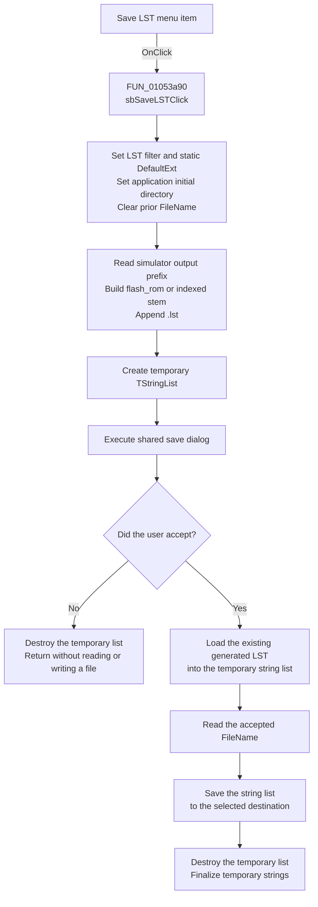

# Save &LST

> Analysis status: Source reviewed. The source-file derivation, save-dialog flow, text-copy behavior, and failure boundaries are supported by recovered code.

## Control

| Property | Recovered value |
| --- | --- |
| Form | FlowChartMainForm |
| Component path | FlowChartMainForm.MainMenu.mnFile.mnSaveLST |
| Control class | TMenuItem |
| Caption | Save &LST |
| Hint | Not present in the recovered resource. |
| Text | Not present in the recovered resource. |
| Handler name | sbSaveLSTClick |
| Handler address | 01053a90 |
| Graph node | `resource:dfm:FlowChartMainForm/FlowChartMainForm.MainMenu.mnFile.mnSaveLST` |
| Handler node | `function:01053a90` |
| Graph layer | UI |

## What happens when clicked

`sbSaveLSTClick` exports a copy of an existing assembler listing. It does not compile the flowchart and does not generate listing content.

Before it opens the dialog, the handler configures the shared save dialog with the filter `LST File|*.lst`. It sets the initial directory to the shared application directory and clears the dialog's prior file name. It also sets `DefaultExt` from static data. The recovered source does not expose the static value as a reliable string, although the filter and generated-source suffix are both `.lst`.

The source file name is built from simulator state:

- The string at simulator offset `0x3508` supplies the output-path prefix.
- If the integer at offset `0x3464` is `0x20`, the file stem is `flash_rom`.
- Otherwise, the stem is `flash_rom_` followed by the value at offset `0x3440`.
- The handler appends `.lst`.

The concatenation routine does not insert a path separator. The prefix must already contain the required separator or trailing path part.

The handler creates a temporary `TStringList` before it shows the dialog. If the user accepts, the list loads the derived source file. The handler then gets the selected destination from the dialog and saves the list to that path. This is a text load and save, not a raw byte copy.

## Click flow

## Handler evidence

- Source: [FUN_01053a90](../../../DecompiledSources/Tina16/functions/0000000001053A90__FUN_01053a90.c).
- Recovered role: Copies the current generated LST file to a user-selected path.
- The DFM binds `mnSaveLST.OnClick` to `sbSaveLSTClick` at `01053a90`.
- The dialog is the form field at offset `0x840`. The simulator is the form field at offset `0x9d8`.
- The handler derives the source path before it executes the dialog. It calls the source-file load and destination-file save only after a nonzero dialog result.
- Complexity: complex.
- Distinct outgoing calls: 12.

## Generated-output prerequisites

The command assumes that the simulator output path and its LST file are already valid. It has no handler-side test for these conditions:

- A compiled or current flowchart.
- A successful prior assembler run.
- The existence or readability of the derived `.lst` file.
- A non-null simulator object.

The related simulator code uses the same `flash_rom` or indexed stem for generated assembler files. [FUN_00f8c160](../../../DecompiledSources/Tina16/functions/0000000000F8C160__FUN_00f8c160.c) invokes `_compile_asm`, reports either a compile error or `Successfully compiled`, and records the compile result. [FUN_00f8b5f0](../../../DecompiledSources/Tina16/functions/0000000000F8B5F0__FUN_00f8b5f0.c) later selects the matching `.lst` path in one simulator mode. These paths support the generated-listing interpretation. They do not add a compile step to this menu handler.

This behavior differs from Save ASM. [FUN_01053720](../../../DecompiledSources/Tina16/functions/0000000001053720__FUN_01053720.c) calls a simulator export routine after dialog acceptance. Save LST instead loads an existing `.lst` file through `TStringList`. Save HEX at [FUN_01053880](../../../DecompiledSources/Tina16/functions/0000000001053880__FUN_01053880.c) uses the same existing-file copy pattern with the `.hex` suffix.

## Path, format, and encoding

- [FUN_015fc650](../../../DecompiledSources/Tina16/functions/00000000015FC650__FUN_015fc650.c) returns the shared application directory used as `InitialDir`.
- [FUN_00724420](../../../DecompiledSources/Tina16/functions/0000000000724420__FUN_00724420.c) sets the dialog's initial directory.
- [FUN_00724380](../../../DecompiledSources/Tina16/functions/0000000000724380__FUN_00724380.c) clears the prior dialog file name.
- [FUN_00f8f540](../../../DecompiledSources/Tina16/functions/0000000000F8F540__FUN_00f8f540.c) returns the simulator output-path prefix from offset `0x3508`.
- [FUN_00f8bba0](../../../DecompiledSources/Tina16/functions/0000000000F8BBA0__FUN_00f8bba0.c) builds the `flash_rom` or indexed file stem.
- [FUN_00724270](../../../DecompiledSources/Tina16/functions/0000000000724270__FUN_00724270.c) gets the accepted dialog file name.

The handler supplies no explicit encoding, code page, byte-order mark, or line-ending option. The one-argument `TStrings.LoadFromFile` path reads and decodes the source into lines. The one-argument `SaveToFile` path serializes those lines with the temporary list's current encoding state and VCL defaults. Therefore, the destination is not proven to be byte-for-byte identical to the source. The exact encoding, preamble, and line endings depend on the recovered VCL load and save behavior.

## Cancel, overwrite, and failure boundaries

- Cancel occurs before the source load. The handler destroys the empty temporary list and returns without reading or writing a file.
- The DFM stores no explicit save-dialog options for this component, and the handler does not set an overwrite option. Any overwrite prompt is controlled by the VCL dialog defaults, not by this handler.
- After acceptance, the VCL save path creates or replaces the selected destination. There is no handler-side same-path check, temporary output file, atomic rename, retry, or rollback.
- If the source load fails, the destination save is not called.
- If destination creation or writing fails, the destination can already be truncated or partially written. The handler has no local error message, catch, cleanup guard, or rollback path.
- The handler does not test a result after the save and does not show a success message.

## UI, model, and persistence effects

The handler changes the shared dialog's filter, default extension, initial directory, and file name. It does not change the flowchart model, compile state, modified flags, project path, window title, recent-file state, or simulator data. It also does not remember the exported destination in a separate form or settings field. Each invocation clears the dialog file name before it opens.

The only persistent output proven here is the destination file written after acceptance.

## Direct calls

- `function:00410f20` - Destroys the temporary string-list object on the recovered normal path.
- `function:00414480` - Clears temporary Delphi UnicodeStrings.
- `function:00414560` - Finalizes the temporary UnicodeString array.
- `function:00414ad0` - Assigns the dialog default extension and filter strings.
- `function:00416cd0` - Concatenates the source prefix, stem, and `.lst` suffix.
- `function:004b6930` - Creates the temporary `TStringList`.
- `function:00724270` - Gets the accepted destination file name.
- `function:00724380` - Clears the dialog file name.
- `function:00724420` - Sets the dialog initial directory.
- `function:00f8bba0` - Builds the generated-output stem.
- `function:00f8f540` - Gets the simulator output-path prefix.
- `function:015fc650` - Gets the shared application directory.

## Resource evidence

- The recovered menu caption is `Save &LST`.
- The control is a `TMenuItem` under `FlowChartMainForm.MainMenu.mnFile`.
- No hint, image, glyph, built-in modal result, checked state, list items, or nearby label is present.
- The shared `TSaveDialog` resource has only position properties. It does not store a filter, file name, or explicit options in the recovered DFM.

## Analysis limits

- The static `DefaultExt` data at `DAT_01053c50` is not recovered as a reliable literal.
- The code proves the source-path formula, but it does not recover a Delphi field name for the simulator prefix or selector fields.
- The handler does not verify compiler state. The recovered code does not prove which earlier user action must create the listing before this command is available.
- The VCL calls prove text loading and serialization. They do not prove a fixed destination encoding or byte-identical output.
