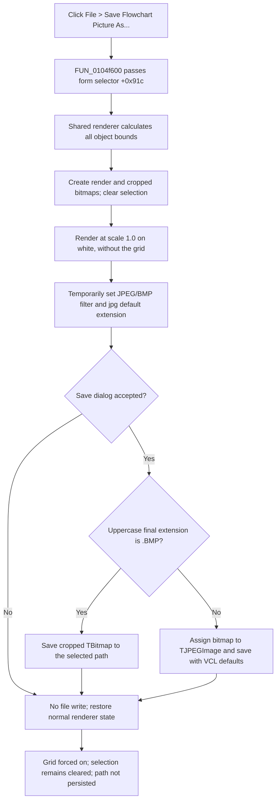

# Save the complete flowchart as JPEG or BMP

> Analysis status: Complete. The recovered menu wrapper, shared renderer, bounds calculation, Save dialog setup, extension branch, bitmap and JPEG writers, and cleanup path support this explanation.

## Control

| Property | Recovered value |
| --- | --- |
| Form | FlowChartMainForm |
| Component path | FlowChartMainForm.MainMenu.mnFile.mnSavePicture |
| Control class | TMenuItem |
| Parent menu | File |
| Caption | Save Flowchart Picture As... |
| Hint | Not present in the recovered resource. |
| Handler name | mnSavePictureClick |
| Handler address | 0104f600 |
| Graph node | `resource:dfm:FlowChartMainForm/FlowChartMainForm.MainMenu.mnFile.mnSavePicture` |
| Handler node | `function:0104f600` |
| Graph layer | UI |

## What happens when clicked

`FUN_0104f600` reads `FlowChartMainForm +0x91c` and passes that same value to the shared picture renderer `FUN_0104f660`. The renderer compares its argument with `+0x91c`, so equality is guaranteed for this wrapper. This selects file export. The sibling **Copy** command passes the constant `1` and normally selects the clipboard branch instead.

The command renders before it opens the Save dialog. It exports the complete flowchart object list, not the current viewport and not only selected objects.

## Render bounds, scale, and colors

The shared renderer calculates minimum and maximum X and Y coordinates across all flowchart objects. If the recovered bounds are `minX`, `minY`, `maxX`, and `maxY`, it prepares:

- a temporary render bitmap with width `maxX + 10` and height `maxY + 10`;
- a cropped output bitmap with width `(maxX - minX) + 10` and height `(maxY - minY) + 10`; and
- a source crop from `(minX - 6, minY - 6)` through `(maxX + 4, maxY + 4)`.

This gives six pixels before the minimum object position and four pixels after the maximum position. There is no selected-region, viewport, page, zoom, DPI, or user-entered scale setting. The rebuild routine resets the renderer scale field to `1.0` before it draws.

For the export render, the helper:

1. redirects both renderer canvas references to the temporary bitmap canvas;
2. sets the temporary canvas font to **Courier New**, size `7`;
3. disables the grid flag;
4. clears selection bit `8` from every flowchart object;
5. clears the target with a solid white brush and a black pen baseline; and
6. draws all visible flowchart objects with the recovered renderer and its configured object colors and styles.

The exported image therefore has a white background, no grid, and no selection state. The source does not set color depth, transparency, physical DPI, JPEG subsampling, or another output profile.

There is no safe empty-flowchart branch. The underlying bounds walker does not initialize useful bounds when the object list is empty, but this function still uses those outputs for bitmap sizes and crop coordinates. The recovered code does not prove a valid blank export in that state.

## Save dialog and format selection

The form-owned `TSaveDialog` at `+0x710` is reused. Before `Execute`, the helper saves its existing `Filter` and `DefaultExt` strings, then applies:

| Setting | Temporary value |
| --- | --- |
| Filter | `JPEG (*.jpg)\|*.jpg\|Bitmap (*.bmp)\|*.bmp` |
| Default extension | `jpg` |

The runtime image resolves static string `DAT_0104fb0c` to `jpg`. The wrapper does not set a default file name, title, initial directory, filter index, or dialog options. Existing dialog state can therefore supply those values.

Cancel skips the filename read and file writer. A successful dialog result reads the selected `FileName` without a second empty-path check. The helper extracts the final extension, converts it to uppercase, and selects the encoder as follows:

| Final extension | Writer |
| --- | --- |
| Exactly `.BMP`, ignoring ASCII case | Save the cropped `TBitmap` directly. |
| Any other extension | Assign the cropped bitmap to a new `TJPEGImage` and save it as JPEG. |

The code does not inspect `FilterIndex`. The JPEG default extension normally supplies `.jpg` when the entered name has no extension, but an unexpected non-BMP extension still receives JPEG data. The JPEG object uses its VCL constructor defaults; this path does not set quality, progressive mode, grayscale, smoothing, or subsampling.

## Overwrite and partial-file behavior

The application does not test whether the selected path exists and does not show its own overwrite question. The recovered DFM does not serialize `SaveDialog.Options`, and the wrapper does not change them. A native overwrite prompt can therefore only come from the existing VCL dialog options; it is not proven by this source.

After acceptance, the selected writer saves directly to the final path. There is no temporary filename, backup, atomic rename, retry, returned-status check, rollback, or partial-file deletion. If the VCL bitmap or JPEG writer creates or truncates the destination and then fails, this handler does not repair the replaced or partial file.

## Runtime state and restoration

On every normal return, including Cancel, the renderer:

- restores the Save dialog's prior `Filter` and `DefaultExt` strings;
- destroys the temporary render and cropped-output bitmaps;
- sets the grid flag to `true`; and
- points both renderer canvas fields back to the active editor-frame canvas.

The grid value is not saved before it is disabled. Normal completion always writes `true`, so an earlier false value is not preserved. The helper also does not restore selection bit `8`; every object remains unselected in the model after Cancel or success. It performs no on-screen redraw in this path, so the current view can remain visually stale until a later refresh.

The dialog's accepted `FileName`, initial directory, and filter index are not copied back to earlier values. They can remain as runtime state in the reused dialog. The selected path is not copied into a FlowChart document field, recent-file list, registry, INI file, or project setting.

## Errors and persistence boundary

- The wrapper and shared renderer have no local exception handler or recovered `try/finally`.
- Allocation, bounds, rendering, dialog, path, encoder, or file errors propagate through the Delphi runtime.
- An exception before cleanup can leave selection cleared, the grid disabled, renderer canvases redirected to a temporary bitmap, temporary objects allocated, and the Save dialog's temporary filter or extension installed. Earlier file output can also remain partial.
- A successful command writes only the selected picture file. It does not save or modify the FlowChart document, record an undo operation, set a dirty flag, or persist export preferences.

## Picture-export flow

## Source evidence

- Save Picture menu wrapper: [FUN_0104f600](../../../DecompiledSources/Tina16/functions/000000000104F600__FUN_0104f600.c)
- Shared bounds, render, dialog, format, and cleanup coordinator: [FUN_0104f660](../../../DecompiledSources/Tina16/functions/000000000104F660__FUN_0104f660.c)
- Complete object-bound calculation: [FUN_00f74dc0](../../../DecompiledSources/Tina16/functions/0000000000F74DC0__FUN_00f74dc0.c)
- Renderer rebuild and unit-scale reset: [FUN_00f63b50](../../../DecompiledSources/Tina16/functions/0000000000F63B50__FUN_00f63b50.c)
- White canvas clear and black baseline: [FUN_00f611b0](../../../DecompiledSources/Tina16/functions/0000000000F611B0__FUN_00f611b0.c)
- Selection-bit clearing: [FUN_00f74f10](../../../DecompiledSources/Tina16/functions/0000000000F74F10__FUN_00f74f10.c) and [FUN_00f6f910](../../../DecompiledSources/Tina16/functions/0000000000F6F910__FUN_00f6f910.c)
- Bitmap crop/copy routine: [FUN_005fead0](../../../DecompiledSources/Tina16/functions/00000000005FEAD0__FUN_005fead0.c)
- Selected filename reader: [FUN_00724270](../../../DecompiledSources/Tina16/functions/0000000000724270__FUN_00724270.c)
- Final-extension extraction and uppercase normalization: [FUN_00441a10](../../../DecompiledSources/Tina16/functions/0000000000441A10__FUN_00441a10.c) and [FUN_0043e130](../../../DecompiledSources/Tina16/functions/000000000043E130__FUN_0043e130.c)
- JPEG image construction with class defaults: [FUN_00a09e20](../../../DecompiledSources/Tina16/functions/0000000000A09E20__FUN_00a09e20.c)
- Sibling Copy wrapper and normal selector contrast: [FUN_0104f620](../../../DecompiledSources/Tina16/functions/000000000104F620__FUN_0104f620.c)

## Resource evidence

- The DFM binds `FlowChartMainForm.MainMenu.mnFile.mnSavePicture.OnClick` to `mnSavePictureClick` at `0104f600`.
- The menu caption is **Save Flowchart Picture As...** under the **File** menu.
- `FlowChartMainForm.SaveDialog` is a `TSaveDialog`; its DFM records no filter, default extension, file name, title, initial directory, or options override.
- The menu item has no recovered hint, shortcut, action, checked state, image reference, or extracted glyph.
- Nearby label candidate: None.

## Analysis limits and annotation ownership

- `TIARA-diz.6.7.512` canonically owns shared renderer `FUN_0104f660`. This article cites its render and state effects without redefining it.
- This article annotates only the Save Picture wrapper `FUN_0104f600`.
- The VCL bitmap and JPEG serializers are reached through virtual calls. Their exact file-open sequence, bitmap header fields, JPEG quality, metadata, exception text, and native dialog overwrite behavior are not direct graph edges in this export.
- Original Delphi names for form offsets `+0x91c`, `+0x980`, and `+0x928` are not recovered. Their descriptions here follow repeated writers and consumers.
