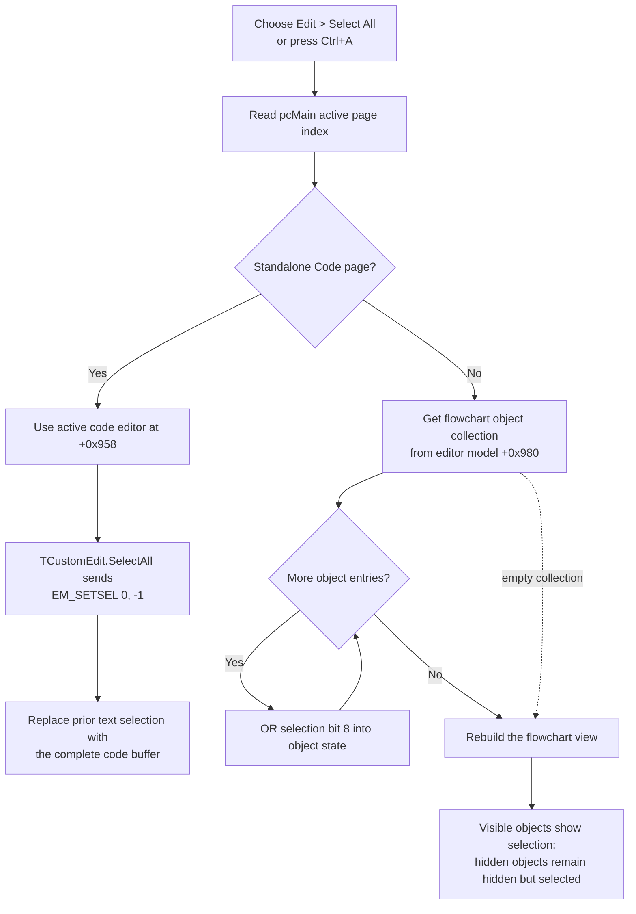

# Select all Code text or all flowchart objects

> Analysis status: Reviewed from recovered handler, page mapping, native text-selection, flowchart object-state, and redraw evidence.

## Control

| Property | Recovered value |
| --- | --- |
| Form | `FlowChartMainForm` (`TFlowChartMainForm`) |
| Component path | `FlowChartMainForm.MainMenu.mnEdit.mnSelectAll` |
| Control class | `TMenuItem` |
| Parent menu | `Edit` |
| Caption | `Select &All` |
| Shortcut | `16449` (`Ctrl+A`) |
| Handler name | `mnSelectAllClick` |
| Handler address | `0104f5a0` |
| Graph node | `resource:dfm:FlowChartMainForm/FlowChartMainForm.MainMenu.mnEdit.mnSelectAll` |
| Handler node | `function:0104f5a0` |
| Graph layer | UI |

The menu item has no recovered hint, action, image, glyph, or nearby label. The handler's active-page test establishes which content `All` refers to.

## What happens when selected

`FUN_0104f5a0` reads the selected page index from `pcMain` at form field `+0x6d8`. The form resource contains four pages in this order: **Flowchart**, **Code**, **Flowchart+Code**, and **Graph**. `FUN_01051600` builds runtime indexes for the visible pages and assigns `DAT_0202f414` to the logical second page, **Code**.

The handler has two paths:

- On the standalone **Code** page, it selects all text in the active code editor at form field `+0x958`.
- On every other page index, it selects every object in the current flowchart model at form field `+0x980` and rebuilds the flowchart view.

There is no additional focus, visibility, document, run-state, or editor-lock test.

## Code-page text selection

For the Code page, the handler passes the active `TMyRichEdit` code editor to canonical VCL helper `FUN_00680ad0`, recovered as `TCustomEdit.SelectAll`. The helper ensures a native window handle and sends `EM_SETSEL` (`0x00b1`) with start `0` and end `-1`.

This replaces the previous native selection with the complete code buffer. The anchor is at character zero; the active end and caret are at the text end. An empty editor gets a valid empty selection at position zero.

The form updates field `+0x958` from the active debugger/editor frame through `FUN_0104e100`. Select All therefore targets the main code editor, not the register view, memory view, message list, or Graph-page memo.

The handler does not copy or change the text, set focus, scroll the caret, mark the editor modified, or inspect the native message result. A later Code-page Copy uses the then-current native selection.

## Flowchart-object selection

For Flowchart, Flowchart+Code, Graph, or any unmatched page index, the handler performs these operations:

1. `FUN_00f62a60` returns the flowchart editor's object collection from editor field `+0x48`.
2. `FUN_00f74eb0(collection, 8)` walks all collection entries.
3. For each object, it calls the shared flag setter, which ORs bit `8` into the object's state word at `+0x10`.
4. `FUN_010508e0` forwards to `FUN_00f63b50` and rebuilds the editor view from the updated model.

Recovered consumers identify bit `8` as the object-selection flag. `FUN_00f6f970` tests it; the object renderer uses that test to draw the selected outline or handles; pointer selection sets it; deselection clears it; and the Copy renderer clears it from every object before making a bitmap.

### Selection replacement and filters

The graphical path does not first clear the old selection. Instead, it sets the selection bit on every collection entry, so the completed selection is the complete object collection regardless of which objects were selected before.

`FUN_00f74eb0` tests only the collection count. It has no object-type, visibility, geometry, lock, active-layer, or selectability filter. Hidden objects are marked selected too. During the rebuild, `FUN_00f63b50` draws only objects whose visible bit `1` is set, so hidden selected objects remain absent from the canvas while keeping selection bit `8` in the model.

The page test is also exact:

- **Flowchart+Code** uses the graphical path even though it displays code beside the flowchart. The command selects flowchart objects, not the visible code text.
- **Graph** also uses the graphical path. It does not select text in `tsGraph.mGraph`; the flowchart model changes even if its editor canvas is not currently visible.

## Selection flow

## Empty, repeated, and error behavior

- There is no loaded-document guard. Form creation allocates the flowchart editor model and its empty object collection. With zero objects, the selection loop does nothing and the view rebuild still runs.
- Empty Code text produces the native empty selection at zero. The handler does not switch to the graphical path or report an error.
- Repeating the command on Code sends the same `EM_SETSEL` again. Repeating it on a flowchart ORs an already-set bit and rebuilds again. There is no unchanged-state shortcut.
- An unknown or unavailable runtime Code-page index takes the graphical path because the handler tests only equality with `DAT_0202f414`.
- There is no local exception handler or rollback. If an object access fails during the loop, earlier objects can already have bit `8` while later objects remain unchanged. If the rebuild fails, the completed selection bits remain in the model although the canvas can be stale or partly rebuilt.
- The handler assumes that `pcMain`, the active editor, the flowchart model, and its collection exist. It has no null recovery or fallback.

## UI and document effects

The Code route changes only native selection and caret state. The graphical route changes only per-object selection flags and view state, then redraws visible objects with selected styling. Neither path adds, removes, moves, edits, or serializes document content.

The handler does not update a status label, toolbar button, menu checked state, Undo history, file name, modified flag, or clipboard. The separate Copy command consumes these selections differently: Code Copy sends `WM_COPY` for the selected text, while graphical Copy clears all object-selection bits and copies a bitmap of the complete flowchart.

## Evidence

- [Select All handler `FUN_0104f5a0`](../../../DecompiledSources/Tina16/functions/000000000104F5A0__FUN_0104f5a0.c) performs the page-index comparison, Code editor SelectAll call, or all-object flag update followed by redraw.
- [Runtime page mapping `FUN_01051600`](../../../DecompiledSources/Tina16/functions/0000000001051600__FUN_01051600.c) maps logical page `1` to `DAT_0202f414` after accounting for visible pages. The DFM order identifies logical page `1` as Code.
- [Active editor selection `FUN_0104e100`](../../../DecompiledSources/Tina16/functions/000000000104E100__FUN_0104e100.c) updates form field `+0x958` from the active editor/debugger frame.
- [VCL SelectAll helper `FUN_00680ad0`](../../../DecompiledSources/Tina16/functions/0000000000680AD0__FUN_00680ad0.c) sends `EM_SETSEL(0, -1)`. Its canonical annotation belongs to `TIARA-diz.6.7.150`.
- [Collection getter `FUN_00f62a60`](../../../DecompiledSources/Tina16/functions/0000000000F62A60__FUN_00f62a60.c) returns editor field `+0x48`.
- [All-object mutator `FUN_00f74eb0`](../../../DecompiledSources/Tina16/functions/0000000000F74EB0__FUN_00f74eb0.c) walks every collection entry and applies the supplied flag mask without filtering.
- [Flag setter `FUN_00f6f900`](../../../DecompiledSources/Tina16/functions/0000000000F6F900__FUN_00f6f900.c), [selection test `FUN_00f6f970`](../../../DecompiledSources/Tina16/functions/0000000000F6F970__FUN_00f6f970.c), and [all-object clear `FUN_00f750e0`](../../../DecompiledSources/Tina16/functions/0000000000F750E0__FUN_00f750e0.c) establish bit `8` set, query, and deselection behavior.
- [Object renderer `FUN_00f63320`](../../../DecompiledSources/Tina16/functions/0000000000F63320__FUN_00f63320.c) tests selection bit `8` to select drawing style and handles.
- [Flowchart rebuild wrapper `FUN_010508e0`](../../../DecompiledSources/Tina16/functions/00000000010508E0__FUN_010508e0.c) forwards the active model to [rebuild `FUN_00f63b50`](../../../DecompiledSources/Tina16/functions/0000000000F63B50__FUN_00f63b50.c), which draws only visible objects and completes the view refresh.
- [Copy handler and renderer](mncopy-de85e2b95a.md) establish the same Code-page branch and show how later Copy consumes text selection but clears graph selection before bitmap rendering.
- [Form creation `FUN_0104fe00`](../../../DecompiledSources/Tina16/functions/000000000104FE00__FUN_0104fe00.c) allocates the flowchart model at `+0x980`, including the collection used here.
- [Recovered UI evidence](../../../DecompiledSources/Tina16/resources/dfm/ui-evidence.json) supplies the Edit menu hierarchy, caption, shortcut, event binding, PageControl, four page captions, editor frames, rich edits, and Graph memo.

## Direct calls

- `function:006d5120` - reads the current `TPageControl` index.
- `function:00680ad0` - selects all text in the active Code-page editor.
- `function:00f62a60` - gets the flowchart object collection.
- `function:00f74eb0` - applies selection bit `8` to every collection object.
- `function:010508e0` - rebuilds the flowchart view.

## Persistence boundary

The command changes live text-selection state or live flowchart object-selection flags. It performs no file, settings, registry, or document-save operation and does not mark the document modified. The recovered handler does not establish whether a later independent flowchart serializer includes or ignores selection bit `8`.

## Annotation ownership

This Bead owns `FUN_0104f5a0` and the unique all-object flag mutator `FUN_00f74eb0`. The text-selection helper, page-index helper, collection getter, per-object flag helpers, renderer, redraw wrapper, page mapper, active-editor selector, and Copy path are shared evidence with separate canonical ownership.

## Analysis limits

- The object collection is proven to contain the drawable flowchart model entries that selection and rendering consume. Recovered type names for every possible entry subclass are not available, so this article does not narrow `all` to a guessed list of block or connector types.
- On Graph or another non-Code page, the source proves that the flowchart model is selected. It does not show a separate visual indication when the flowchart canvas is hidden.
