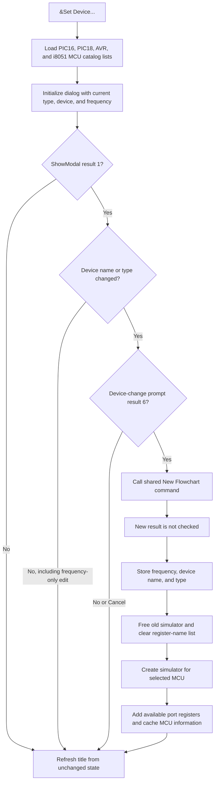

# &Set Device...

> Analysis status: Source-reviewed. The menu handler, Set Device dialog, catalog population, simulator replacement, and later compiler consumers establish the behavior below.

## Control

| Property | Recovered value |
| --- | --- |
| Form | FlowChartMainForm |
| Component path | FlowChartMainForm.MainMenu.mnTools.mnSetDevice |
| Control class | TMenuItem |
| Caption | &Set Device... |
| Hint | Not present in the recovered resource. |
| Handler name | mnSetDeviceClick |
| Handler address | 01053f40 |
| Graph node | `resource:dfm:FlowChartMainForm/FlowChartMainForm.MainMenu.mnTools.mnSetDevice` |
| Handler node | `function:01053f40` |
| Graph layer | UI |

## Dialog inputs and catalogs

`FUN_01053f40` obtains the shared catalog manager and prepares four device lists. The requested `[MCU]` catalog families correspond to the dialog's recovered type items: `PIC16`, `PIC18`, `AVR`, and `i8051`. The catalog loader expands `<COMMONCATDIR>` and `<CATALOGDIR>`, rejects `[Internal]` entries, applies the family filters, and adds matching catalog display names to the lists.

The handler creates `dlgFlowChartSetDevice` and initializes it with these lists and the current flowchart values:

| Dialog value | FlowChartMainForm field |
| --- | --- |
| Type code | `+0x9a0` |
| Device name | `+0x9b0` |
| Frequency | `+0x9b8` |

The dialog shows a read-only type list and a read-only device list. Changing the type replaces the device list with that family's catalog and selects its first entry. The initializer selects the current device name when the relevant list contains it. The recovered mapping helpers do not expose a reliable numeric value for each type, so this article does not invent that mapping.

## Dialog validation and cancellation

The dialog has a `TFloatEdit` for Frequency. Its error event shows the edit's supplied error text and sets a dialog error byte. `FormCloseQuery` rejects that close attempt when the byte is set, then clears the byte. This proves that a frequency parse or edit error can keep the dialog open. The recovered source does not expose an additional frequency range.

The OK button copies the selected device text and parsed frequency into dialog-private fields. A modal result other than `1` makes the menu handler discard the dialog and all staged values. No flowchart, simulator, title, file, or setting is changed, apart from an unconditional title refresh with the existing values.

## Change decision

After OK, the menu handler compares only the selected device name and type code with the current values. It does not compare the frequency.

- If the device name and type are unchanged, the handler discards all dialog values. A frequency-only edit is therefore not committed.
- If either the device name or type changed, it shows the localized `HDLStrings.Msg_FC_DeviceChanged` Yes, No, or Cancel prompt.
- Only modal result `6` continues. Every other result keeps the current device, frequency, model, and simulator.

## Accepted device change

For an accepted device change, the handler calls the shared New Flowchart command before it applies the selected device. If New is permitted, that command changes the document name to `noname`, clears its saved path, destroys every flowchart item, clears the model's modified state, and rebuilds the empty editor. The device change is therefore normally a destructive new-document operation, not an in-place conversion of the existing diagram.

The menu handler does not receive or test a success result from New. This has two important consequences:

- If the New command's modified-document prompt is canceled, New keeps the current flowchart model, but Set Device still applies the new type, name, and frequency and replaces the simulator.
- If New's Yes path starts a save and that save is canceled or returns false, New still clears the document because its own unsaved-change guard ignores the save result.

After New returns, `FUN_01053f40` performs these operations in order:

1. It stores the dialog frequency at `FlowChartMainForm + 0x9b8`.
2. It stores the selected device name at `+0x9b0` and type code at `+0x9a0`.
3. It frees the current VHDL DLL simulator object.
4. It clears the form's available-register string list at `+0x930`.
5. It creates a simulator for the new type and device name.
6. `FUN_01053210` checks candidate port registers against the new simulator, adds each available name to the list, and reads MCU information into `+0x9a4`, `+0x9a8`, and `+0x9ac`.
7. It updates the form caption. The caption uses the new MCU family display name.

The known register candidates include `PORTA` through `PORTG`. Four additional literals are not decoded in the recovered C, so their names remain unknown.

## Compiler, generated code, and persistence boundaries

Set Device does not compile or generate code. The later compiler coordinator `FUN_01050900` reads the stored type code to choose an architecture-specific generator. It passes the device name, frequency, cached MCU information, simulator, and flowchart model into that generator. This proves that the accepted values affect later code generation.

The command does not clear or recreate the debugger/generated-output object at `FlowChartMainForm + 0x9d8`. The Save ASM, Save HEX, and Save LST commands export from that later toolchain state; they are not called here. Existing generated output can therefore remain until a later compile or debugger path replaces it.

The handler writes no TFC file, generated-code file, INI value, registry value, or recent-file entry. It also does not mark a retained model as modified after changing the device. When New completes, the new blank model is unmodified. When New is blocked but the device change continues, the old model keeps its previous modified state. Persistence of the selected device outside the current form instance is not proven.

## Failure and partial-state boundaries

- Catalog, dialog, message, simulator DLL, register-query, and title exceptions propagate. There is no local exception handler.
- The commit is not transactional. The three selected fields are stored before the old simulator is freed. The available-register list is cleared before the new simulator and MCU information are ready.
- A failure after the old simulator is freed can leave the new fields installed without a working replacement simulator. A later failure can leave an incomplete register list or stale MCU information.
- No rollback to the prior device, model, simulator, title, or generated output is recovered.
- The dialog object and its four temporary device lists are destroyed on the normal exit path, including dialog Cancel and rejected device-change confirmation.

## Click flow

## Handler evidence

- [FUN_01053f40](../../../DecompiledSources/Tina16/functions/0000000001053F40__FUN_01053f40.c) builds the four catalog lists, initializes and shows the dialog, compares name and type, prompts, calls New without an outcome check, commits the three values, replaces the simulator, refreshes MCU data, and updates the title.
- [FUN_00fd82f0](../../../DecompiledSources/Tina16/functions/0000000000FD82F0__FUN_00fd82f0.c) stores the dialog working values and family lists, selects the current type and device, and fills the frequency editor.
- [FUN_017105e0](../../../DecompiledSources/Tina16/functions/00000000017105E0__FUN_017105e0.c) lazily creates the shared catalog manager and registers the common and product catalog directories.
- [FUN_01717260](../../../DecompiledSources/Tina16/functions/0000000001717260__FUN_01717260.c) filters catalog entries and fills the supplied family list.
- [FUN_00fd8430](../../../DecompiledSources/Tina16/functions/0000000000FD8430__FUN_00fd8430.c) copies the selected device text and parsed frequency into the dialog working fields. Its direct OK-control article owns its annotation.
- [FUN_0104f160](../../../DecompiledSources/Tina16/functions/000000000104F160__FUN_0104f160.c) is the shared New Flowchart command. Its article owns the unsaved-change and model-reset details.
- [FUN_01053210](../../../DecompiledSources/Tina16/functions/0000000001053210__FUN_01053210.c) probes candidate port registers and caches the new simulator's MCU information.
- [FUN_01050900](../../../DecompiledSources/Tina16/functions/0000000001050900__FUN_01050900.c) is a later compiler coordinator that consumes the selected type, device, frequency, simulator, and model.
- [FUN_01051360](../../../DecompiledSources/Tina16/functions/0000000001051360__FUN_01051360.c) updates the caption from the document and MCU family state.

## Resource evidence

- The recovered DFM binds `mnSetDevice.OnClick` to `mnSetDeviceClick` at `01053f40`.
- The menu caption is `&Set Device...`; it has no recovered hint, action, image, modal result, or glyph.
- The recovered `dlgFlowChartSetDevice` resource has the caption `Set Device`; labels `Type:`, `Devices:`, and `Frequency:`; `PIC16`, `PIC18`, `AVR`, and `i8051` type items; OK, Cancel, and Help buttons; and the event bindings used above.

## Analysis limits and ownership

- `FUN_01053f40`, `FUN_00fd82f0`, and `FUN_01053210` are annotated with this control.
- The dialog OK handler is reserved for its direct control article. New, caption, catalog, simulator DLL, and compiler or export helpers are evidence only here.
- The recovered source proves that the simulator is replaced. It does not prove that the external DLL call always succeeds or report its internal validation rules.
- The generated-output export articles own their file formats and output behavior. This article uses them only to establish what Set Device does not refresh.
