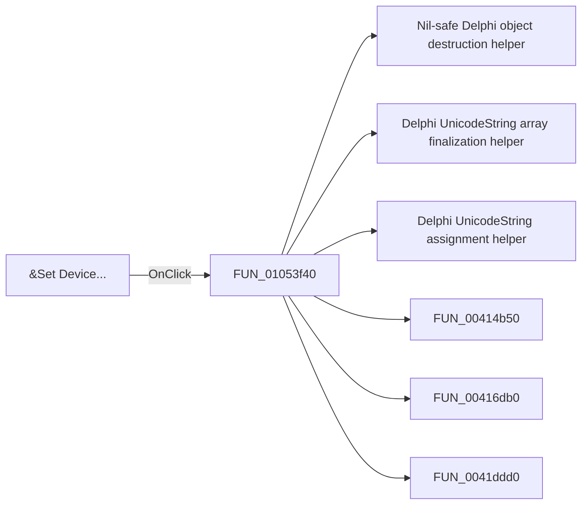

# &Set Device...

> Analysis status: Pending individual source review.

## Control

| Property | Recovered value |
| --- | --- |
| Form | FlowChartMainForm |
| Component path | FlowChartMainForm.MainMenu.mnTools.mnSetDevice |
| Control class | TMenuItem |
| Caption | &Set Device... |
| Hint | Not present in the recovered resource. |
| Text | Not present in the recovered resource. |
| Handler name | mnSetDeviceClick |
| Handler address | 01053f40 |
| Graph node | `resource:dfm:FlowChartMainForm/FlowChartMainForm.MainMenu.mnTools.mnSetDevice` |
| Handler node | `function:01053f40` |
| Graph layer | UI |

## What happens when clicked

Pending individual analysis. An agent must read the recovered handler source and its relevant callees before it replaces this text.

## Click flow

## Handler evidence

- Source: [DecompiledSources/Tina16/functions/0000000001053F40__FUN_01053f40.c](../../../DecompiledSources/Tina16/functions/0000000001053F40__FUN_01053f40.c)
- Recovered role: Not present in the recovered resource.
- Current graph summary: Handles 1 Delphi UI event: FlowChartMainForm.MainMenu.mnTools.mnSetDevice.OnClick.
- Current graph behavior: Not present in the recovered resource.
- Current graph evidence: Not present in the recovered resource.
- Complexity: complex
- Distinct outgoing calls: 23

## Direct calls

- `function:00410f20` — Nil-safe Delphi object destruction helper
- `function:00414560` — Delphi UnicodeString array finalization helper
- `function:00414ad0` — Delphi UnicodeString assignment helper
- `function:00414b50` — FUN_00414b50
- `function:00416db0` — FUN_00416db0
- `function:0041ddd0` — FUN_0041ddd0
- `function:00442620` — FUN_00442620
- `function:004b6930` — FUN_004b6930
- `function:0072d440` — FUN_0072d440
- `function:007fc180` — FUN_007fc180
- `function:00b89270` — FUN_00b89270
- `function:00b8e650` — FUN_00b8e650
- `function:00e031a0` — Calls the VHDL_DLL2.DLL export _CreateSimulatorObject.
- `function:00e031c0` — Calls the VHDL_DLL2.DLL export _FreeSimulatorObject.
- `function:00fd82f0` — FUN_00fd82f0
- `function:00fd84e0` — FUN_00fd84e0
- `function:00fd84f0` — FUN_00fd84f0
- `function:00fd8520` — FUN_00fd8520
- `function:0104f160` — New flowchart command coordinator
- `function:01051360` — Flowchart editor window-title updater
- `function:01053210` — FUN_01053210
- `function:017105e0` — FUN_017105e0
- `function:01717260` — FUN_01717260

## Resource evidence

- Kind: Not present in the recovered resource.
- Modal result: Not present in the recovered resource.
- Checked state: Not present in the recovered resource.
- List items: Not present in the recovered resource.
- Image reference: Not present in the recovered resource.
- Extracted glyph: None.

## Nearby label candidates

Nearby labels are layout candidates only. They are not proof of behavior.

- No same-parent label candidate is available.

## Analysis limits

- Do not infer behavior from the control class, caption, hint, glyph, or nearby label alone.
- Do not replace the pending status until the handler source and relevant call path provide enough evidence.
