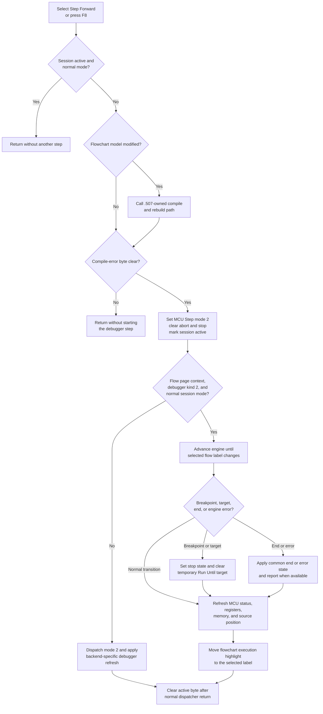

# Step Forward

> Analysis status: Complete. The recovered resource, keyboard dispatcher, command handler, execution dispatcher, and two visible backend routes support this explanation.

## Control

| Property | Recovered value |
| --- | --- |
| Form | FlowChartMainForm |
| Component path | FlowChartMainForm.MainMenu.mnDebug.mnStepForward |
| Control class | TMenuItem |
| Caption | Step Forward |
| Hint | Not present on the menu item. |
| Handler name | sbStepForwardClick |
| Handler address | 010529b0 |
| Graph node | `resource:dfm:FlowChartMainForm/FlowChartMainForm.MainMenu.mnDebug.mnStepForward` |
| Handler node | `function:010529b0` |
| Graph layer | UI |

The same handler is bound to the `sbStepForward` speed button. That button has the hint **Step Forward (F8)**. The form key handler calls `FUN_010529b0` for key code `0x77`, which is the Windows virtual-key value for F8. Thus, the menu item, toolbar button, and F8 use the same command path.

The toolbar resource contains a 32 by 16 bitmap with two 16 by 16 button states. Each state contains a right-pointing triangle and vertical bars. This glyph supports the forward-step meaning, but it does not identify the backend or the size of one step.

## What happens when selected

`FUN_010529b0` performs one synchronous debugger step. It does not toggle a breakpoint and it does not enter the shared continuous Run loop.

The handler first reads the debugger-session active byte. If execution is already active and the session's alternate-mode byte is clear, it returns immediately. This prevents a second Step Forward request from entering the normal backend while it is active. The recovered handler has no null check for the debugger-session pointer, so the UI is expected to expose this command only after that object exists.

Next, the handler checks the flowchart model's modified byte. If it is set, the handler calls the `.507`-owned compile and rebuild path. A successful rebuild clears the modified byte. That path also stores a compile-error byte on the main form. Step Forward reads this byte after the optional rebuild and stops if it is nonzero. This also means that a previously stored compile error can block the step when the model is not currently marked as modified.

When the gates pass, the handler:

1. Sets the MCU debug mode to value `2`, the recovered Step mode.
2. Clears the MCU aborted state.
3. Clears the main-form stop-request byte at `+0x6C4` and the debugger-session stop byte at `+0x33F8`.
4. Sets the debugger-session active byte at `+0x3454`.
5. Calls `FUN_01052800` with execution-mode value `2`.
6. Clears the active byte after the dispatcher returns normally.

The external setters return no status to this caller. The handler assumes that debug-mode and aborted-state changes succeed.

## Meaning of one step

`FUN_01052800` first calls `FUN_010527b0`. This predicate is true only when the selected page identifier equals one of two recovered FlowChart page identifiers and the debugger reports kind `2`. The exact Delphi names of the two page identifiers are not recovered.

For that context, while the session's alternate-mode byte is clear, the dispatcher uses the selected-label simulation route. It temporarily disables animated updates, enables the internal debug flag, and calls `FUN_00f8daa0` in step mode. That loop can call `_step_simulation_new` more than once. It stops the step after the MCU-selected flow label changes. Therefore, one user step is one visible flow statement or label transition on this route, not necessarily one low-level MCU instruction.

After the transition, Step mode requests the full debugger refresh. The code reads the current MCU status, maps it to the current source or flow position, rebuilds the register/status and memory views, and refreshes the source-position display. The dispatcher then reads the current selected-label string, clears the previous flowchart execution-highlight bit `0x20`, applies that bit to the node with the matching label, and rebuilds the flowchart editor when the form's update-suppression byte is clear.

For other supported contexts, `FUN_01052800` forwards value `2` to the debugger-session dispatcher. One visible backend compiles the design if needed, then advances `_step_simulation_new` until the MCU program counter or simulation time changes. It refreshes MCU status, registers, memory, and source position, and sets the session stop byte for mode `2`. The second alternate backend is selected through `FUN_00f8d310`; its lower-level step operation is not exposed clearly enough in the recovered source to claim the same PC-or-time rule.

## Breakpoints, end states, and errors

- The selected-label route checks the breakpoint flag for the next mapped flow line after an engine step. When it finds a breakpoint, it sets the stop byte, clears the active byte, and clears external and local Run Until state. Step Forward does not create, delete, or toggle the persistent breakpoint itself.
- The same loop checks the configured Run Until time predicate. If the target is reached, it stops and clears that temporary target.
- End and error status are handled by the common debugger status functions. The recovered code updates the current position and can send debugger-specific status messages after the engine stops.
- If `_step_simulation_new` returns zero on the selected-label route, the code shows `TINA: Internal error in the HDL engine` and leaves the loop. The outer dispatcher still performs its normal post-call refresh when control returns.
- One visible backend checks PIC supply state. If supply is off, it sets the stop byte, invalidates the current positions, refreshes the debugger views, and shows a localized error.
- No exception handler or rollback surrounds the external calls or the dispatcher. A raised error can bypass the final active-byte clear. The source does not prove recovery for that case.

Repeated clicks after a completed step start another step from the new current position. A repeated click during an active normal-backend call is ignored by the first guard. The alternate session mode does not use that early return, so its repeated-click behavior depends on the session dispatcher and UI message processing.

## State and persistence

The command changes the live MCU debug mode, aborted and stop flags, current execution position, debugger displays, and flowchart execution highlight. It does not call the breakpoint toggle, undo manager, flowchart modified-state setter, project serializer, settings writer, or a file-save routine.

If the model was modified, the shared compile path can rebuild generated debugger data and clears the model's modified byte only after success. The recovered Step Forward path does not establish which generated artifacts that compile path can write. The current execution marker and debugger position are runtime state in this path; no direct project or settings persistence is present.

## Click flow

## Source evidence

- Step Forward handler: [FUN_010529b0](../../../DecompiledSources/Tina16/functions/00000000010529B0__FUN_010529b0.c)
- FlowChart page and debugger-kind predicate: [FUN_010527b0](../../../DecompiledSources/Tina16/functions/00000000010527B0__FUN_010527b0.c)
- Execution dispatcher and position synchronization: [FUN_01052800](../../../DecompiledSources/Tina16/functions/0000000001052800__FUN_01052800.c)
- Keyboard dispatcher for F8: [FUN_0104e420](../../../DecompiledSources/Tina16/functions/000000000104E420__FUN_0104e420.c)
- `.507`-owned compile and rebuild entry plus compile-error state: [FUN_01053ee0](../../../DecompiledSources/Tina16/functions/0000000001053EE0__FUN_01053ee0.c), [FUN_01053ec0](../../../DecompiledSources/Tina16/functions/0000000001053EC0__FUN_01053ec0.c), and [FUN_01053ed0](../../../DecompiledSources/Tina16/functions/0000000001053ED0__FUN_01053ed0.c)
- Selected-label simulation loop, breakpoint and Run Until checks, and internal-error message: [FUN_00f8daa0](../../../DecompiledSources/Tina16/functions/0000000000F8DAA0__FUN_00f8daa0.c)
- MCU status and full debugger refresh: [FUN_00f8d910](../../../DecompiledSources/Tina16/functions/0000000000F8D910__FUN_00f8d910.c)
- PC-or-time step backend and PIC supply error: [FUN_00f8cb00](../../../DecompiledSources/Tina16/functions/0000000000F8CB00__FUN_00f8cb00.c)
- Current-label flowchart highlight: [FUN_00f65450](../../../DecompiledSources/Tina16/functions/0000000000F65450__FUN_00f65450.c)
- Recovered form, menu, toolbar, hint, event, and glyph metadata: [ui-evidence.json](../../../DecompiledSources/Tina16/resources/dfm/ui-evidence.json) and [glyph manifest](../../../glyph/manifest.json)

## Analysis limits and ownership

- `FUN_010527b0` compares the current page identifier with two global values, but the flat recovered image does not preserve their Delphi field names. This article does not assign names to those pages.
- The alternate-mode route through `FUN_00f8d310` does not expose a complete instruction-level step in the recovered function. The PC-or-time rule is stated only for the visible `FUN_00f8cb00` backend.
- The MCU engine is in `VHDL_DLL2.DLL`. Its internal scheduling, status generation, and exception behavior are outside the recovered application source.
- `.509` owns the unique handler `FUN_010529b0`, context predicate `FUN_010527b0`, and execution dispatcher `FUN_01052800`. `.507` owns shared modified-flowchart preparation `FUN_01053ee0`. Low-level session accessors, engine loops, breakpoint helpers, and display refresh functions remain evidence-only here.
