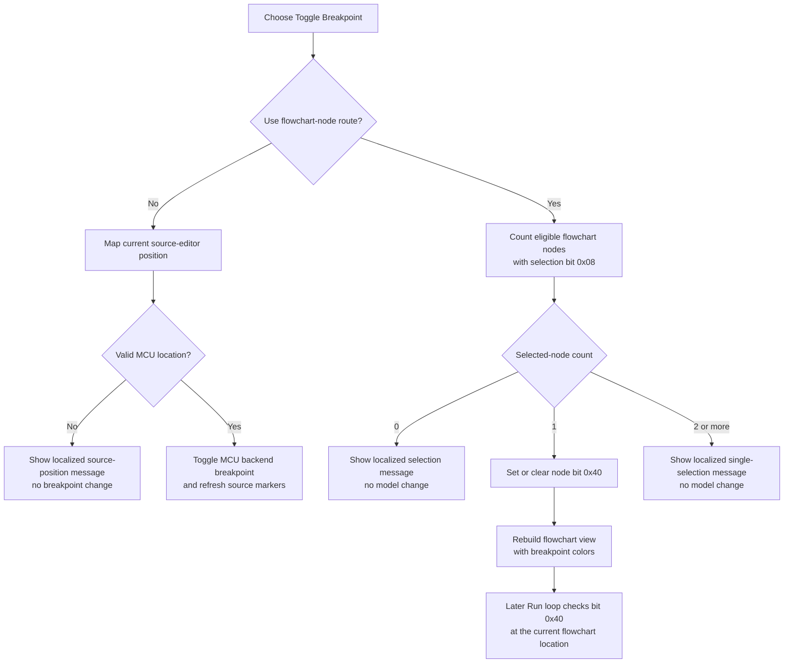

# Toggle a source or flowchart breakpoint

> Analysis status: Complete. The recovered dispatcher, node-selection scan, breakpoint flag helpers, renderer, serializer, source-editor backend path, and run loop establish both supported breakpoint routes and their state boundaries.

## Control

| Property | Recovered value |
| --- | --- |
| Form | FlowChartMainForm |
| Component path | FlowChartMainForm.MainMenu.mnDebug.mnToggleBreakpoint |
| Control class | TMenuItem |
| Caption | Toggle Breakpoint |
| Hint | Not present in the recovered resource. |
| Handler name | sbToggleBreakPointClick |
| Handler address | 01052da0 |
| Graph node | `resource:dfm:FlowChartMainForm/FlowChartMainForm.MainMenu.mnDebug.mnToggleBreakpoint` |
| Handler node | `function:01052da0` |
| Graph layer | UI |

## What happens when clicked

`FUN_01052da0` dispatches the command to one of two breakpoint implementations according to the current editor context:

1. **MCU source-editor route:** If the recovered flowchart-context test is false, or a second form-object identity guard matches, the handler delegates to the MCU source-editor breakpoint helper. That helper maps the current source-editor position to an MCU program location, calls `_MCU_ToggleBreakPoint`, and refreshes source breakpoint markers and the editor position display.
2. **Flowchart-node route:** In the other supported context, the handler scans the flowchart model for eligible nodes whose selection flag `0x08` is set. Exactly one such node must be selected. The handler toggles that node's breakpoint flag `0x40` and rebuilds the flowchart editor.

The handler ignores the menu-item sender. The same method is bound to the toolbar **Toggle BreakPoint** speed button, and the form key handler also calls it for recovered key code `0x74` in two editor-control contexts.

## Flowchart selection and breakpoint state

The flowchart selector `FUN_00f752b0` scans the model collection reached through form field `+0x980`. It excludes the recovered node kind whose byte at `+0x30` equals `10`, and it counts nodes with selection bit `0x08`.

- **No eligible selected node:** The handler resolves localization key `HDLStrings.Msg_FC_Breakp_Sel2` and shows the resulting message. It does not change a node or rebuild the editor.
- **Exactly one selected node:** `FUN_00f6f920` tests breakpoint bit `0x40`. If clear, it sets the bit; if set, it clears the bit. The handler then calls the flowchart rebuild wrapper.
- **Two or more eligible selected nodes:** The handler resolves localization key `HDLStrings.Msg_FC_Breakp_Sel` and shows the resulting message. It does not change any node or rebuild the editor.

A breakpoint is therefore a Boolean flag on the selected model node, not a separate list entry. Repeating the command on the same node removes the breakpoint; it cannot create duplicate breakpoint records for that node.

The flowchart renderer `FUN_00f63320` reads bit `0x40` and applies the recovered breakpoint-specific fill and border colors. The rebuild after a successful toggle makes that visual state current. The menu item itself has no recovered checked state, and the handler does not set `TMenuItem.Checked`.

## Source-editor and backend synchronization

The shared source-editor helper `FUN_00f8e0c0` follows a different path:

1. It checks that the editor has a usable current position.
2. It obtains the current source coordinates and maps them to a program location.
3. If mapping succeeds, it passes the mapped source location through a shared source helper, calls `_MCU_ToggleBreakPoint` with the MCU backend object and mapped location, and refreshes editor breakpoint markers and position state.
4. If the editor position or mapping is not usable, it shows one of the localized messages identified by resource IDs `0x89B` or `0x89A` instead of calling the backend.

This source route updates the active MCU breakpoint backend immediately. It does not toggle flowchart node bit `0x40`.

The recovered context predicate `FUN_010527b0` allows the flowchart route only when the active editor class matches one of two recovered class references and the associated editor/debug state equals `2`. The additional object-identity guard in `FUN_01052da0` can still force the source-editor route. The original Delphi names of these state values and fields are not recovered, so this article does not assign them stronger names.

## Compile, run, and persistence boundaries

The command does not compile, start, pause, stop, or step execution. It also has no explicit running-state guard. Menu enablement can restrict normal UI use, but the handler itself performs the context checks described above and then toggles the chosen breakpoint state.

For the flowchart route, the later Run loop calls `FUN_010521e0` with the current debug-location text. That helper finds the corresponding model node and tests its `0x40` flag. When the flag is set, the run loop changes debugger continuation state so execution stops at that node. Thus, the click does not send a flowchart breakpoint to `_MCU_ToggleBreakPoint`; the flowchart execution loop reads the model flag later.

The model writer `FUN_00f6e330` writes the node byte at `+0x10`, and the matching reader `FUN_00f6e520` restores it. Breakpoint bit `0x40` is in that byte, so it is included when the flowchart model is later serialized. This handler does not start a save or set a recovered document-dirty or title flag. Persistence of the source-editor backend breakpoint is not established by this click path.

## Toggle flow

## Errors and partial failures

- Zero or multiple eligible flowchart selections are handled message paths, not exceptions. They leave all node breakpoint flags unchanged.
- An unusable source position or failed program-location mapping produces a localized message and does not call `_MCU_ToggleBreakPoint`.
- The flowchart route has no local exception handler or rollback. It changes bit `0x40` before rebuilding the view. If rebuild fails, the model retains the new breakpoint state while the visual state can remain stale.
- The source route calls the MCU backend before its final editor refresh. If the later refresh fails, the backend breakpoint can be changed while the displayed markers remain stale.
- The handler does not report a success value. Localized message, backend, allocation, and redraw exceptions propagate through the Delphi runtime.
- The recovered source does not prove that a breakpoint change is allowed while every possible compile or run state is active. It proves only that this handler has no separate compile/run-state rejection branch.

## Evidence

- [Toggle Breakpoint handler `FUN_01052da0`](../../../DecompiledSources/Tina16/functions/0000000001052DA0__FUN_01052da0.c) selects the source or flowchart route, enforces the selected-node count, toggles bit `0x40`, and rebuilds after a flowchart change.
- [Shared context predicate `FUN_010527b0`](../../../DecompiledSources/Tina16/functions/00000000010527B0__FUN_010527b0.c) tests the active editor class and recovered state value `2`.
- [MCU source-editor breakpoint helper `FUN_00f8e0c0`](../../../DecompiledSources/Tina16/functions/0000000000F8E0C0__FUN_00f8e0c0.c) maps the current source position, calls `_MCU_ToggleBreakPoint`, shows invalid-position messages, and refreshes the source editor.
- [Flowchart selection scan `FUN_00f752b0`](../../../DecompiledSources/Tina16/functions/0000000000F752B0__FUN_00f752b0.c) counts eligible nodes with selection flag `0x08` and returns the last matching node.
- [Node flag toggle `FUN_00f6f920`](../../../DecompiledSources/Tina16/functions/0000000000F6F920__FUN_00f6f920.c) sets or clears the requested flag according to its current state.
- [Flowchart rebuild wrapper `FUN_010508e0`](../../../DecompiledSources/Tina16/functions/00000000010508E0__FUN_010508e0.c) rebuilds the editor from the current model.
- [Flowchart node renderer `FUN_00f63320`](../../../DecompiledSources/Tina16/functions/0000000000F63320__FUN_00f63320.c) applies breakpoint-specific drawing colors when bit `0x40` is set.
- [Breakpoint lookup `FUN_010521e0`](../../../DecompiledSources/Tina16/functions/00000000010521E0__FUN_010521e0.c) finds a node by debug-location text and tests its breakpoint bit.
- [Run handler `FUN_01052a70`](../../../DecompiledSources/Tina16/functions/0000000001052A70__FUN_01052a70.c) checks the current flowchart node's breakpoint flag during its execution loop and stops continuation at a flagged node. Bead `TIARA-diz.6.7.507` owns that handler.
- [Flowchart node writer `FUN_00f6e330`](../../../DecompiledSources/Tina16/functions/0000000000F6E330__FUN_00f6e330.c) writes the flag byte at node offset `+0x10`.
- [Flowchart node reader `FUN_00f6e520`](../../../DecompiledSources/Tina16/functions/0000000000F6E520__FUN_00f6e520.c) restores the same flag byte.
- [Form key handler `FUN_0104e420`](../../../DecompiledSources/Tina16/functions/000000000104E420__FUN_0104e420.c) routes recovered key code `0x74` to this same command in two editor-control contexts.
- [Recovered form and control properties](../../../DecompiledSources/Tina16/resources/dfm/ui-evidence.json) bind both the menu item and toolbar button to `sbToggleBreakPointClick`.

## Direct calls and annotation ownership

- `function:010527b0` - checks whether the recovered flowchart editor context is active.
- `function:00f8e0c0` - owns the shared source-editor and MCU-backend breakpoint route.
- `function:00f752b0` - scans selected eligible flowchart nodes.
- `function:00f6f920` - toggles node flag `0x40`.
- `function:010508e0` - rebuilds the flowchart view and already has a canonical graph annotation.
- Localization and message helpers resolve and display the zero-selection and multiple-selection messages.
- This fragment owns only `FUN_01052da0`. Shared context, selection, flag, rebuild, render, run, backend, and serialization functions remain evidence-only for their canonical owners.

## Resource and glyph evidence

- The menu item has caption **Toggle Breakpoint**. It has no recovered hint, image, checked state, auto-check state, or shortcut.
- The same handler is bound to `FlowChartMainForm.pnToolbar.sbToggleBreakPoint`, whose hint is **Toggle BreakPoint**.
- The toolbar button contains a two-frame 32 by 16 bitmap whose active frame shows a red breakpoint dot: [`0167_FlowChartMainForm_FlowChartMainForm_pnToolbar_sbToggleBreakPoint_Glyph_Data.png`](../../../glyph/0167_FlowChartMainForm_FlowChartMainForm_pnToolbar_sbToggleBreakPoint_Glyph_Data.png).
- The shared caption, hint, and glyph support breakpoint intent. The bit toggle, MCU backend call, renderer, and run-loop check establish the behavior.

## Analysis limits

- The localized fallback strings referenced through `PTR_PTR_020049f0` and `PTR_PTR_020058f8` were not recovered as readable literals. This article identifies their selection-count branches and localization keys without inventing exact message text.
- The original Delphi names for flowchart flag bits `0x08` and `0x40`, the context state value `2`, and the object-identity guard are absent. Their selection, breakpoint, dispatch, render, and execution effects are established by repeated use.
- The source-editor route's long-term breakpoint persistence is outside the recovered handler. The flowchart model serialization path is proven separately.
