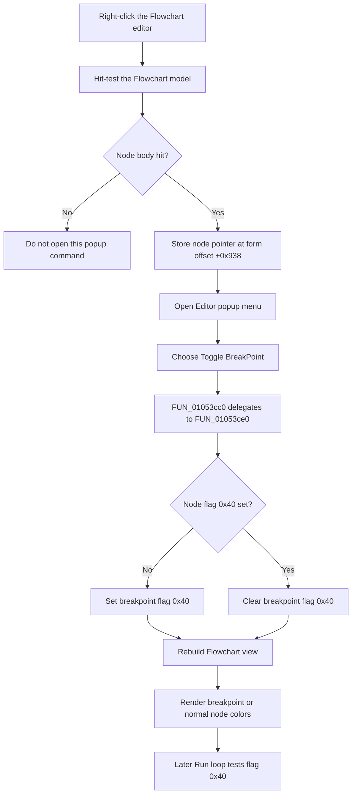

# Toggle the right-clicked Flowchart node breakpoint

> Analysis status: Reviewed from the popup wrapper, right-click hit test, node-state toggle, renderer, run loop, and model serialization path.

## Control

| Property | Recovered value |
| --- | --- |
| Form | FlowChartMainForm |
| Component path | FlowChartMainForm.pcMain.tsEditor.Editor.mnPopupEditor.mnToggleBreakPoint |
| Control class | TMenuItem |
| Parent page | `tsEditor`, caption **Flowchart** |
| Caption | `Toggle &BreakPoint`, inherited from `TFlowChartEditorFrame` |
| Hint | Not present in the recovered resource. |
| Handler name | EditormnToggleBreakPointClick |
| Handler address | 01053cc0 |
| Graph node | `resource:dfm:FlowChartMainForm/FlowChartMainForm.pcMain.tsEditor.Editor.mnPopupEditor.mnToggleBreakPoint` |
| Handler node | `function:01053cc0` |
| Graph layer | UI |

## What happens when clicked

This menu item toggles a breakpoint on the graphical Flowchart node that the
user right-clicked. It does not use the current text-source line and it does
not apply the command to all selected nodes.

`TFlowChartMainForm.EditormnToggleBreakPointClick` is a one-call wrapper. It
delegates to `FUN_01053ce0`, which:

1. reads the stored popup target from form offset `+0x938`;
2. toggles flag `0x40` in that node's state word at node offset `+0x10`;
3. rebuilds the current Flowchart view.

If flag `0x40` is clear, the helper sets it. If it is set, the helper clears
it. The command therefore stores one Boolean breakpoint state on the node. It
does not create a breakpoint record or add an entry to a list. Repeating the
command on the same node removes the breakpoint instead of creating a
duplicate.

## How the popup target is selected

The PaintBox `OnMouseDown` handler establishes the target before this menu
handler runs. In the normal UI path, it handles the right mouse button as
follows:

1. It converts the click position to Flowchart coordinates.
2. It searches the active Flowchart model for the object body at that point.
3. It stores the returned node pointer at form offset `+0x938`.
4. It opens the active editor frame's popup menu only when the pointer is
   nonzero and the hit classification is `2`, the recovered object-body hit.

This makes the popup target the node under the right-click, not necessarily a
node whose selection bit `0x08` is set. The toggle implementation does not
scan the selection, count selected nodes, or reject a node kind. These are
important differences from the main **Debug > Toggle Breakpoint** command.

The same shared popup implementation is called by the corresponding menu in
`Editor2` on the combined **Flowchart+Code** page. Bead
`TIARA-diz.6.7.533` owns that second wrapper.

## Visual result

The Flowchart renderer tests node flag `0x40`. A set flag selects the recovered
breakpoint-specific fill and border color slots. A clear flag selects the
normal or selection-dependent colors. `FUN_01053ce0` rebuilds the editor after
the toggle, so the new marker colors appear immediately when the rebuild
succeeds.

The popup menu item has no recovered `Checked` state, image, or glyph. The UI
does not show the breakpoint state by checking this menu item. The node drawing
is the visual indication.

## Source editor and MCU backend boundary

Although the embedded frame is named `Editor`, it is the graphical
`TFlowChartEditorFrame` on the **Flowchart** page. This click does not:

- read a source-text caret or source line;
- map source coordinates to an MCU program location;
- call `_MCU_ToggleBreakPoint`;
- refresh MCU source-editor breakpoint markers.

The main command documented by Bead `TIARA-diz.6.7.510` can select either an
MCU source-backend route or a selected-Flowchart-node route. This popup bypasses
that dispatcher and changes only the right-clicked Flowchart node's flag.

## Compile, run, and persistence

The click does not compile, start, pause, stop, or step the program. It has no
separate compile-state or run-state guard.

During later Flowchart execution, the Run loop gets the current debug-location
text, finds the matching model node, and tests flag `0x40`. When the flag is
set, the loop stops debugger continuation at that node. The popup click itself
does not call the run loop or the MCU backend.

The model writer saves the byte at node offset `+0x10`, and the matching reader
restores it. Breakpoint flag `0x40` is part of that byte. A later Flowchart
model save can therefore persist the changed breakpoint state. This handler
does not start a save, write a file, update a registry setting, or set a
recovered document-modified or title flag.

## Toggle flow

## Guards, no-op paths, and errors

- The normal right-click path does not open the popup when no object body is
  found. Therefore, no click event occurs and no state changes through that
  path.
- Once this handler runs, it has no unchanged-state guard. It always inverts
  flag `0x40` and requests a rebuild.
- The shared implementation does not check the stored target for null before
  it calls the flag helper. Direct or programmatic invocation without a valid
  popup target can therefore dereference an invalid pointer. There is no local
  error message or recovery branch.
- The flag changes before the rebuild call. If rebuilding fails, the model can
  contain the new flag while the displayed node keeps stale colors.
- The handler has no local exception handler, transaction, result value,
  confirmation, or rollback. Flag and rebuild exceptions propagate through
  the Delphi runtime.
- The popup-target field is not cleared by this handler. Normal use refreshes
  it during the next valid right-click before the popup opens.

## Evidence

- [Popup wrapper `FUN_01053cc0`](../../../DecompiledSources/Tina16/functions/0000000001053CC0__FUN_01053cc0.c) delegates directly to the shared target-toggle implementation.
- [Shared popup-target toggle `FUN_01053ce0`](../../../DecompiledSources/Tina16/functions/0000000001053CE0__FUN_01053ce0.c) passes the node stored at form offset `+0x938` and mask `0x40` to the flag toggle, then calls the Flowchart rebuild wrapper.
- [PaintBox mouse-down handler `FUN_0104e8d0`](../../../DecompiledSources/Tina16/functions/000000000104E8D0__FUN_0104e8d0.c) obtains the right-click target, stores it at `+0x938`, and opens the active frame popup only for a nonzero object-body hit.
- [Flowchart hit test `FUN_00f74ae0`](../../../DecompiledSources/Tina16/functions/0000000000F74AE0__FUN_00f74ae0.c) returns the model node whose object body contains the click position and reports hit classification `2`.
- [Node flag toggle `FUN_00f6f920`](../../../DecompiledSources/Tina16/functions/0000000000F6F920__FUN_00f6f920.c) tests the supplied flag and calls the set or clear helper.
- [Flowchart rebuild wrapper `FUN_010508e0`](../../../DecompiledSources/Tina16/functions/00000000010508E0__FUN_010508e0.c) rebuilds the editor from the current model.
- [Flowchart renderer `FUN_00f63320`](../../../DecompiledSources/Tina16/functions/0000000000F63320__FUN_00f63320.c) uses node flag `0x40` to select breakpoint-specific drawing colors.
- [Breakpoint lookup `FUN_010521e0`](../../../DecompiledSources/Tina16/functions/00000000010521E0__FUN_010521e0.c) finds the current debug-location node and reports whether flag `0x40` is set.
- [Run handler `FUN_01052a70`](../../../DecompiledSources/Tina16/functions/0000000001052A70__FUN_01052a70.c) uses that lookup to stop Flowchart continuation at a breakpoint. Bead `TIARA-diz.6.7.507` owns its annotation.
- [Flowchart node writer `FUN_00f6e330`](../../../DecompiledSources/Tina16/functions/0000000000F6E330__FUN_00f6e330.c) writes the node-state byte that contains flag `0x40`.
- [Flowchart node reader `FUN_00f6e520`](../../../DecompiledSources/Tina16/functions/0000000000F6E520__FUN_00f6e520.c) restores the same state byte.
- [Sibling wrapper `FUN_01053cd0`](../../../DecompiledSources/Tina16/functions/0000000001053CD0__FUN_01053cd0.c) delegates the `Editor2` popup item to the same implementation.
- [Recovered component tree](../../../DecompiledSources/Tina16/resources/dfm/ui-evidence.json) identifies `Editor` as a `TFlowChartEditorFrame` on the **Flowchart** page, binds this inherited popup item to `EditormnToggleBreakPointClick`, and supplies the inherited `Toggle &BreakPoint` caption.

## Resource evidence

- The embedded `Editor` frame is on `tsEditor`, caption **Flowchart**.
- The frame template supplies popup caption `Toggle &BreakPoint`; the embedded
  child resource overrides only its event handler.
- This embedded menu item has no recovered hint, action, image, glyph, checked
  state, default state, or shortcut.
- Breakpoint meaning is confirmed by the `0x40` state transition, renderer,
  run-loop consumer, and serialization path, not by the inherited caption
  alone.

## Annotation ownership and analysis limits

- This Bead owns wrapper `FUN_01053cc0` and shared popup-target implementation
  `FUN_01053ce0`.
- Bead `TIARA-diz.6.7.533` owns only sibling wrapper `FUN_01053cd0` and must use
  the exact shared fields from this fragment if it duplicates them.
- Bead `TIARA-diz.6.7.510` owns main command `FUN_01052da0`. Generic flag,
  rebuild, render, run, and serialization helpers remain evidence-only here.
- The original Delphi names for form field `+0x938` and node flag `0x40` are not
  recovered. Their popup-target and breakpoint roles follow from target
  acquisition, toggling, rendering, execution, and serialization evidence.
- The recovered source does not prove how compilation transforms or retains
  the current in-memory model. This article claims only that this click does
  not call the compiler and that the later Run loop reads the model flag.
