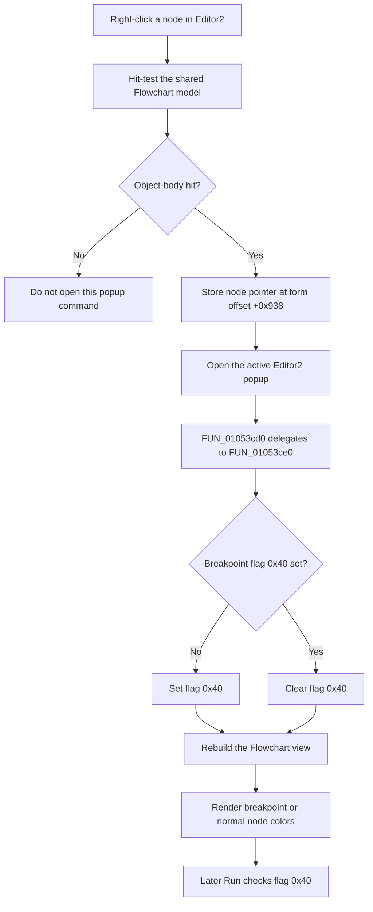

# Toggle the right-clicked Flowchart+Code node breakpoint

> Analysis status: Reviewed from the Editor2 wrapper, page-selection logic, shared paint-box mouse handler, breakpoint state change, renderer, run loop, and model serialization path.

## Control

| Property | Recovered value |
| --- | --- |
| Form | FlowChartMainForm |
| Component path | FlowChartMainForm.pcMain.tsEditorAndCode.pnEditor2.Editor2.mnPopupEditor.mnToggleBreakPoint |
| Control class | TMenuItem |
| Parent page | `tsEditorAndCode`, caption **Flowchart+Code** |
| Caption | `Toggle &BreakPoint`, inherited from `TFlowChartEditorFrame` |
| Hint | Not present in the recovered resource. |
| Handler name | Editor2mnToggleBreakPointClick |
| Handler address | 01053cd0 |
| Graph node | `resource:dfm:FlowChartMainForm/FlowChartMainForm.pcMain.tsEditorAndCode.pnEditor2.Editor2.mnPopupEditor.mnToggleBreakPoint` |
| Handler node | `function:01053cd0` |
| Graph layer | UI |

## What happens when clicked

This popup item toggles the breakpoint flag on the graphical Flowchart node that the user right-clicked in `Editor2`. `Editor2` is the `TFlowChartEditorFrame` in the left pane of the combined **Flowchart+Code** page. The command does not use a caret or source line from the adjacent code pane.

`TFlowChartMainForm.Editor2mnToggleBreakPointClick` is a one-call wrapper. It delegates to the shared popup-target implementation `FUN_01053ce0`, which is owned by Bead `TIARA-diz.6.7.530`. The shared function:

1. reads the node pointer stored at form offset `+0x938`;
2. toggles flag `0x40` in that node's state byte at node offset `+0x10`;
3. rebuilds the Flowchart view.

If the flag is clear, the helper sets it. If it is set, the helper clears it. The breakpoint is therefore one Boolean flag on the node, not a separate list item. A repeated click after a new right-click on the same node removes the breakpoint.

## How Editor2 supplies the popup target

The main page-change handler selects the second editor-frame field at form offset `+0x810` as the active frame when the combined page becomes active. The embedded `Editor2.pbEditor` paint box and the standalone `Editor.pbEditor` paint box both call `FUN_0104e8d0` on `OnMouseDown`.

For the normal Editor2 popup path, that handler:

1. converts the right-click position to Flowchart coordinates;
2. hit-tests the shared Flowchart model;
3. stores the returned node pointer at form offset `+0x938`;
4. opens the active frame's popup only when the pointer is nonzero and the recovered hit class is `2`, an object-body hit.

This proves that the command applies to the node below the Editor2 right-click. It does not scan selected nodes or use selection flag `0x08`. The stored popup target can differ from the currently selected node.

## Visual, execution, and persistence effects

The Flowchart renderer tests node flag `0x40`. A set flag selects the recovered breakpoint fill and border colors. A clear flag selects the normal or selection-dependent colors. The shared implementation rebuilds the view after the state change, so a successful rebuild shows the new node colors immediately. The popup menu item itself has no recovered `Checked` state, image, or glyph.

The click does not compile, start, pause, stop, or step execution. During a later Flowchart run, the run path finds the model node for the current debug location and tests flag `0x40`. A set flag stops continuation at that node. This popup does not call `_MCU_ToggleBreakPoint` and does not update source-editor breakpoint markers.

The Flowchart model writer and reader save and restore the complete node state byte at `+0x10`, which includes flag `0x40`. A later Flowchart save can therefore persist the change. This click does not start a save, set a recovered modified-state flag, update the title, or write settings.

## Click flow

## Guards, no-op paths, and errors

- A right-click that does not hit an object body does not open this popup. No toggle event occurs and no model state changes through that normal path.
- Once this handler runs, it has no unchanged-state guard. It always delegates to the state inversion and rebuild.
- The shared implementation does not validate the stored pointer before it calls the flag helper. A direct or programmatic call without a valid popup target can dereference an invalid pointer.
- The flag changes before the rebuild. If rebuilding fails, the model can retain the new breakpoint flag while the visible colors remain stale.
- The wrapper and shared implementation have no local exception handler, rollback, confirmation, or error message. An exception propagates through the Delphi runtime.
- The target field is not cleared after the click. A later valid right-click replaces it before opening the popup.

## Evidence

- [Editor2 wrapper `FUN_01053cd0`](../../../DecompiledSources/Tina16/functions/0000000001053CD0__FUN_01053cd0.c) contains only a call to the shared popup-target implementation and a return.
- [Shared popup-target toggle `FUN_01053ce0`](../../../DecompiledSources/Tina16/functions/0000000001053CE0__FUN_01053ce0.c) passes the node at form offset `+0x938` and mask `0x40` to the flag toggle, then calls the Flowchart rebuild wrapper. Bead `TIARA-diz.6.7.530` owns this function.
- [Main page-change handler `FUN_0104eb00`](../../../DecompiledSources/Tina16/functions/000000000104EB00__FUN_0104eb00.c) selects the frame at form offset `+0x810` as the active frame for the combined page and selects the standalone frame at `+0x7f8` for the Flowchart page.
- [Runtime page mapper `FUN_01051600`](../../../DecompiledSources/Tina16/functions/0000000001051600__FUN_01051600.c) maps logical page index `2` to the runtime value tested by the combined-page branch. The recovered DFM order identifies index `2` as **Flowchart+Code**.
- [Shared paint-box mouse-down handler `FUN_0104e8d0`](../../../DecompiledSources/Tina16/functions/000000000104E8D0__FUN_0104e8d0.c) stores the hit-test result at `+0x938` and opens the active frame popup only for a nonzero target with hit class `2`.
- [Node flag toggle `FUN_00f6f920`](../../../DecompiledSources/Tina16/functions/0000000000F6F920__FUN_00f6f920.c) sets or clears the supplied bit according to its current state.
- [Flowchart rebuild wrapper `FUN_010508e0`](../../../DecompiledSources/Tina16/functions/00000000010508E0__FUN_010508e0.c) rebuilds the current Flowchart model view.
- [Flowchart renderer `FUN_00f63320`](../../../DecompiledSources/Tina16/functions/0000000000F63320__FUN_00f63320.c) selects breakpoint-specific node colors when flag `0x40` is set.
- [Breakpoint lookup `FUN_010521e0`](../../../DecompiledSources/Tina16/functions/00000000010521E0__FUN_010521e0.c) finds the current debug-location node and tests flag `0x40`.
- [Flowchart node writer `FUN_00f6e330`](../../../DecompiledSources/Tina16/functions/0000000000F6E330__FUN_00f6e330.c) and [reader `FUN_00f6e520`](../../../DecompiledSources/Tina16/functions/0000000000F6E520__FUN_00f6e520.c) save and restore the state byte that contains the breakpoint flag.
- [Recovered component tree](../../../DecompiledSources/Tina16/resources/dfm/ui-evidence.json) places `Editor2` on **Flowchart+Code**, binds its paint box to the shared mouse handler, and binds this inherited popup item to `Editor2mnToggleBreakPointClick`.
- [Standalone popup analysis](mntogglebreakpoint-4d95c0a04a.md) documents the shared implementation owned by `.530`; [main Toggle Breakpoint analysis](mntogglebreakpoint-038e7da221.md) documents the source-or-selected-node dispatcher owned by `.510`.

## Resource evidence

- `Editor2` is a `TFlowChartEditorFrame` inside `pnEditor2` on the page captioned **Flowchart+Code**.
- The frame template supplies the caption `Toggle &BreakPoint`. The embedded menu item overrides only its event handler.
- This menu item has no recovered hint, image, glyph, checked state, action, default state, or shortcut.
- The caption supports the breakpoint intent, but the target acquisition, flag toggle, rendering, run-loop consumer, and serialization establish the behavior.

## Annotation ownership and analysis limits

- This Bead owns only wrapper `FUN_01053cd0`.
- Bead `TIARA-diz.6.7.530` owns shared implementation `FUN_01053ce0`. Bead `TIARA-diz.6.7.510` owns main command `FUN_01052da0`. This fragment does not duplicate either annotation.
- Generic hit-test, flag, rebuild, render, run, and serialization helpers remain evidence-only here.
- The original Delphi names for form fields `+0x810`, `+0x938`, and node flag `0x40` are not recovered. Their active-frame, popup-target, and breakpoint roles follow from the page switch, resource binding, target acquisition, state change, renderer, run loop, and serializer.
- The source does not prove how a later compile transforms or retains the current in-memory model. This article claims only that the popup click does not call the compiler and that later Flowchart execution reads the flag.
