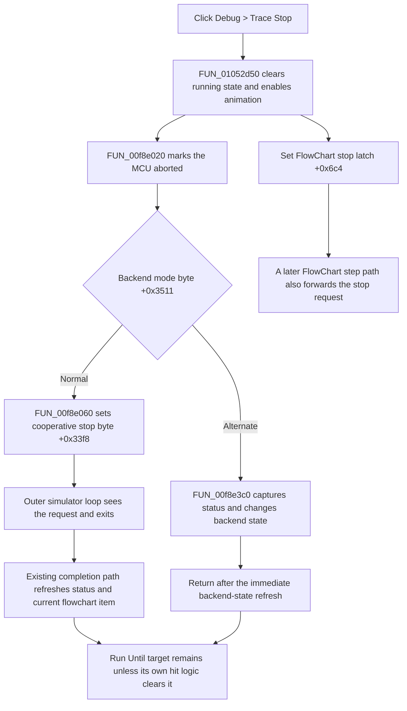

# Request that FlowChart tracing stop

> Analysis status: Complete. The recovered menu and toolbar resources, click handler, backend stop dispatcher, simulator run loop, and FlowChart refresh path support this explanation.

## Control

| Property | Recovered value |
| --- | --- |
| Form | FlowChartMainForm |
| Component path | FlowChartMainForm.MainMenu.mnDebug.mnTraceStop |
| Control class | TMenuItem |
| Parent menu | Debug |
| Caption | Trace Stop |
| Hint | Not present in the recovered menu resource. |
| Handler name | sbTraceStopClick |
| Handler address | 01052d50 |
| Graph node | `resource:dfm:FlowChartMainForm/FlowChartMainForm.MainMenu.mnDebug.mnTraceStop` |
| Handler node | `function:01052d50` |
| Graph layer | UI |

## What happens when clicked

`FUN_01052d50` sends a stop request to the active FlowChart debugger at form field `+0x9d8`. In source order, it:

1. clears the debugger's running byte at `+0x3454`;
2. enables debugger animation at `+0x3472` and calls the VHDL MCU `SetAnimate` export;
3. calls the backend stop dispatcher, which marks the MCU aborted; and
4. sets a FlowChart-form stop latch at `+0x6c4`.

The same handler is bound to the toolbar **Stop** speed button. The toolbar hint and square stop glyph agree with this behavior, but the handler and run-loop state changes are the proof of the command's effect.

The handler does not ask for confirmation and does not wait for a stopped-state result. It only updates in-memory state and returns.

## Normal run-loop stop

For the normal backend mode, `FUN_00f8e020` calls `_MCU_SetAborted(..., 1)` and `FUN_00f8e060` sets debugger byte `+0x33f8` to `1`. `FUN_00f8daa0` executes the simulator while that byte is zero. It pumps application messages during the loop, so this menu command can run while the outer Run handler is still active. At the next loop check, the nonzero byte ends execution.

After the loop exits, its existing completion path reads current MCU status, updates debugger location and status data, and refreshes the animated debugger views. In the FlowChart-driven stepping path, the outer Run handler then retrieves the current source item, moves the flowchart highlight to it, and calls the FlowChart rebuild wrapper. These are consequences of the run loop returning. `FUN_01052d50` does not directly rebuild the flowchart, reset a toolbar button, or change menu enablement.

The form latch at `+0x6c4` supplies the same request to `FUN_01052800`: if a FlowChart step path sees the latch, it sets backend stop byte `+0x33f8` before it enters the simulator engine. Run and Step Forward clear the latch when they start a new operation.

## Alternate backend mode

Debugger byte `+0x3511` selects a second recovered backend route. Its original Delphi field name is not available. In this route, the dispatcher still marks the MCU aborted, but `FUN_00f8e3c0` does not write the cooperative loop byte. Instead, it:

- sets debugger byte `+0x3452` to `1`;
- captures the current MCU status and refreshes debugger state; and
- clears debugger byte `+0x3453`.

Because the click enabled animation first, the status update also takes the recovered animated-view refresh path. The source does not establish user-facing names for bytes `+0x3452`, `+0x3453`, or mode byte `+0x3511`.

## Run Until and breakpoint state

Trace Stop does not remove permanent breakpoints. It also does not clear the temporary Run Until target. The Run Until handler stores that target both in the MCU and in debugger fields `+0x33fa` and `+0x34f0`. The normal run loop clears those values only when a breakpoint or the Run Until condition is reached. A manual Trace Stop ends the loop through `+0x33f8` before that cleanup branch, so the recovered stop path leaves the temporary target staged in memory.

This command therefore must not be described as breakpoint cleanup. Toggle Breakpoint and Run Until have separate handlers and ownership.

## Repeated calls and inactive state

`FUN_01052d50` has no running-state or null check. If the handler is invoked when no run is active but the debugger object is valid, it still repeats the same writes and DLL calls. The local Boolean writes are stable on repetition, but the backend abort and animation calls are issued again; the alternate route can also repeat its status refresh.

Normal form construction installs the debugger object before these controls are used. If form field `+0x9d8` is unexpectedly null, the handler dereferences it. No recovered source guard converts that case into a no-op.

## Errors and persistence

- The handler has no validation, returned status, local exception handler, or rollback.
- It clears the running byte and enables animation before it calls the abort dispatcher. A failure in a later DLL or refresh call can therefore leave those earlier in-memory changes applied.
- No file, registry, project serializer, or settings writer occurs in this path. The stop latch, backend flags, aborted state, animation state, and retained Run Until target are runtime state only.
- The menu command does not close the form or set a modal result.

## Stop-request flow

## Source evidence

- FlowChart Trace Stop handler: [FUN_01052d50](../../../DecompiledSources/Tina16/functions/0000000001052D50__FUN_01052d50.c)
- Active FlowChart debugger construction and storage: [FUN_01051c30](../../../DecompiledSources/Tina16/functions/0000000001051C30__FUN_01051c30.c)
- Backend stop dispatcher: [FUN_00f8e020](../../../DecompiledSources/Tina16/functions/0000000000F8E020__FUN_00f8e020.c)
- Normal cooperative stop-byte setter: [FUN_00f8e060](../../../DecompiledSources/Tina16/functions/0000000000F8E060__FUN_00f8e060.c)
- Alternate backend stop-state transition: [FUN_00f8e3c0](../../../DecompiledSources/Tina16/functions/0000000000F8E3C0__FUN_00f8e3c0.c)
- Running-state and animation setters: [FUN_00f8d300](../../../DecompiledSources/Tina16/functions/0000000000F8D300__FUN_00f8d300.c) and [FUN_00f8d160](../../../DecompiledSources/Tina16/functions/0000000000F8D160__FUN_00f8d160.c)
- Normal simulator loop and stop check: [FUN_00f8daa0](../../../DecompiledSources/Tina16/functions/0000000000F8DAA0__FUN_00f8daa0.c)
- FlowChart step dispatcher and form-latch consumer: [FUN_01052800](../../../DecompiledSources/Tina16/functions/0000000001052800__FUN_01052800.c)
- Run handler and later FlowChart refresh: [FUN_01052a70](../../../DecompiledSources/Tina16/functions/0000000001052A70__FUN_01052a70.c)
- Current-item highlight and FlowChart rebuild: [FUN_00f65450](../../../DecompiledSources/Tina16/functions/0000000000F65450__FUN_00f65450.c) and [FUN_010508e0](../../../DecompiledSources/Tina16/functions/00000000010508E0__FUN_010508e0.c)
- Run Until target setup and hit-only cleanup: [FUN_0104f440](../../../DecompiledSources/Tina16/functions/000000000104F440__FUN_0104f440.c), [FUN_00f90ab0](../../../DecompiledSources/Tina16/functions/0000000000F90AB0__FUN_00f90ab0.c), and [FUN_00f8df50](../../../DecompiledSources/Tina16/functions/0000000000F8DF50__FUN_00f8df50.c)

## Resource evidence

- The menu item is captioned **Trace Stop** under the **Debug** menu.
- The same handler is bound to `FlowChartMainForm.pnToolbar.sbTraceStop`, a `TSpeedButton` with hint **Stop**.
- The toolbar resource has two glyph cells in [`0170_FlowChartMainForm_FlowChartMainForm_pnToolbar_sbTraceStop_Glyph_Data.png`](../../../glyph/0170_FlowChartMainForm_FlowChartMainForm_pnToolbar_sbTraceStop_Glyph_Data.png). Both show a square stop symbol in different color states.
- The menu item has no recovered shortcut, action, checked state, image reference, or extracted glyph of its own.
- Nearby label candidate: None.

## Analysis limits and annotation ownership

- `TIARA-diz.6.7.507` owns the Run handler and shared running-state behavior. This article cites those functions without redefining them.
- `TIARA-diz.6.7.508` owns Run Until setup and temporary-target helpers. This article cites them to establish the missing manual-stop cleanup without redefining them.
- `TIARA-diz.6.7.509` and `TIARA-diz.6.7.510` own Step Forward and Toggle Breakpoint behavior. This article cites only the shared stop-latch consumer.
- The existing graph annotation owns the shared animation setter. This article annotates the Trace Stop handler and its three stop-specific backend functions only.
- Original Delphi names for the debugger fields are not recovered. The names in this article describe their proven writers and readers.
