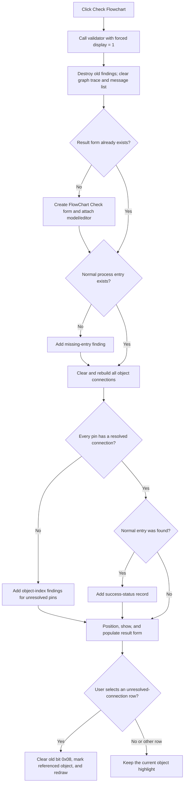

# Check Flowchart

## Control

| Property | Recovered value |
| --- | --- |
| Form | FlowChartMainForm |
| Component path | FlowChartMainForm.pnToolbar.sbCheckFlowChart |
| Control class | TSpeedButton |
| Caption | Not present in the recovered resource. |
| Hint | Check Flowchart |
| Handler name | sbCheckFlowChartClick |
| Handler address | 0104f150 |
| Graph node | `resource:dfm:FlowChartMainForm/FlowChartMainForm.pnToolbar.sbCheckFlowChart` |
| Handler node | `function:0104f150` |
| Graph layer | UI |

The resource binds this toolbar button to `TFlowChartMainForm.sbCheckFlowChartClick`. Its two-frame glyph contains two check marks. The hint and glyph support the control identity. The recovered call path establishes the behavior.

## What happens when clicked

The button validates the complete active flowchart and opens the modeless **FlowChart Check** form with a new result list. It does not validate only the current selection.

The handler calls a wrapper that passes the value `1` to the common validation coordinator. This value forces the result form to appear even when the flowchart is valid. Other callers, such as debugger preparation, pass `0` and show the form only when validation fails or a separate application option requests it.

Each click performs these steps:

1. It destroys and removes all records from the previous validation-result list.
2. It clears the validator's previous graph-trace strings.
3. It creates the **FlowChart Check** form if this is the first check. Otherwise, it reuses the existing form and clears its message list.
4. It rebuilds the flowchart connectivity graph and evaluates the recovered rules below.
5. It positions the result form near the lower-right corner of the editor, with a 20-pixel inset.
6. It shows and activates the result form, attaches the new result list, and adds one formatted row for each result record.

The result form is not modal. Its **Close** handler clears the visible list and hides the form. A later check reuses the same form object.

## Recovered validation rules

The validator receives the active flowchart model and its full object collection. The top-level result is valid only when both of these tests pass:

- The object collection contains at least one type-8 process marker whose selector identifies the normal, non-interrupt entry.
- Every object has a nonnegative resolved connection index for every pin entry.

The connection test first clears each object's old pin connection indices and connection count. It then reconstructs wire and component relationships in two passes across the full collection. If an object still has an unresolved pin, the validator adds a finding that contains the object's stored index. It uses separate message codes for type-10 wire objects and other flowchart objects. If the normal process entry is missing, it adds a separate finding without an object index.

When both tests pass, the validator adds one success-status record. The recovered localized message table is indirect, so the exact displayed text for the status and finding codes is not available in source. The source does prove that the list formatter prefixes each record with a localized category string and then appends the localized message for its code.

The validator checks only the two rules above in this path. The source does not prove checks for duplicate normal entries, unreachable branches, expression syntax, target-device limits, or generated-code validity.

## Diagnostics and highlighting

The click itself does not select or highlight a flowchart object. It displays the result list.

The result form's instruction says: `Click any of the errors/warnings above to highlight the questionable connection or component.` Its list-click handler implements this only for the two unresolved-connection message codes. It clears highlight bit `0x08` from all flowchart objects, looks up the object index stored in the selected record, sets that bit on the referenced object, and rebuilds the editor view. The missing-entry and success-status records do not enter this highlight branch.

Closing the result form does not clear an object highlight. It clears the message list and hides the form.

## Relationship to compile and run

This button is a validation-only command. It does not call the target-specific code generator, compiler, debugger-data builder, simulator, or generated-output writers. It also does not update the form's execution-block byte.

Debugger Run and Step preparation use the same validation coordinator through `FUN_01053ee0`, but with forced display disabled. That preparation helper continues only after a valid result. It then rebuilds target-specific debugger data, clears the model's compile-dirty byte, and stores the execution-block result. The Check Flowchart button does none of those later steps and discards the validator's Boolean return value.

## State, persistence, and failures

The check changes these in-memory derived and UI states:

- It replaces the validation records and validator graph-trace strings.
- It rebuilds per-object connection indices and connection counts.
- It clears and repopulates the modeless result list.
- It creates or reuses, positions, and shows the result form.

It does not add, delete, or edit authored flowchart objects. It does not write the model modified byte or compile-dirty byte. It does not save the flowchart or write settings. Therefore, the validation results, rebuilt connection state, form position, and message selection are not proven to persist after the editor closes.

There is no cancel branch because the check runs synchronously before it shows the completed list. A failed validation is a normal result: the form opens and displays the findings. Repeating the click runs the full check again and replaces the old results.

The handler, wrapper, coordinator, and validator have no local exception handler. An allocation or runtime exception can escape after the coordinator has cleared the old records, graph trace, and visible list. If it escapes during graph construction, partial derived connection state or partial findings can remain. The recovered path has no rollback transaction. It does not show a separate application error dialog for such an exception.

## Click flow

## Evidence

- [Button handler](../../../DecompiledSources/Tina16/functions/000000000104F150__FUN_0104f150.c): calls only the forced-validation wrapper.
- [Forced-validation wrapper](../../../DecompiledSources/Tina16/functions/000000000104F590__FUN_0104f590.c): calls the common coordinator with forced display set to `1`.
- [Validation and result coordinator](../../../DecompiledSources/Tina16/functions/0000000001050AF0__FUN_01050af0.c): clears old state, lazily creates and clears the result form, runs validation, positions and shows the form, and populates its list.
- [Top-level validator](../../../DecompiledSources/Tina16/functions/0000000000F77D30__FUN_00f77d30.c): combines the normal-entry and connection results and adds the status record.
- [Normal-entry search](../../../DecompiledSources/Tina16/functions/0000000000F753D0__FUN_00f753d0.c): searches type-8 objects for the requested normal or interrupt selector.
- [Connection validator](../../../DecompiledSources/Tina16/functions/0000000000F76700__FUN_00f76700.c): rebuilds connectivity, checks every object's pin indices, and records unresolved objects.
- [Connectivity builder](../../../DecompiledSources/Tina16/functions/0000000000F773C0__FUN_00f773c0.c): clears per-object derived connection state and reconstructs wire and component relationships in two passes.
- [Message-list builder](../../../DecompiledSources/Tina16/functions/0000000000F760D0__FUN_00f760d0.c): formats category and message strings from the result records and adds them to the list box.
- [Message selection handler](../../../DecompiledSources/Tina16/functions/0000000000F76290__FUN_00f76290.c): applies highlight bit `0x08` for the two connection finding codes and rebuilds the editor.
- [Debugger preparation](../../../DecompiledSources/Tina16/functions/0000000001053EE0__FUN_01053ee0.c): proves that validation is a prerequisite to, but separate from, target-data regeneration and compile-dirty state changes.
- [Check-button glyph](../../../glyph/0165_FlowChartMainForm_FlowChartMainForm_pnToolbar_sbCheckFlowChart_Glyph_Data.png): contains the two recovered check-mark frames.

## Limits

- The localized strings for result codes `3`, `4`, `6`, and `7` are not recovered as direct literals. This article describes their source-proven conditions instead of assigning unproven wording.
- The original Delphi names for the model, validator, result-record, and graph-trace classes are not recovered.
- The normal-entry selector is source-proven as value `0`; its normal, non-interrupt meaning follows from the paired search mode and related flowchart entry use. The original enumeration name is not recovered.
