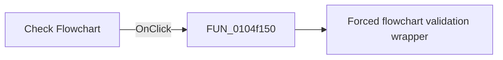

# Check Flowchart

> Analysis status: Pending individual source review.

## Control

| Property | Recovered value |
| --- | --- |
| Form | FlowChartMainForm |
| Component path | FlowChartMainForm.pnToolbar.sbCheckFlowChart |
| Control class | TSpeedButton |
| Caption | Not present in the recovered resource. |
| Hint | Check Flowchart |
| Text | Not present in the recovered resource. |
| Handler name | sbCheckFlowChartClick |
| Handler address | 0104f150 |
| Graph node | `resource:dfm:FlowChartMainForm/FlowChartMainForm.pnToolbar.sbCheckFlowChart` |
| Handler node | `function:0104f150` |
| Graph layer | UI |

## What happens when clicked

Pending individual analysis. An agent must read the recovered handler source and its relevant callees before it replaces this text.

## Click flow

## Handler evidence

- Source: [DecompiledSources/Tina16/functions/000000000104F150__FUN_0104f150.c](../../../DecompiledSources/Tina16/functions/000000000104F150__FUN_0104f150.c)
- Recovered role: Flowchart check button handler
- Current graph summary: Starts a forced flowchart validation and result display. Handles 1 Delphi UI event: FlowChartMainForm.pnToolbar.sbCheckFlowChart.OnClick.
- Current graph behavior: Starts a forced flowchart validation and result display.
- Current graph evidence: The button hint is Check Flowchart and its two-frame glyph shows check marks. The function contains only a call to FUN_0104f590.
- Complexity: simple
- Distinct outgoing calls: 1

## Direct calls

- `function:0104f590` — Forced flowchart validation wrapper

## Resource evidence

- Kind: Not present in the recovered resource.
- Modal result: Not present in the recovered resource.
- Checked state: Not present in the recovered resource.
- List items: Not present in the recovered resource.
- Image reference: Not present in the recovered resource.
- Extracted glyph: [`0165_FlowChartMainForm_FlowChartMainForm_pnToolbar_sbCheckFlowChart_Glyph_Data.png`](../../../glyph/0165_FlowChartMainForm_FlowChartMainForm_pnToolbar_sbCheckFlowChart_Glyph_Data.png)

## Nearby label candidates

Nearby labels are layout candidates only. They are not proof of behavior.

- No same-parent label candidate is available.

## Analysis limits

- Do not infer behavior from the control class, caption, hint, glyph, or nearby label alone.
- Do not replace the pending status until the handler source and relevant call path provide enough evidence.
