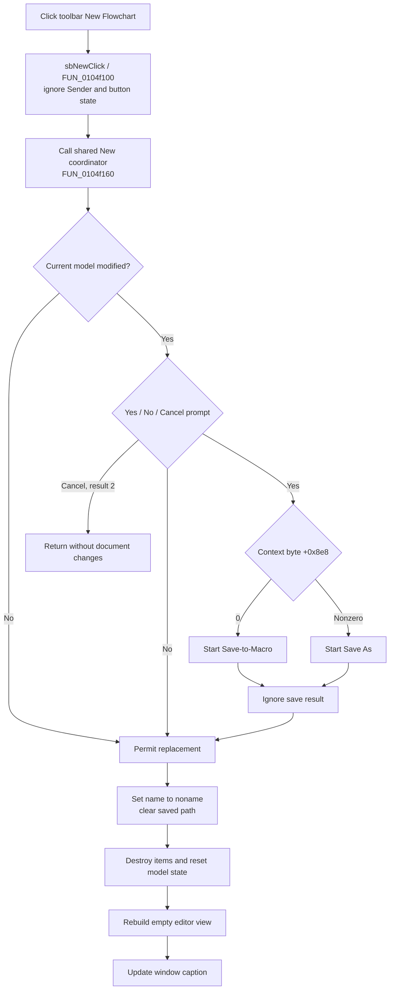

# Create a new FlowChart from the toolbar

## Control

| Property | Recovered value |
| --- | --- |
| Form | FlowChartMainForm |
| Component path | FlowChartMainForm.pnToolbar.sbNew |
| Control class | TSpeedButton |
| Caption | Not present in the recovered resource. |
| Hint | New Flowchart |
| Handler name | sbNewClick |
| Handler address | 0104f100 |
| Graph node | `resource:dfm:FlowChartMainForm/FlowChartMainForm.pnToolbar.sbNew` |
| Handler node | `function:0104f100` |
| Graph layer | UI |

## What happens when clicked

The toolbar button forwards directly to the same New FlowChart command that the File > New menu item uses. `FUN_0104f100` contains one call to `FUN_0104f160` and no other operation.

The wrapper does not inspect `Sender`, the speed button, its pressed state, the active page, or a toolbar-specific option. It does not synthesize a menu click. The form object remains the target of the direct call, so the shared command acts on the current `FlowChartMainForm` document. The toolbar route and menu route therefore have the same prompt, reset, state, and failure behavior.

## Unsaved-document guard

The shared New command first asks whether the current document can be replaced.

- An unmodified model is replaced without a prompt.
- A modified model shows a localized Yes, No, or Cancel prompt.
- Cancel, modal result `2`, stops New before the name, path, model, view, or title changes.
- No permits New and discards the unsaved in-memory model.
- Yes starts a save route. Context byte `FlowChartMainForm + 0x8e8 == 0` uses Save-to-Macro; a nonzero value uses Save As.

The guard does not test the selected save route's return value. Thus, choosing Yes and then canceling Save As, or receiving false from Save-to-Macro, still permits New. An exception from the prompt or save path propagates before the reset begins.

## Blank-document reset

When the guard permits replacement, the shared command performs these operations in order:

1. It changes the display name at `+0x8d0` to `noname`.
2. It clears the saved path at `+0x8d8`.
3. It destroys every owned FlowChart item and clears the model list.
4. It clears the modified flag, sets the recovered model byte at `+0x19` to `1`, and resets the next-item counter at `+0x30` to zero.
5. It rebuilds the editor view for the empty model.
6. It updates the window caption.

The result is a blank in-memory FlowChart. The command does not add a default start block or another model item. It does not create, overwrite, or delete a FlowChart file.

## Click flow

## Preserved state and persistence

The shared New path resets the document identity and FlowChart item model. It does not rerun form construction. It therefore does not explicitly reset the selected MCU family, MCU text, clock value, context mode, editor colors, grid or view settings, simulator object, debugger object, or MCU backend.

The old saved file remains unchanged unless the user chose Yes and the invoked save route produced an output before New continued. After the reset, the blank document has no saved path. A later normal Save therefore enters the Save As route. The wrapper does not write a recent-file list, INI file, registry value, or toolbar preference.

## Cancellation and failure behavior

- Cancel in the first modified-document prompt is the only recovered user action that reliably stops New.
- No intentionally discards unsaved model state but leaves the existing file unchanged.
- Yes followed by a canceled or false save result still resets the document because the guard ignores that result.
- The reset is not transactional. It assigns `noname` and clears the path before it destroys model items, and it rebuilds the view and caption afterward. An exception can leave a mixture of new identity, old or partly cleared model, and stale view or title state.
- Item destruction can run item-specific cleanup. No rollback restores destroyed items.
- Repeated clicks on an unmodified blank document reset it again without a prompt.

## Evidence

- [Toolbar wrapper `FUN_0104f100`](../../../DecompiledSources/Tina16/functions/000000000104F100__FUN_0104f100.c) contains only a direct call to the shared New command. It has no source-control or Sender branch.
- [Shared New coordinator `FUN_0104f160`](../../../DecompiledSources/Tina16/functions/000000000104F160__FUN_0104f160.c) runs the guard, assigns `noname`, clears the saved path, resets the model, rebuilds the view, and updates the title.
- [Unsaved-change guard `FUN_01053000`](../../../DecompiledSources/Tina16/functions/0000000001053000__FUN_01053000.c) prompts only for a modified model, blocks result `2`, selects the save route for result `6`, and does not test the save result.
- [Model reset `FUN_00f629d0`](../../../DecompiledSources/Tina16/functions/0000000000F629D0__FUN_00f629d0.c) destroys the owned items, clears the collection and modified state, sets the recovered byte, and resets the item counter.
- [Save As route `FUN_0104f2e0`](../../../DecompiledSources/Tina16/functions/000000000104F2E0__FUN_0104f2e0.c) can return after dialog cancellation, but the guard does not consume that outcome.
- [Save-to-Macro route `FUN_0104fb30`](../../../DecompiledSources/Tina16/functions/000000000104FB30__FUN_0104fb30.c) returns a success value that the guard also ignores.
- [Editor rebuild wrapper `FUN_010508e0`](../../../DecompiledSources/Tina16/functions/00000000010508E0__FUN_010508e0.c) redraws the FlowChart model after reset.
- [Title updater `FUN_01051360`](../../../DecompiledSources/Tina16/functions/0000000001051360__FUN_01051360.c) formats the current form caption after reset.
- [Recovered Delphi resource evidence](../../../DecompiledSources/Tina16/resources/dfm/ui-evidence.json) binds `pnToolbar.sbNew.OnClick` to `sbNewClick` and gives the speed button its `New Flowchart` hint.
- [Extracted two-frame glyph](../../../glyph/0162_FlowChartMainForm_FlowChartMainForm_pnToolbar_sbNew_Glyph_Data.png) depicts the toolbar's new-document control. The hint and wrapper call path, not the glyph alone, establish the behavior.

## Direct calls and annotation ownership

- `FUN_0104f100` directly calls only `FUN_0104f160`.
- `FUN_0104f100` is the toolbar-specific forwarding wrapper and is annotated in this control's fragment.
- `FUN_0104f160`, `FUN_01053000`, and `FUN_00f629d0` are canonically annotated by the File > New analysis in `TIARA-diz.6.7.515`. This article cites them without redefining them.

## Analysis limits

- The wrapper has no recovered Sender-dependent logic. Calling-convention details that pass the form object into the direct coordinator call are not named by the decompiler.
- The semantic name of model byte `+0x19` is not recovered.
- The reset does not explicitly destroy the debugger or simulator, but this does not prove that later view or model callbacks cannot affect those objects.
- The exact external effects of a save operation that raises before New starts depend on that save path and are outside this wrapper.
