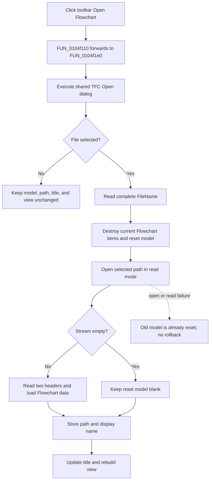

# Open a Flowchart from the toolbar

> Analysis status: Reviewed from the toolbar wrapper, canonical Open handler, dialog setup, TFC loader, component resources, and extracted glyph.

## Control

| Property | Recovered value |
| --- | --- |
| Form | FlowChartMainForm |
| Component path | FlowChartMainForm.pnToolbar.sbOpen |
| Control class | TSpeedButton |
| Caption | Not present in the recovered resource. |
| Hint | Open Flowchart |
| Handler name | sbOpenClick |
| Handler address | 0104f110 |
| Graph node | `resource:dfm:FlowChartMainForm/FlowChartMainForm.pnToolbar.sbOpen` |
| Handler node | `function:0104f110` |
| Graph layer | UI |

## What happens when clicked

`TFlowChartMainForm.sbOpenClick` is a forwarding wrapper. It contains only a
call to `TFlowChartMainForm.mnOpenClick` and a return. The toolbar button
therefore runs the same **Open Flowchart** command as the File-menu item.

The wrapper does not read button state, current selection, the active page, a
file path, or a mode flag. It does not open the dialog itself and it adds no
toolbar-specific guard, state change, result handling, or error handling.

## Sender handling

The recovered wrapper has no used event parameter. Its call preserves the
`FlowChartMainForm` instance for the canonical handler, but neither the wrapper
nor `FUN_0104f1e0` reads the VCL `Sender` value. Consequently:

- the canonical command does not test whether the source was `sbOpen` or
  `mnOpen`;
- the toolbar button does not pass a different initial directory, filter,
  file name, owner, or load mode;
- menu and toolbar activation have the same cancel, acceptance, load, and
  failure boundaries.

The decompiler's `void FUN_0104f110(void)` signature reflects that its event
arguments are unused. The call still operates on the current form instance.

## Delegated Open command

The `.516`-owned handler `FUN_0104f1e0` executes the form's `dOpenDialog`.
Form initialization configures that dialog with the filter
`TINA Flowchart file (*.tfc)|*.tfc`, selects the application `Examples`
directory when it exists, and otherwise uses `Edison5\Examples`.

- If the user cancels, the command returns without changing the current
  Flowchart model, document path, title, view, or debugger state.
- If the user accepts, it gets the dialog's complete `FileName` and passes it
  unchanged to `FUN_01050790`.

The handler does not enforce the `.tfc` extension after dialog acceptance. It
also does not call the shared unsaved-change guard. The toolbar path therefore
has the same important behavior as the menu path: accepting a file can replace
a modified Flowchart without an application confirmation prompt.

## Load and state changes

The canonical loader performs these actions after acceptance:

1. It destroys and clears the current Flowchart items and resets model state.
2. It opens the selected path as a read-mode Delphi file stream.
3. For a nonempty stream, the TFC reader reads two four-byte header values and
   delegates the remaining model data to the contained Flowchart loader.
4. It stores the complete selected path and its derived display name on the
   form.
5. It updates the window caption from the display name and MCU family.
6. It rebuilds the Flowchart editor and redraws the loaded model at scale
   `1.0`.

An empty file skips the header and model reads but still becomes a named blank
Flowchart. The toolbar wrapper does not alter any of these decisions.

The model reset clears the recovered modified byte. The command does not mark
the loaded model modified, add a recent-file item, write preferences, write a
registry or INI value, or write the selected TFC file. A later Save can use the
stored selected path.

## Click flow

## Cancel, errors, and partial state

- Dialog Cancel is the only handled no-op path. Because cancellation occurs
  before the loader call, it preserves the current document.
- The loader resets the current model before it constructs the input stream.
  A missing, unreadable, truncated, or malformed file can therefore destroy
  the old in-memory items before loading fails.
- An open or read exception before identity update can leave the old displayed
  path and title with a blank or partly loaded model.
- A zero-byte file is accepted as a named blank document; it is not an error in
  the recovered reader.
- Neither the toolbar wrapper nor the canonical handler has a local exception
  handler, backup model, atomic swap, retry, status result, or rollback.
- The wrapper cannot fail after a successful delegated command because it does
  no work after `FUN_0104f1e0` returns.

## Evidence

- [Toolbar wrapper `FUN_0104f110`](../../../DecompiledSources/Tina16/functions/000000000104F110__FUN_0104f110.c) contains only a call to the canonical Open handler and a return.
- [Canonical Open handler `FUN_0104f1e0`](../../../DecompiledSources/Tina16/functions/000000000104F1E0__FUN_0104f1e0.c) executes `dOpenDialog`, reads `FileName` only after acceptance, and calls the loader. Bead `TIARA-diz.6.7.516` owns its annotation.
- [Dialog initialization `FUN_0104fe00`](../../../DecompiledSources/Tina16/functions/000000000104FE00__FUN_0104fe00.c) assigns the TFC filter, initial directory, and empty initial file name.
- [File-load coordinator `FUN_01050790`](../../../DecompiledSources/Tina16/functions/0000000001050790__FUN_01050790.c) resets the current model, opens the stream, stores the new document identity, updates the title, and rebuilds the view. Bead `.516` owns its annotation.
- [TFC reader `FUN_01050690`](../../../DecompiledSources/Tina16/functions/0000000001050690__FUN_01050690.c) handles empty input, reads two header values for nonempty input, and delegates the contained model load. Bead `.516` owns its annotation.
- [Document-model reset `FUN_00f629d0`](../../../DecompiledSources/Tina16/functions/0000000000F629D0__FUN_00f629d0.c) destroys current items and resets recovered model fields before stream construction.
- [Unsaved-change guard `FUN_01053000`](../../../DecompiledSources/Tina16/functions/0000000001053000__FUN_01053000.c) is used by New and Close but is absent from this Open path. Bead `.515` owns it.
- [Recovered component tree](../../../DecompiledSources/Tina16/resources/dfm/ui-evidence.json) binds `sbOpen.OnClick` to `sbOpenClick` and supplies the **Open Flowchart** hint.
- [Extracted toolbar glyph](../../../glyph/0163_FlowChartMainForm_FlowChartMainForm_pnToolbar_sbOpen_Glyph_Data.png) is a 32 by 16 two-frame folder image. It supports the Open intent, while the wrapper call proves the behavior.

## Resource and glyph evidence

- The speed button hint is **Open Flowchart**.
- Its extracted bitmap contains two 16 by 16 folder frames in a 32 by 16
  resource. The bitmap does not identify the file type or load behavior by
  itself.
- The button has no recovered caption, text, action, image-list reference,
  checked state, modal result, or shortcut.
- The corresponding File-menu item has caption **Open Flowchart** and owns the
  canonical handler.

## Annotation ownership and analysis limits

- This Bead owns only toolbar wrapper `FUN_0104f110` and preserves its existing
  graph annotation fields.
- Bead `TIARA-diz.6.7.516` owns canonical Open handler `FUN_0104f1e0`, loader
  `FUN_01050790`, and reader `FUN_01050690`; this fragment does not duplicate
  them.
- The recovered source proves that `Sender` is unused. It does not recover
  source-level parameter names or show whether Delphi source called
  `mnOpenClick(Sender)` or an equivalent form-only helper; these alternatives
  have the same recovered behavior.
