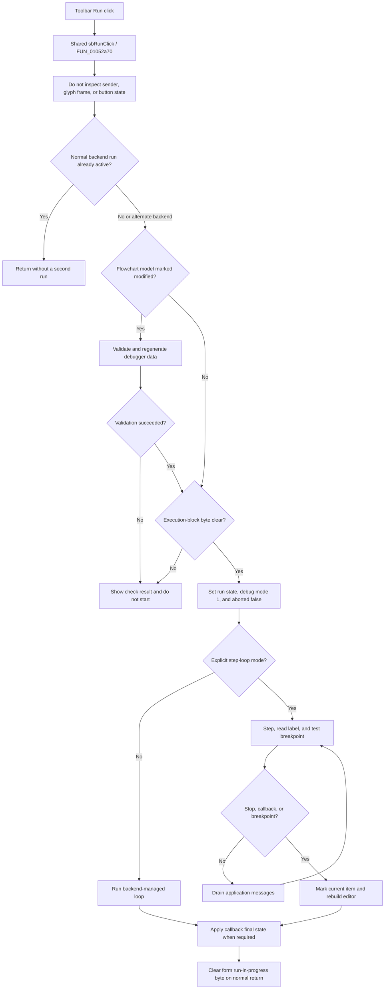

# Run from the Flowchart toolbar

> Analysis status: Source-reviewed. The shared Run handler, simulator branches, modified-model preparation, backend loops, Stop path, toolbar resource, and glyph establish the behavior below.

## Control

| Property | Recovered value |
| --- | --- |
| Form | FlowChartMainForm |
| Component path | FlowChartMainForm.pnToolbar.sbRun |
| Control class | TSpeedButton |
| Caption | Not present in the recovered resource. |
| Hint | Run |
| Text | Not present in the recovered resource. |
| Handler name | sbRunClick |
| Handler address | 01052a70 |
| Graph node | `resource:dfm:FlowChartMainForm/FlowChartMainForm.pnToolbar.sbRun` |
| Handler node | `function:01052a70` |
| Graph layer | UI |

The main-menu item `FlowChartMainForm.MainMenu.mnDebug.mnRun` uses the same handler and has the caption **Run**. The toolbar image is a recovered 32-by-16 raster with `NumGlyphs = 2`. It contains two 16-by-16 right-pointing triangle frames, one green and one yellow. The hint, menu caption, and image support the Run meaning, but the handler source establishes the execution behavior.

## Sender, glyph, and button state

`sbRunClick` does not inspect the `TSpeedButton`, its glyph frame, `Down`, `Enabled`, or any other sender property. The recovered handler has a second event parameter, but it never branches on or dereferences that value. Two calls display the value as an extra argument; the recovered target functions `FUN_00f8da20` and `FUN_00f8f400` accept and read only the simulator pointer. The toolbar button and menu item therefore select the same backend and execution path.

The resource has no recovered `Down`, `GroupIndex`, or `AllowAllUp` value. The handler does not turn this speed button into a persistent toggle and does not choose one of the two glyph frames. The original VCL state-to-frame mapping is not recovered. Run-state feedback comes from simulator, animation, and current-item updates, not from a proven button-state write in this handler.

## Initial gates and modified-model preparation

The handler operates on the simulator at form offset `+0x9d8`, the flowchart model at `+0x980`, and the VHDL MCU interface at `+0x970`.

It first reads the simulator run-active byte at `+0x3454` and backend-mode byte at `+0x3511`. When a normal-backend run is already active, it returns without starting another run. The alternate backend mode is not rejected by this first test.

If the model modified-state getter reports a change, the `.507`-owned preparation helper `FUN_01053ee0`:

1. runs the flowchart validation and result-dialog coordinator;
2. on success, clears the generated-code view, builds and attaches target-specific debugger data, and clears the compile-dirty byte at model `+0x19`; and
3. stores validation failure in the form execution-block byte at `+0x8ed`.

The Run handler tests `+0x8ed` after preparation. A set byte stops before debugger or simulator start state changes. When the model is not marked modified, preparation is skipped and the current execution-block byte remains the gate.

## Execution start and backend selection

After the gates pass, the handler:

- sets the form run-in-progress byte at `+0x8eb`;
- clears the Stop-request byte at `+0x6c4`;
- marks the simulator as running and clears its stopped byte at `+0x33f8`;
- calls `VHDL_DLL2.DLL::_MCU_SetDebugMode` with mode `1`; and
- calls `VHDL_DLL2.DLL::_MCU_SetAborted` with `0`.

It then selects one of two execution shapes.

### Backend-managed run

The general path dispatches simulator initialization and continuous execution through `FUN_00f8d6c0` and `FUN_00f8da20`. The normal implementation compiles the design, checks that the compiled design and debugger state are usable, and repeatedly steps the MCU. It updates MCU status, animation data, the current instruction or flowchart state, and the Run Until condition. It drains application messages during the loop. The alternate backend mode selects shorter setup and run adapters.

Before continuous execution, the handler copies the form animation selection at `+0x940` to the simulator. The animation setter also calls `VHDL_DLL2.DLL::_MCU_SetAnimate`.

### Explicit flowchart-step loop

A separate predicate selects an explicit loop for one recovered MCU-selection and simulator-type combination. While no stop callback is pending and the simulator stopped byte remains clear, the handler:

1. calls the shared step dispatcher `FUN_01052800`;
2. reads the simulator's current flowchart label;
3. finds the corresponding model item and tests its `0x40` breakpoint flag;
4. clears run-active state and sets stopped state when a breakpoint is present; and
5. drains pending application messages before the next test.

After the loop, it reads the final label, moves the model's `0x20` current-item flag to the matching item, and rebuilds the flowchart editor. This updates the visible current-flow marker.

## Stop, Run Until, and normal completion

The message drain lets the separate menu or toolbar Stop handler execute during the synchronous loop. Stop clears run-active state, sets the MCU aborted state, dispatches a backend abort, and sets form Stop-request byte `+0x6c4`. The shared step path consumes that request and lets the explicit loop end. The continuous backend also checks its stop and abort state.

Run Until programs its target and calls this same Run handler. The continuous backend clears the target when it reaches that point or another stop condition.

Two callbacks can set form byte `+0x8ea` and a reason byte at `+0x941`. During debug mode `1`, the Run handler selects one of two final-state adapters from that reason. On every normal return after the first gate, it clears the form run-in-progress byte at `+0x8eb`.

## Persistence, no-op, and failure boundaries

Run does not save the flowchart or write a settings file. Successful modified-model preparation clears compile-dirty byte `+0x19`, but it does not clear the separate document modified-state byte at `+0x18`. Execution therefore uses regenerated in-memory data without proving disk persistence.

- An already active normal-backend run is a no-op. The handler does not change button state or start another run.
- A validation failure shows the FlowChart Check result path, sets the execution-block byte, and does not start the debugger.
- Backend preparation can return without running when its compiled-design or debugger checks fail.
- The normal continuous loop reports `TINA: Internal error in the HDL engine` when a simulator step fails and then leaves the loop.
- The two direct MCU state setters have no checked return value in this handler.
- The handler has no simulator-null guard, local exception handler, or `finally` cleanup. An escaping exception after `+0x8eb` is set can leave run, debug, animation, or abort state without the normal final clear or restoration.
- A normal backend return, handled Stop, breakpoint, or internal-loop exit reaches the final run-in-progress clear.

## Run flow

## Source evidence

- [Run handler](../../../DecompiledSources/Tina16/functions/0000000001052A70__FUN_01052a70.c) contains the re-entry and validation gates, debugger state writes, backend selection, explicit loop, breakpoint test, editor rebuild, and normal final clear. It has no sender-property read.
- [Backend run dispatcher](../../../DecompiledSources/Tina16/functions/0000000000F8DA20__FUN_00f8da20.c) and [callback final-state adapter](../../../DecompiledSources/Tina16/functions/0000000000F8F400__FUN_00f8f400.c) each recover one simulator parameter and do not inspect the event sender shown as an extra call argument.
- [Modified-flowchart preparation](../../../DecompiledSources/Tina16/functions/0000000001053EE0__FUN_01053ee0.c) validates, rebuilds target-specific debugger data, clears compile-dirty state, and records the execution-block result.
- [Backend start dispatcher](../../../DecompiledSources/Tina16/functions/0000000000F8D6C0__FUN_00f8d6c0.c), [continuous-run dispatcher](../../../DecompiledSources/Tina16/functions/0000000000F8DA20__FUN_00f8da20.c), and [normal continuous loop](../../../DecompiledSources/Tina16/functions/0000000000F8DAA0__FUN_00f8daa0.c) establish the backend branches, preparation, stepping, Run Until checks, message processing, and internal-engine error.
- [Shared step dispatcher](../../../DecompiledSources/Tina16/functions/0000000001052800__FUN_01052800.c) consumes the Stop-request byte, executes one selected step path, updates animation, and refreshes the current model item.
- [Breakpoint predicate](../../../DecompiledSources/Tina16/functions/00000000010521E0__FUN_010521e0.c) maps a simulator label to a model item and tests its `0x40` flag.
- [Current-item marker](../../../DecompiledSources/Tina16/functions/0000000000F65450__FUN_00f65450.c) and [editor rebuild wrapper](../../../DecompiledSources/Tina16/functions/00000000010508E0__FUN_010508e0.c) update the `0x20` current-item flag and rebuild the visible editor.
- [Application-message drain](../../../DecompiledSources/Tina16/functions/000000000080CC70__FUN_0080cc70.c) fetches and dispatches pending messages.
- [Trace Stop handler](../../../DecompiledSources/Tina16/functions/0000000001052D50__FUN_01052d50.c) and [abort dispatcher](../../../DecompiledSources/Tina16/functions/0000000000F8E020__FUN_00f8e020.c) establish how a Stop click reaches active execution.
- [Run Until handler](../../../DecompiledSources/Tina16/functions/000000000104F440__FUN_0104f440.c) programs its target and calls this shared Run handler.
- [Run toolbar glyph](../../../glyph/0168_FlowChartMainForm_FlowChartMainForm_pnToolbar_sbRun_Glyph_Data.png) contains the two recovered triangle frames.

## Analysis limits and ownership

- The recovered source does not name backend-mode byte `+0x3511`, the MCU selection tested by `FUN_010527b0`, or the callback reason values at `+0x941`. This article describes only their proven tests and effects.
- The exact VCL state represented by each raster frame is not recovered. The image does not prove the runtime state transition.
- Bead `.507` owns the canonical annotations for shared Run handler `FUN_01052a70` and modified-flowchart preparation helper `FUN_01053ee0`.
- This duplicate Bead copies the complete `FUN_01052a70` annotation exactly. It cites but does not redefine `FUN_01053ee0` or broad simulator, MCU, validation, step, Stop, and editor helpers.
