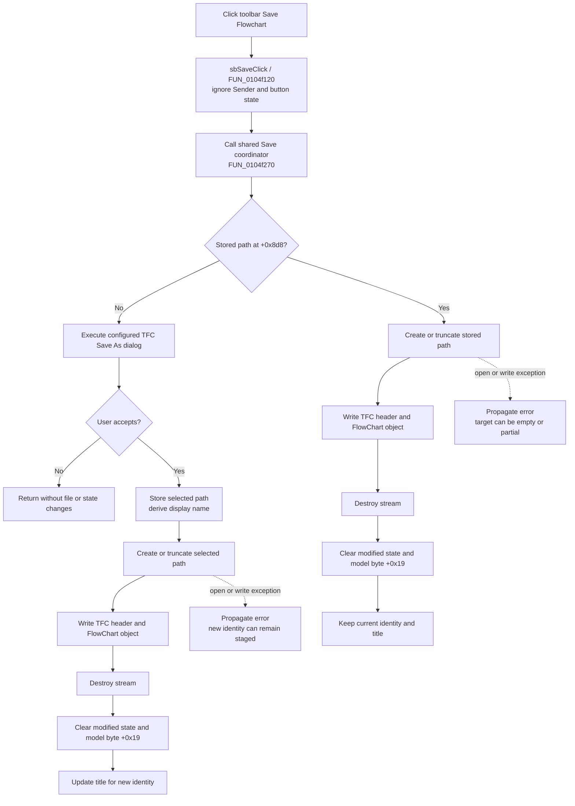

# Save the current FlowChart from the toolbar

## Control

| Property | Recovered value |
| --- | --- |
| Form | FlowChartMainForm |
| Component path | FlowChartMainForm.pnToolbar.sbSave |
| Control class | TSpeedButton |
| Caption | Not present in the recovered resource. |
| Hint | Save Flowchart |
| Handler name | sbSaveClick |
| Handler address | 0104f120 |
| Graph node | `resource:dfm:FlowChartMainForm/FlowChartMainForm.pnToolbar.sbSave` |
| Handler node | `function:0104f120` |
| Graph layer | UI |

## What happens when clicked

The toolbar button forwards directly to the same current-document Save command that the File > Save Flowchart menu item uses. `FUN_0104f120` contains one call to `FUN_0104f270` and no other operation.

The wrapper does not inspect `Sender`, the speed button, its pressed state, the active page, the model's modified flag, or a toolbar-specific option. It does not synthesize a menu click. The form object remains the target of the direct call, so the toolbar and menu routes use the same stored path, Save As dialog, binary serializer, state updates, and error behavior.

## Path decision

The shared Save coordinator reads the full saved-path field at `FlowChartMainForm + 0x8d8`.

- If the field is empty, it calls Save As. The configured dialog uses the filter `TINA Flowchart file (*.tfc)|*.tfc`, default extension `tfc`, an empty starting filename, and the recovered Examples directory. Cancel returns without writing and keeps the document path, title, and modified state unchanged.
- If the field contains a path, Save creates or truncates that exact file with stream mode `0xff00`. It does not show a dialog or perform a handler-local overwrite check.

The wrapper does not check whether the model is modified before it delegates. A click can rewrite the stored file even when the in-memory model is already marked clean.

## Accepted Save As and direct Save

After Save As acceptance, the handler stores the selected full path at `+0x8d8`, derives an extension-free display name at `+0x8d0`, and then creates or truncates the selected file. A successful Save As updates the window title after the write.

Direct Save keeps the existing path and display name. It does not update the title because the document identity does not change.

Both paths call the same TFC stream serializer. After serialization returns and the stream is destroyed, they clear the model's modified state and the separate recovered model byte at `+0x19`. The modified-state helper also clears the matching state in the optional secondary editor/debugger object when it exists.

## TFC output

The output is a binary TFC document, not text. The shared writer emits:

1. the four-byte format marker `111`;
2. the model's four-byte document counter from offset `+0x30`; and
3. the contained FlowChart object's serialized item data.

The item writer stores an item count, type bytes, type-specific binary fields, and length-prefixed strings. Current strings use a four-byte UTF-16 code-unit count followed by two bytes per code unit. On this Windows target, that payload is UTF-16LE without a text BOM or terminating null.

## Click flow

## State and persistence

A successful click persists the current FlowChart model to the stored or newly selected TFC file. It does not change the model items, active page, context mode, MCU selection, clock, editor view, debugger state, simulator state, or toolbar state. It does not add a recent-file entry or write an INI or registry setting in this path.

The Save As dialog can retain native dialog state in memory, but the selected path becomes the document's live path through form field `+0x8d8`. A later toolbar or menu Save then writes directly to it.

## Cancellation and failure behavior

- Cancel exists only on the delegated Save As path. It is a clean no-op for the file, document identity, title, and model flags.
- Direct Save has no dialog, backup, temporary file, atomic rename, retry loop at the command level, or rollback.
- The create-mode stream can truncate an existing target before serialization completes. A failure can leave the file empty or partial.
- Modified state and model byte `+0x19` are cleared only after serialization returns and the stream is destroyed. A file open, write, or stream-finalization failure before those calls leaves these flags uncleared.
- Save As assigns the new path and display name before it creates the file. A later failure can leave the new identity staged while the title and modified flags still reflect the incomplete save.
- No local exception handler restores the old file, old identity, or partial in-memory success state. The exception propagates to outer application handling.
- Repeated clicks on a named document rewrite the same path, even if the previous save cleared modified state.

## Evidence

- [Toolbar wrapper `FUN_0104f120`](../../../DecompiledSources/Tina16/functions/000000000104F120__FUN_0104f120.c) contains only a direct call to the shared Save coordinator. It has no Sender, state, or path branch of its own.
- [Current-document Save coordinator `FUN_0104f270`](../../../DecompiledSources/Tina16/functions/000000000104F270__FUN_0104f270.c) selects Save As for an empty path or creates the stored path, runs the shared writer, destroys the stream, and clears model state.
- [Save As handler `FUN_0104f2e0`](../../../DecompiledSources/Tina16/functions/000000000104F2E0__FUN_0104f2e0.c) proves accepted-path and display-name staging, the shared write, cancellation, and title-update boundary.
- [TFC stream writer `FUN_01050620`](../../../DecompiledSources/Tina16/functions/0000000001050620__FUN_01050620.c) writes the two four-byte header values and delegates the remaining model serialization.
- [File-stream constructor `FUN_004b9860`](../../../DecompiledSources/Tina16/functions/00000000004B9860__FUN_004b9860.c) supplies create/truncate semantics for mode `0xff00`.
- [Modified-state synchronizer `FUN_01053e80`](../../../DecompiledSources/Tina16/functions/0000000001053E80__FUN_01053e80.c) clears the main model and optional secondary-view modified state after success.
- [UTF-16 stream writer `FUN_01b20e90`](../../../DecompiledSources/Tina16/functions/0000000001B20E90__FUN_01b20e90.c) writes the four-byte character count and two-byte code units used by current string records.
- [Recovered Delphi resource evidence](../../../DecompiledSources/Tina16/resources/dfm/ui-evidence.json) binds `pnToolbar.sbSave.OnClick` to `sbSaveClick` and gives the speed button its `Save Flowchart` hint.
- [Extracted two-frame glyph](../../../glyph/0164_FlowChartMainForm_FlowChartMainForm_pnToolbar_sbSave_Glyph_Data.png) depicts a floppy disk. The hint and wrapper call path, not the artwork alone, establish Save behavior.

## Direct calls and annotation ownership

- `FUN_0104f120` directly calls only `FUN_0104f270`.
- `FUN_0104f120` is the toolbar-specific forwarding wrapper and is annotated in this control's fragment.
- `FUN_0104f270` is canonically owned by the File > Save analysis in `TIARA-diz.6.7.517`.
- `FUN_0104f2e0`, `FUN_01050620`, and the shared UTF-16 string writer are canonically owned by the Save As analysis in `TIARA-diz.6.7.519`. This article cites those functions without redefining them.

## Analysis limits

- The wrapper has no recovered Sender-dependent logic. Calling-convention details that pass the form object into the direct coordinator call are not named by the decompiler.
- The inner FlowChart object's virtual writer contains the detailed type-specific schema, which is outside this toolbar-wrapper analysis.
- The original Delphi names of form field `+0x8d8` and model byte `+0x19` are not recovered.
- No local code proves how an outer exception handler presents file-system errors to the user.
