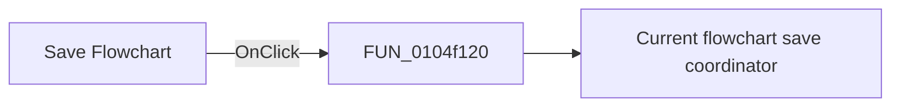

# Save Flowchart

> Analysis status: Pending individual source review.

## Control

| Property | Recovered value |
| --- | --- |
| Form | FlowChartMainForm |
| Component path | FlowChartMainForm.pnToolbar.sbSave |
| Control class | TSpeedButton |
| Caption | Not present in the recovered resource. |
| Hint | Save Flowchart |
| Text | Not present in the recovered resource. |
| Handler name | sbSaveClick |
| Handler address | 0104f120 |
| Graph node | `resource:dfm:FlowChartMainForm/FlowChartMainForm.pnToolbar.sbSave` |
| Handler node | `function:0104f120` |
| Graph layer | UI |

## What happens when clicked

Pending individual analysis. An agent must read the recovered handler source and its relevant callees before it replaces this text.

## Click flow

## Handler evidence

- Source: [DecompiledSources/Tina16/functions/000000000104F120__FUN_0104f120.c](../../../DecompiledSources/Tina16/functions/000000000104F120__FUN_0104f120.c)
- Recovered role: Save Flowchart toolbar forwarding handler
- Current graph summary: Forwards the Save Flowchart toolbar click to the shared save command. Handles 1 Delphi UI event: FlowChartMainForm.pnToolbar.sbSave.OnClick.
- Current graph behavior: Forwards the Save Flowchart toolbar click to the shared save command.
- Current graph evidence: The speed button has the hint Save Flowchart and a two-frame floppy-disk glyph. The function contains only a call to FUN_0104f270.
- Complexity: simple
- Distinct outgoing calls: 1

## Direct calls

- `function:0104f270` — Current flowchart save coordinator

## Resource evidence

- Kind: Not present in the recovered resource.
- Modal result: Not present in the recovered resource.
- Checked state: Not present in the recovered resource.
- List items: Not present in the recovered resource.
- Image reference: Not present in the recovered resource.
- Extracted glyph: [`0164_FlowChartMainForm_FlowChartMainForm_pnToolbar_sbSave_Glyph_Data.png`](../../../glyph/0164_FlowChartMainForm_FlowChartMainForm_pnToolbar_sbSave_Glyph_Data.png)

## Nearby label candidates

Nearby labels are layout candidates only. They are not proof of behavior.

- No same-parent label candidate is available.

## Analysis limits

- Do not infer behavior from the control class, caption, hint, glyph, or nearby label alone.
- Do not replace the pending status until the handler source and relevant call path provide enough evidence.
