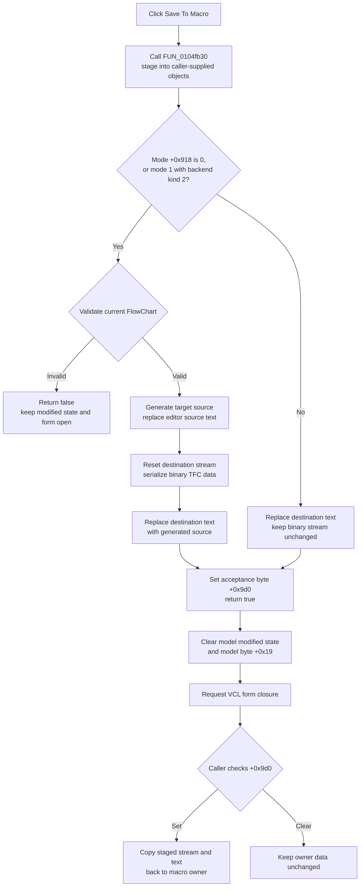

# Commit the FlowChart to its macro owner

## Control

| Property | Recovered value |
| --- | --- |
| Form | FlowChartMainForm |
| Component path | FlowChartMainForm.pnToolbar.sbSaveToMacro |
| Control class | TSpeedButton |
| Caption | Not present in the recovered resource. |
| Hint | Save To Macro |
| Handler name | sbSaveToMacroClick |
| Handler address | 0104fc30 |
| Graph node | `resource:dfm:FlowChartMainForm/FlowChartMainForm.pnToolbar.sbSaveToMacro` |
| Handler node | `function:0104fc30` |
| Graph layer | UI |

## What happens when clicked

The button commits the current FlowChart data to objects that the form's caller supplied. It does not open a file dialog and it does not select, create, or overwrite a file.

`FUN_0104fc30` first calls the shared Save-to-Macro staging helper `FUN_0104fb30`. The helper returns false when full FlowChart validation fails. The click handler then leaves the model state unchanged and does not request form closure. On success, the handler clears the primary model's modified state, clears a separate model byte at `+0x19`, mirrors the clean state to an optional secondary debugger or editor object, and requests form closure through the common VCL close path.

## In-memory targets and acceptance state

The form receives three macro-commit fields from its caller:

- `FlowChartMainForm + 0x9c0` points to the destination binary stream.
- `FlowChartMainForm + 0x9c8` points to the destination source-text collection.
- byte `FlowChartMainForm + 0x9d0` is the success or acceptance marker. Construction clears it; Save-to-Macro sets it only after all selected destination writes complete.

The recovered modal caller creates a temporary stream and text collection, installs them through `FUN_010515b0` and `FUN_010515c0`, loads their existing content into the FlowChart editor, and shows the form. After the form closes, the caller tests byte `+0x9d0`. It copies both staged objects back to the owning macro only when that byte is nonzero. Thus, form closure and macro acceptance are separate decisions.

## Full FlowChart commit

Mode field `+0x918 == 0`, or mode `1` with backend kind `2`, uses the full commit path:

1. `FUN_01050af0(form, 0)` validates the current FlowChart. A false result stops the commit before either supplied destination is reset. The validation path can show its result form.
2. `FUN_01050900` selects a target-specific source generator from field `+0x9a0`, supplies the current model and generator options, and replaces the embedded source editor text with the generated output.
3. The helper resets the supplied stream at `+0x9c0` and calls the shared TFC serializer. The stream receives the binary format marker, model counter, and serialized FlowChart items.
4. The helper clears the supplied text collection at `+0x9c8` and assigns the generated source editor text to it.
5. It sets acceptance byte `+0x9d0` and returns true.

Strings inside the binary TFC representation use length-prefixed UTF-16LE records. The separate source-text object remains an in-memory Delphi text collection in this command, so there is no handler-level file encoding.

## Source-text-only commit

Any other nonzero value of mode field `+0x918` uses a shorter path. Mode `1` reaches this path when the attached backend kind is not `2`.

The helper does not run FlowChart validation, does not regenerate source, and does not touch the supplied binary stream. It clears the supplied text collection, assigns the current editor source text, sets acceptance byte `+0x9d0`, and returns true. The original Delphi name and business meaning of the mode field are not recovered, so this article records the exact branch conditions instead of assigning a speculative mode name.

## Click flow

## Modified state, title, and closure

The click handler clears model state only after the staging helper returns true. `FUN_01053e80(form, 0)` clears the main FlowChart model's modified flag and mirrors the value to an optional secondary backend object. `FUN_00f629b0(model, 0)` clears the separate recovered byte at model offset `+0x19`.

The command does not change the saved-path field at `+0x8d8`, the display-name field at `+0x8d0`, or the window title. It also does not explicitly clear an independent modified flag on the embedded source editor.

For the normal modeless application form, the common close pipeline runs the form's CloseQuery and OnClose handlers and normally hides the persistent form. In the recovered modal macro caller, the VCL close routine sets modal result `mrCancel`. That modal result does not mean that the macro commit failed: the caller uses byte `+0x9d0`, not the modal result, as the acceptance signal.

## Relation to the unsaved-change guard

The modified-document guard `FUN_01053000`, owned by `TIARA-diz.6.7.515`, calls `FUN_0104fb30` directly when the user selects Yes in a macro-backed context. It does not call this toolbar wrapper and it does not inspect the helper's Boolean result.

This difference is significant:

- The toolbar handler clears modified state and closes the form only after successful staging.
- The guard treats Yes as permission to continue even when validation makes Save-to-Macro return false. It also does not perform the wrapper's state-clear or close calls.

Therefore, a New or close operation that uses the guard can continue after a failed Save-to-Macro attempt. The toolbar action itself does not have that ignored-result behavior.

## Cancellation and failure behavior

- This handler has no path chooser, overwrite prompt, or user cancellation after the click. Validation failure is the recovered false-result path.
- A false validation result leaves the supplied stream, supplied text, acceptance byte, modified flags, and form-closure state unchanged by this command.
- The caller must install valid destination objects. The staging helper does not check `+0x9c0` or `+0x9c8` for null before using the selected target.
- The commit is not transactional. In the full path, source generation changes the embedded editor before destination serialization. The stream is reset before serialization, and the text target is cleared before assignment. An exception can therefore leave generated editor text, an empty or partial stream, or an empty or partial text target while `+0x9d0` is still clear.
- In the source-text-only path, an exception after the text collection is cleared can leave that destination empty or partial. The binary stream remains unchanged.
- No local exception handler restores the old editor text or destination content. An exception propagates to outer application handling.
- After `+0x9d0` is set, an exception while clearing state or closing can leave accepted staged data with a form that remains visible or partly cleaned.
- Repeated successful clicks overwrite the supplied text collection and, on the full path, reset and rewrite the same supplied stream. This command alone does not persist the enclosing macro or project to disk.

## Evidence

- [Click handler `FUN_0104fc30`](../../../DecompiledSources/Tina16/functions/000000000104FC30__FUN_0104fc30.c) tests the staging helper result, clears two model states only on success, and then calls the common form-close routine.
- [Save-to-Macro staging helper `FUN_0104fb30`](../../../DecompiledSources/Tina16/functions/000000000104FB30__FUN_0104fb30.c) proves the exact mode branches, validation gate, source-generation call, destination reset and assignment order, acceptance-byte write, and false result.
- [Target source generator coordinator `FUN_01050900`](../../../DecompiledSources/Tina16/functions/0000000001050900__FUN_01050900.c) selects a generator from field `+0x9a0`, supplies the current FlowChart model, and assigns generated source to the editor.
- [Matching load path `FUN_01050730`](../../../DecompiledSources/Tina16/functions/0000000001050730__FUN_01050730.c) deserializes `+0x9c0`, assigns `+0x9c8` to the editor, and rebuilds the FlowChart view. This proves the two destination object roles.
- [Recovered modal macro caller `FUN_01419510`](../../../DecompiledSources/Tina16/functions/0000000001419510__FUN_01419510.c) installs a temporary stream and text collection, loads them into the form, shows the form modally, tests byte `+0x9d0`, and copies the staged objects back only after acceptance.
- [Unsaved-change guard `FUN_01053000`](../../../DecompiledSources/Tina16/functions/0000000001053000__FUN_01053000.c) calls the staging helper for Yes in the macro context and ignores its return value.
- [TFC serializer `FUN_01050620`](../../../DecompiledSources/Tina16/functions/0000000001050620__FUN_01050620.c) writes the binary FlowChart representation. Its canonical annotation belongs to `TIARA-diz.6.7.519`.
- [Modified-state synchronizer `FUN_01053e80`](../../../DecompiledSources/Tina16/functions/0000000001053E80__FUN_01053e80.c) clears the primary model and optional secondary object's modified state.
- [Recovered Delphi resource evidence](../../../DecompiledSources/Tina16/resources/dfm/ui-evidence.json) binds `pnToolbar.sbSaveToMacro.OnClick` to `sbSaveToMacroClick` and supplies the `Save To Macro` hint.
- [Extracted glyph](../../../glyph/0166_FlowChartMainForm_FlowChartMainForm_pnToolbar_sbSaveToMacro_Glyph_Data.png) shows a transfer between two document-like images. It supports a transfer action, but the hint and call path establish the macro target and data semantics.

## Direct calls and annotation ownership

- `FUN_0104fc30` calls `FUN_0104fb30`, `FUN_01053e80`, `FUN_00f629b0`, and the common VCL close routine `FUN_00805200`.
- This control's fragment owns the toolbar handler `FUN_0104fc30` and the shared in-memory staging helper `FUN_0104fb30`.
- The binary serializer belongs to `TIARA-diz.6.7.519`. The modified-document guard belongs to `TIARA-diz.6.7.515`. Common modified-state and VCL close helpers remain canonical elsewhere and are cited without duplicate annotations.

## Analysis limits

- The original Delphi field names for `+0x918`, `+0x9c0`, `+0x9c8`, and `+0x9d0` are not recovered.
- The generated source language and exact generator option meanings depend on fields used by `FUN_01050900`; this handler does not name them.
- The validator and generator can update their own internal or UI state. This article limits its no-change claims to the macro destination objects and wrapper-controlled model state.
- The recovered modal caller proves one macro-owner integration. Other callers can supply compatible stream and text objects and can decide separately when their enclosing data is written to disk.
