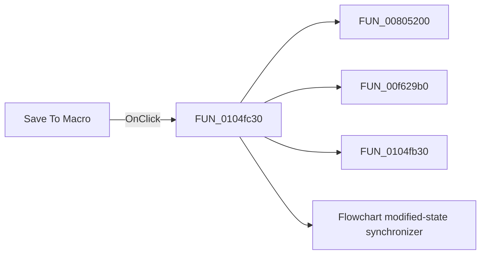

# Save To Macro

> Analysis status: Pending individual source review.

## Control

| Property | Recovered value |
| --- | --- |
| Form | FlowChartMainForm |
| Component path | FlowChartMainForm.pnToolbar.sbSaveToMacro |
| Control class | TSpeedButton |
| Caption | Not present in the recovered resource. |
| Hint | Save To Macro |
| Text | Not present in the recovered resource. |
| Handler name | sbSaveToMacroClick |
| Handler address | 0104fc30 |
| Graph node | `resource:dfm:FlowChartMainForm/FlowChartMainForm.pnToolbar.sbSaveToMacro` |
| Handler node | `function:0104fc30` |
| Graph layer | UI |

## What happens when clicked

Pending individual analysis. An agent must read the recovered handler source and its relevant callees before it replaces this text.

## Click flow

## Handler evidence

- Source: [DecompiledSources/Tina16/functions/000000000104FC30__FUN_0104fc30.c](../../../DecompiledSources/Tina16/functions/000000000104FC30__FUN_0104fc30.c)
- Recovered role: Not present in the recovered resource.
- Current graph summary: Handles 1 Delphi UI event: FlowChartMainForm.pnToolbar.sbSaveToMacro.OnClick.
- Current graph behavior: Not present in the recovered resource.
- Current graph evidence: Not present in the recovered resource.
- Complexity: complex
- Distinct outgoing calls: 4

## Direct calls

- `function:00805200` — FUN_00805200
- `function:00f629b0` — FUN_00f629b0
- `function:0104fb30` — FUN_0104fb30
- `function:01053e80` — Flowchart modified-state synchronizer

## Resource evidence

- Kind: Not present in the recovered resource.
- Modal result: Not present in the recovered resource.
- Checked state: Not present in the recovered resource.
- List items: Not present in the recovered resource.
- Image reference: Not present in the recovered resource.
- Extracted glyph: [`0166_FlowChartMainForm_FlowChartMainForm_pnToolbar_sbSaveToMacro_Glyph_Data.png`](../../../glyph/0166_FlowChartMainForm_FlowChartMainForm_pnToolbar_sbSaveToMacro_Glyph_Data.png)

## Nearby label candidates

Nearby labels are layout candidates only. They are not proof of behavior.

- No same-parent label candidate is available.

## Analysis limits

- Do not infer behavior from the control class, caption, hint, glyph, or nearby label alone.
- Do not replace the pending status until the handler source and relevant call path provide enough evidence.
