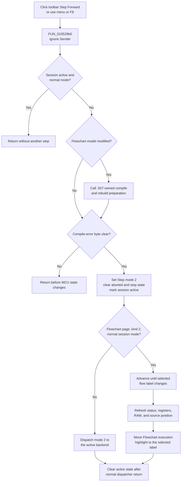

# Step Forward toolbar button

> Analysis status: Complete. The toolbar resource, shared command handler, keyboard route, execution dispatcher, and recovered backend paths support this explanation.

## Control

| Property | Recovered value |
| --- | --- |
| Form | FlowChartMainForm |
| Component path | FlowChartMainForm.pnToolbar.sbStepForward |
| Control class | TSpeedButton |
| Caption | Not present in the recovered resource. |
| Hint | Step Forward (F8) |
| Handler name | sbStepForwardClick |
| Handler address | 010529b0 |
| Graph node | `resource:dfm:FlowChartMainForm/FlowChartMainForm.pnToolbar.sbStepForward` |
| Handler node | `function:010529b0` |
| Graph layer | UI |

The same `FUN_010529b0` handler is bound to `Debug > Step Forward`. The form key handler also calls it for virtual key `0x77`, which is F8. The toolbar, menu, and keyboard routes therefore run the same command.

The button's embedded bitmap is 32 by 16 pixels and `NumGlyphs` is `2`. Its two 16-by-16 cells show the same right-pointing step symbol in normal and alternate colors. The image supports the forward-step intent. It does not establish the size of a step or the selected debugger backend.

## What happens when clicked

The toolbar button requests one debugger step. `FUN_010529b0` does not inspect `Sender`, the button state, or the glyph. The toolbar route and the menu route therefore have identical guards and effects. The button has no recovered checked state, and the handler does not make it stay down.

The handler first tests the debugger-session active byte. If the session is active and its alternate-mode byte is clear, the request returns without another step. This prevents a repeated click from re-entering the normal backend while a step or run is active. If alternate mode is set, this early-return condition does not apply; the later dispatcher controls that route.

The next gate tests the Flowchart model's modified byte. A modified model calls the shared `.507` compile-and-rebuild preparation path. That path clears the modified byte only after a successful rebuild and stores the resulting compile-error state on the form. The Step Forward handler reads this compile-error byte after preparation. A nonzero value stops the command before it changes MCU execution state. A previously stored compile error can also block the step when the model is not currently modified.

When the gates pass, the handler performs these operations in order:

1. Set the external MCU debug mode to value `2`, the recovered Step mode.
2. Clear the external MCU aborted state.
3. Clear the main-form stop-request byte at `+0x6c4`.
4. Clear the debugger-session stop state.
5. Set the debugger-session active state.
6. Call the shared execution dispatcher with mode `2`.
7. Clear the active state after the dispatcher returns normally.

The two external MCU setters return no status to this caller. The command assumes that they succeed.

## Meaning and result of one step

The `.509`-owned dispatcher first tests whether the selected page is one of two recovered Flowchart page identifiers and whether the debugger kind is `2`. If that predicate is true and alternate session mode is clear, it uses the selected-label simulation route.

That route advances the engine until the MCU-selected flow label changes. The engine can perform more than one low-level simulation call before that label transition. In this context, one button click means one visible Flowchart statement or label transition, not necessarily one MCU instruction.

After the transition, execution mode `2` requests the full debugger refresh. The refresh updates MCU status, register and status displays, RAM output, and the current source position. The dispatcher then reads the selected-label text, removes execution-highlight bit `0x20` from the former Flowchart node, sets it on the node with the new label, and rebuilds the editor when updates are not suppressed.

For other supported contexts, the dispatcher forwards mode `2` to the active debugger-session backend. One recovered backend steps until the MCU program counter or simulation time changes, then refreshes the debugger views. The alternate backend is not recovered clearly enough to assign the same PC-or-time rule.

## Click flow

## Stops, errors, and repeated clicks

- The selected-label loop checks the next mapped flow line for an existing breakpoint. A hit sets stop state and clears temporary Run Until state. Step Forward does not create, remove, or toggle the breakpoint.
- The same loop checks a configured Run Until time. Reaching it stops execution and clears that temporary target.
- Common debugger status functions process normal end and error states and update the current position.
- If the selected-label engine call reports its recovered internal failure, the application shows `TINA: Internal error in the HDL engine`. The outer dispatcher still performs its normal post-call refresh after control returns.
- One recovered backend checks PIC supply state. If supply is off, it stops, invalidates current positions, refreshes the debugger views, and shows a localized error.
- A repeated click after a completed step starts from the new position. A repeated click while the normal backend remains active follows the initial no-op guard.
- The handler has no local null guard for its model, external MCU context, or debugger-session fields. It also has no exception handler or rollback. An exception can bypass the final active-state clear.

## State and persistence

The command changes live debugger state: MCU debug and aborted modes, stop and active flags, the execution position, debugger displays, and the Flowchart execution highlight. If compilation is required, the shared preparation path can rebuild generated debugger data and clear the model's modified byte after success.

The click path does not call a breakpoint toggle, undo manager, project serializer, settings writer, or file-save routine. The execution marker and current debugger position are runtime state. The source does not prove which generated files the separate compile preparation can write.

## Source evidence

- [Shared Step Forward handler `FUN_010529b0`](../../../DecompiledSources/Tina16/functions/00000000010529B0__FUN_010529b0.c) implements the active and compile-error gates, selects MCU mode `2`, clears stop state, and brackets dispatcher mode `2` with active-state writes.
- [Keyboard dispatcher `FUN_0104e420`](../../../DecompiledSources/Tina16/functions/000000000104E420__FUN_0104e420.c) calls the same handler for F8 key code `0x77`.
- [Context predicate `FUN_010527b0`](../../../DecompiledSources/Tina16/functions/00000000010527B0__FUN_010527b0.c) restricts the selected-label route to two Flowchart page identifiers and debugger kind `2`.
- [Execution dispatcher `FUN_01052800`](../../../DecompiledSources/Tina16/functions/0000000001052800__FUN_01052800.c) selects the execution route, requests the full Step refresh, and synchronizes the Flowchart label highlight.
- [Compile preparation `FUN_01053ee0`](../../../DecompiledSources/Tina16/functions/0000000001053EE0__FUN_01053ee0.c) uses the `.507`-owned rebuild path and updates modified and compile-error state.
- [Selected-label loop `FUN_00f8daa0`](../../../DecompiledSources/Tina16/functions/0000000000F8DAA0__FUN_00f8daa0.c) advances simulation, checks breakpoints and Run Until, and reports the internal engine error.
- [Full debugger refresh `FUN_00f8d910`](../../../DecompiledSources/Tina16/functions/0000000000F8D910__FUN_00f8d910.c) updates the recovered status and display paths.
- [PC-or-time backend `FUN_00f8cb00`](../../../DecompiledSources/Tina16/functions/0000000000F8CB00__FUN_00f8cb00.c) provides the separately recovered non-label stepping rule and PIC supply error path.
- [Flowchart highlight helper `FUN_00f65450`](../../../DecompiledSources/Tina16/functions/0000000000F65450__FUN_00f65450.c) moves execution bit `0x20` to the node with the selected label.
- [Recovered UI evidence](../../../DecompiledSources/Tina16/resources/dfm/ui-evidence.json) supplies the button hint, two-glyph metadata, event binding, and matching menu binding; the [glyph manifest](../../../glyph/manifest.json) records the extracted BMP-to-PNG resource.

## Analysis limits and ownership

- The flat recovered image does not preserve the Delphi names of the two page identifiers used by the context predicate.
- The external engine is in `VHDL_DLL2.DLL`; its scheduling and exception behavior are outside the recovered application source.
- `.509` owns the canonical annotations for `FUN_010529b0`, `FUN_010527b0`, and `FUN_01052800`. This `.541` fragment duplicates only the handler fields for the toolbar binding. `.507` owns `FUN_01053ee0`. Low-level session accessors, loops, and refresh helpers remain evidence-only.
