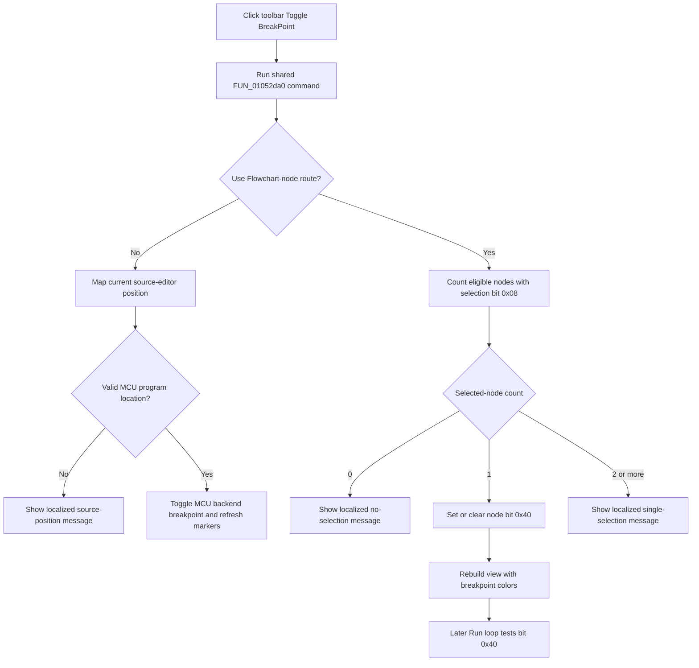

# Toggle a source or Flowchart breakpoint from the toolbar

> Analysis status: Reviewed from the shared handler, toolbar resource and glyph, source-backend route, Flowchart-node route, renderer, run loop, and model serialization path.

## Control

| Property | Recovered value |
| --- | --- |
| Form | FlowChartMainForm |
| Component path | FlowChartMainForm.pnToolbar.sbToggleBreakPoint |
| Control class | TSpeedButton |
| Caption | Not present in the recovered resource. |
| Hint | Toggle BreakPoint |
| NumGlyphs | 2 |
| Handler name | sbToggleBreakPointClick |
| Handler address | 01052da0 |
| Graph node | `resource:dfm:FlowChartMainForm/FlowChartMainForm.pnToolbar.sbToggleBreakPoint` |
| Handler node | `function:01052da0` |
| Graph layer | UI |

## What happens when clicked

The toolbar button and **Debug > Toggle Breakpoint** menu item call the same
handler, `TFlowChartMainForm.sbToggleBreakPointClick`. The command selects one
of two implementations from the current editor and debugger context:

1. **MCU source route:** It maps the current source-editor position to an MCU
   program location, calls `_MCU_ToggleBreakPoint`, and refreshes the source
   breakpoint markers and editor position display.
2. **Flowchart-node route:** It counts eligible Flowchart nodes whose selection
   bit `0x08` is set. Exactly one must be selected. It toggles that node's
   breakpoint bit `0x40` and rebuilds the Flowchart view.

The toolbar supplies no separate breakpoint mode. It uses the same route
selection, messages, model state, backend state, and error behavior as the
menu command documented by Bead `TIARA-diz.6.7.510`.

## Sender independence

The shared handler does not inspect the toolbar control class, hint, glyph,
pressed state, or component identity. The recovered function has an apparent
second event argument, but:

- the Flowchart-node route does not use that argument;
- the source route passes it as an extra decompiler call argument to
  `FUN_00f8e0c0`, whose recovered signature and body consume only the source
  debugger object;
- the form key handler calls `FUN_01052da0` for recovered key code `0x74` while
  supplying a different event source.

Behavior is therefore determined by the form's active editor and debugger
state, not by whether the command came from the toolbar, menu, or key path.

## Flowchart-node route

The selection scanner excludes the recovered node kind whose type byte at
`+0x30` equals `10`, then counts nodes with selection bit `0x08`.

- **No eligible selected node:** The handler resolves localization key
  `HDLStrings.Msg_FC_Breakp_Sel2`, shows the message, and changes no node.
- **Exactly one selected node:** It inverts that node's bit `0x40` and rebuilds
  the view.
- **Two or more eligible selected nodes:** It resolves
  `HDLStrings.Msg_FC_Breakp_Sel`, shows the message, and changes no node.

Breakpoint state is one Boolean flag on the model node, not a separate list
record. Repeating the command on the same single selected node removes the
breakpoint. It does not create a duplicate.

The renderer reads bit `0x40` and uses the recovered breakpoint-specific fill
and border color slots. A successful rebuild updates the visible node marker.

## MCU source route

The source helper first checks for a usable editor position. It maps the
current source coordinates to a program location and calls
`_MCU_ToggleBreakPoint` only when mapping succeeds.

- An unusable editor position loads localized string resource `0x89B` and
  shows it instead of changing the backend.
- A failed program-location mapping loads localized string resource `0x89A`
  and shows it instead of changing the backend.
- After a valid mapping and backend toggle, the helper refreshes source
  breakpoint markers and position state.

This route changes the active MCU breakpoint backend immediately. It does not
change Flowchart node bit `0x40`.

## Toolbar glyph and control state

The button has a 32 by 16 bitmap and `NumGlyphs = 2`. The extracted resource
contains two 16 by 16 breakpoint-dot frames: a red frame and a gray frame. The
same bitmap hash is used by breakpoint buttons in other recovered debugger
forms, which supports the breakpoint meaning.

The handler does not set `Down`, `Checked`, `Enabled`, `Visible`, `GroupIndex`,
or the glyph frame. The button has no recovered checked state. The selected
node's colors or source-editor markers show the breakpoint result; the toolbar
button does not become a persistent pressed-state indicator.

The two glyph frames can support normal and unavailable presentation, but the
bitmap alone does not establish the exact VCL state-to-frame mapping. The
handler itself has no compile-state or run-state rejection branch.

## Compile, run, and persistence

The click does not compile, start, pause, stop, or step execution.

For the Flowchart route, the later Run loop finds the model node for the
current debug-location text and tests bit `0x40`. When set, that bit causes the
loop to stop continuation at the node. The model writer and reader serialize
and restore the byte containing bit `0x40`, so a later Flowchart save can
persist it. This click does not start a save or set a recovered document-dirty
or title flag.

Long-term persistence of the MCU backend breakpoint is not established by this
handler. It updates the current backend and display but calls no project,
settings, registry, INI, or file writer.

## Toggle flow

## No-op, error, and partial-state paths

- Zero or multiple eligible Flowchart selections are handled message paths.
  They leave all node breakpoint flags unchanged.
- An invalid source position or failed source-to-program mapping is also a
  handled message path. It does not call `_MCU_ToggleBreakPoint`.
- The Flowchart route changes bit `0x40` before rebuilding. If the rebuild
  fails, the model can contain the new flag while the visible node keeps stale
  colors.
- The source route changes the backend before its final display refresh. If
  refresh fails, backend state can differ from the visible markers.
- The handler has no local exception handler, transaction, success result,
  rollback, or confirmation. Message, backend, allocation, and redraw
  exceptions propagate through the Delphi runtime.
- Repeated successful commands are not no-ops. Each one inverts the current
  breakpoint state.

## Evidence

- [Shared handler `FUN_01052da0`](../../../DecompiledSources/Tina16/functions/0000000001052DA0__FUN_01052da0.c) selects the source or Flowchart route, enforces the Flowchart selection count, toggles bit `0x40`, and rebuilds after a model change.
- [Context predicate `FUN_010527b0`](../../../DecompiledSources/Tina16/functions/00000000010527B0__FUN_010527b0.c) tests recovered editor classes and state value `2`.
- [MCU source-breakpoint helper `FUN_00f8e0c0`](../../../DecompiledSources/Tina16/functions/0000000000F8E0C0__FUN_00f8e0c0.c) maps the current source position, calls `_MCU_ToggleBreakPoint`, shows invalid-position messages, and refreshes the source editor.
- [Flowchart selection scanner `FUN_00f752b0`](../../../DecompiledSources/Tina16/functions/0000000000F752B0__FUN_00f752b0.c) counts eligible nodes with selection bit `0x08`.
- [Node flag toggle `FUN_00f6f920`](../../../DecompiledSources/Tina16/functions/0000000000F6F920__FUN_00f6f920.c) sets or clears the supplied flag according to its current state.
- [Flowchart rebuild wrapper `FUN_010508e0`](../../../DecompiledSources/Tina16/functions/00000000010508E0__FUN_010508e0.c) rebuilds the graphical editor.
- [Flowchart renderer `FUN_00f63320`](../../../DecompiledSources/Tina16/functions/0000000000F63320__FUN_00f63320.c) selects breakpoint-specific drawing colors for bit `0x40`.
- [Breakpoint lookup `FUN_010521e0`](../../../DecompiledSources/Tina16/functions/00000000010521E0__FUN_010521e0.c) finds the current debug-location node and tests bit `0x40`.
- [Run handler `FUN_01052a70`](../../../DecompiledSources/Tina16/functions/0000000001052A70__FUN_01052a70.c) stops Flowchart continuation at a flagged node. Bead `.507` owns it.
- [Node writer `FUN_00f6e330`](../../../DecompiledSources/Tina16/functions/0000000000F6E330__FUN_00f6e330.c) and [node reader `FUN_00f6e520`](../../../DecompiledSources/Tina16/functions/0000000000F6E520__FUN_00f6e520.c) serialize and restore the state byte that contains bit `0x40`.
- [Form key handler `FUN_0104e420`](../../../DecompiledSources/Tina16/functions/000000000104E420__FUN_0104e420.c) calls the same handler for recovered key code `0x74` on two editor pages.
- [Recovered component tree](../../../DecompiledSources/Tina16/resources/dfm/ui-evidence.json) binds both the menu item and this toolbar button to `sbToggleBreakPointClick`, supplies the toolbar hint, and records `NumGlyphs = 2`.
- [Extracted breakpoint glyph](../../../glyph/0167_FlowChartMainForm_FlowChartMainForm_pnToolbar_sbToggleBreakPoint_Glyph_Data.png) shows the red and gray dot frames in the recovered 32 by 16 bitmap.

## Resource evidence

- The toolbar hint is **Toggle BreakPoint**.
- The corresponding Debug-menu caption is **Toggle Breakpoint**.
- The speed button has a two-frame embedded BMP resource, `ShowHint = true`,
  and `ParentShowHint = false`.
- It has no recovered caption, text, action, image-list reference, checked
  state, modal result, or shortcut.
- The resource evidence establishes command intent. The handler, backend call,
  node flag, renderer, and run-loop consumer establish its behavior.

## Annotation ownership and analysis limits

- This article duplicates `.510`'s complete `FUN_01052da0` annotation exactly
  because both controls bind the same handler.
- Shared context, source-backend, selection, flag, rebuild, renderer, run, and
  serialization helpers remain evidence-only for their canonical owners.
- The original Delphi names of selection bit `0x08`, breakpoint bit `0x40`,
  context state value `2`, and the additional identity guard are not recovered.
- The exact text of resources `0x89A`, `0x89B`,
  `HDLStrings.Msg_FC_Breakp_Sel`, and `HDLStrings.Msg_FC_Breakp_Sel2` is not
  recovered; this article describes their proven branches without inventing
  text.
