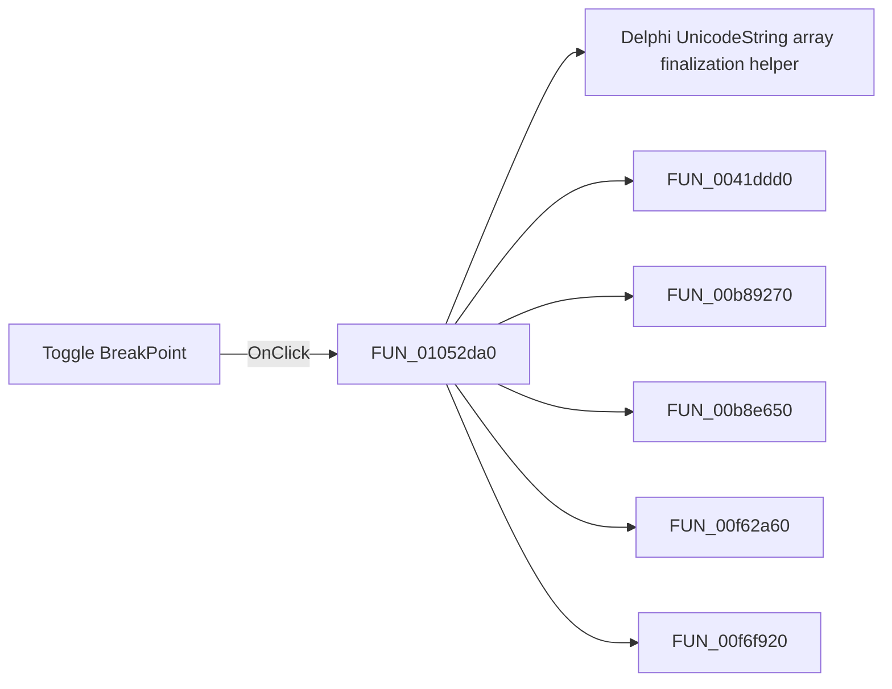

# Toggle BreakPoint

> Analysis status: Pending individual source review.

## Control

| Property | Recovered value |
| --- | --- |
| Form | FlowChartMainForm |
| Component path | FlowChartMainForm.pnToolbar.sbToggleBreakPoint |
| Control class | TSpeedButton |
| Caption | Not present in the recovered resource. |
| Hint | Toggle BreakPoint |
| Text | Not present in the recovered resource. |
| Handler name | sbToggleBreakPointClick |
| Handler address | 01052da0 |
| Graph node | `resource:dfm:FlowChartMainForm/FlowChartMainForm.pnToolbar.sbToggleBreakPoint` |
| Handler node | `function:01052da0` |
| Graph layer | UI |

## What happens when clicked

Pending individual analysis. An agent must read the recovered handler source and its relevant callees before it replaces this text.

## Click flow

## Handler evidence

- Source: [DecompiledSources/Tina16/functions/0000000001052DA0__FUN_01052da0.c](../../../DecompiledSources/Tina16/functions/0000000001052DA0__FUN_01052da0.c)
- Recovered role: Not present in the recovered resource.
- Current graph summary: Handles 2 Delphi UI events: FlowChartMainForm.pnToolbar.sbToggleBreakPoint.OnClick, FlowChartMainForm.MainMenu.mnDebug.mnToggleBreakpoint.OnClick.
- Current graph behavior: Not present in the recovered resource.
- Current graph evidence: Not present in the recovered resource.
- Complexity: complex
- Distinct outgoing calls: 11

## Direct calls

- `function:00414560` — Delphi UnicodeString array finalization helper
- `function:0041ddd0` — FUN_0041ddd0
- `function:00b89270` — FUN_00b89270
- `function:00b8e650` — FUN_00b8e650
- `function:00f62a60` — FUN_00f62a60
- `function:00f6f920` — FUN_00f6f920
- `function:00f752b0` — FUN_00f752b0
- `function:00f8e0c0` — FUN_00f8e0c0
- `function:010508e0` — Flowchart editor rebuild wrapper
- `function:010527b0` — FUN_010527b0
- `function:016fd940` — FUN_016fd940

## Resource evidence

- Kind: Not present in the recovered resource.
- Modal result: Not present in the recovered resource.
- Checked state: Not present in the recovered resource.
- List items: Not present in the recovered resource.
- Image reference: Not present in the recovered resource.
- Extracted glyph: [`0167_FlowChartMainForm_FlowChartMainForm_pnToolbar_sbToggleBreakPoint_Glyph_Data.png`](../../../glyph/0167_FlowChartMainForm_FlowChartMainForm_pnToolbar_sbToggleBreakPoint_Glyph_Data.png)

## Nearby label candidates

Nearby labels are layout candidates only. They are not proof of behavior.

- No same-parent label candidate is available.

## Analysis limits

- Do not infer behavior from the control class, caption, hint, glyph, or nearby label alone.
- Do not replace the pending status until the handler source and relevant call path provide enough evidence.
