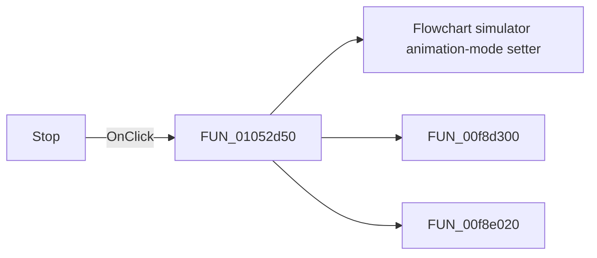

# Stop

> Analysis status: Pending individual source review.

## Control

| Property | Recovered value |
| --- | --- |
| Form | FlowChartMainForm |
| Component path | FlowChartMainForm.pnToolbar.sbTraceStop |
| Control class | TSpeedButton |
| Caption | Not present in the recovered resource. |
| Hint | Stop |
| Text | Not present in the recovered resource. |
| Handler name | sbTraceStopClick |
| Handler address | 01052d50 |
| Graph node | `resource:dfm:FlowChartMainForm/FlowChartMainForm.pnToolbar.sbTraceStop` |
| Handler node | `function:01052d50` |
| Graph layer | UI |

## What happens when clicked

Pending individual analysis. An agent must read the recovered handler source and its relevant callees before it replaces this text.

## Click flow

## Handler evidence

- Source: [DecompiledSources/Tina16/functions/0000000001052D50__FUN_01052d50.c](../../../DecompiledSources/Tina16/functions/0000000001052D50__FUN_01052d50.c)
- Recovered role: Not present in the recovered resource.
- Current graph summary: Handles 2 Delphi UI events: FlowChartMainForm.pnToolbar.sbTraceStop.OnClick, FlowChartMainForm.MainMenu.mnDebug.mnTraceStop.OnClick.
- Current graph behavior: Not present in the recovered resource.
- Current graph evidence: Not present in the recovered resource.
- Complexity: complex
- Distinct outgoing calls: 3

## Direct calls

- `function:00f8d160` — Flowchart simulator animation-mode setter
- `function:00f8d300` — FUN_00f8d300
- `function:00f8e020` — FUN_00f8e020

## Resource evidence

- Kind: Not present in the recovered resource.
- Modal result: Not present in the recovered resource.
- Checked state: Not present in the recovered resource.
- List items: Not present in the recovered resource.
- Image reference: Not present in the recovered resource.
- Extracted glyph: [`0170_FlowChartMainForm_FlowChartMainForm_pnToolbar_sbTraceStop_Glyph_Data.png`](../../../glyph/0170_FlowChartMainForm_FlowChartMainForm_pnToolbar_sbTraceStop_Glyph_Data.png)

## Nearby label candidates

Nearby labels are layout candidates only. They are not proof of behavior.

- No same-parent label candidate is available.

## Analysis limits

- Do not infer behavior from the control class, caption, hint, glyph, or nearby label alone.
- Do not replace the pending status until the handler source and relevant call path provide enough evidence.
