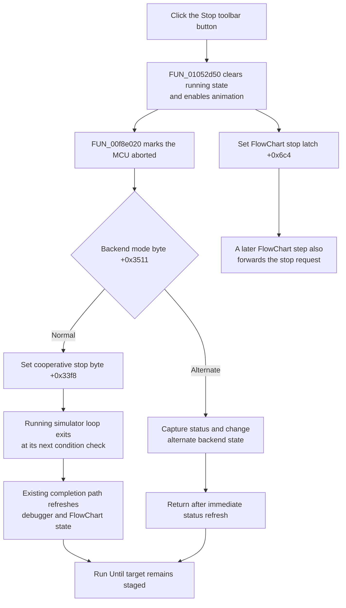

# Stop FlowChart tracing

> Analysis status: Complete. The toolbar resource, shared handler, backend stop dispatcher, simulator loop, and FlowChart refresh path establish the behavior.

## Control

| Property | Recovered value |
| --- | --- |
| Form | FlowChartMainForm |
| Component path | FlowChartMainForm.pnToolbar.sbTraceStop |
| Control class | TSpeedButton |
| Hint | Stop |
| Caption | Not present in the recovered resource. |
| Handler name | sbTraceStopClick |
| Handler address | 01052d50 |
| Graph node | `resource:dfm:FlowChartMainForm/FlowChartMainForm.pnToolbar.sbTraceStop` |
| Handler node | `function:01052d50` |
| Graph layer | UI |

## What happens when clicked

The **Stop** toolbar button requests that the active FlowChart trace stop. `FUN_01052d50` applies these operations in source order:

1. clears the active debugger's running byte at `+0x3454`;
2. enables debugger animation at `+0x3472` and calls the VHDL MCU `SetAnimate` export;
3. calls the backend stop dispatcher, which marks the MCU aborted and selects the backend-specific stop route; and
4. sets the FlowChart form's stop latch at `+0x6c4`.

The click does not ask for confirmation or wait for completion. It changes in-memory request state and returns.

## Shared menu handler and sender independence

The toolbar button and **Debug > Trace Stop** menu item bind to the same `sbTraceStopClick` method. The handler does not inspect or compare `Sender`. It forwards the second event argument through `FUN_00f8e020`, but neither backend branch reads it. Both controls therefore run the same stop path.

The main page-change handler also calls `FUN_01052d50` programmatically when a trace is active. This call has no meaningful control sender and confirms that the stop logic is not toolbar-specific. That caller separately resets the MCU aborted state after the shared handler returns; the toolbar click does not perform that page-change follow-up.

## Normal cooperative stop

For normal backend mode, `FUN_00f8e020` first calls `_MCU_SetAborted(..., 1)`. It then calls `FUN_00f8e060`, which sets debugger stop byte `+0x33f8` to `1`. The simulator loop continues only while this byte is zero. Because that loop pumps application messages, the Stop click can run while the outer Run handler is active. The next loop check ends execution.

The existing completion path then reads MCU status, updates debugger location and state, and refreshes animated debugger views. In the FlowChart step path, the outer Run handler also updates the current flowchart item and rebuilds the view. These are consequences of the loop returning. The Stop handler does not directly redraw the flowchart or update control enablement.

The form latch at `+0x6c4` supplies the same request to `FUN_01052800`. If a FlowChart step path sees the latch, it forwards the request to the backend stop byte before entering the simulator engine. Run and Step Forward clear this latch when they start a new operation.

## Alternate backend stop

Debugger byte `+0x3511` selects an alternate route. The dispatcher still marks the MCU aborted. `FUN_00f8e3c0` then:

- sets debugger byte `+0x3452` to `1` through the status-state setter;
- captures current MCU status and refreshes debugger state; and
- clears debugger byte `+0x3453`.

This route does not set the normal cooperative-loop byte. The original Delphi field names and user-facing backend-mode name are not recovered.

## Toolbar glyph and button state

The speed button has the hint **Stop**, `NumGlyphs = 2`, and an extracted 32 by 16 bitmap. Its two 16 by 16 cells show square stop symbols in different display colors. This supports the stop meaning and supplies two visual states, but the runtime state changes above prove the behavior.

The resource does not define a caption, `Down` state, `GroupIndex`, `AllowAllUp`, action, or checked state. The handler does not write the button's `Enabled`, `Visible`, or pressed state and does not swap its glyph. Any external command-state refresh is outside this click path. The button is a momentary command, not a stored stop-state toggle.

## Run Until, breakpoints, and persistence

Stop does not remove FlowChart breakpoints. It also does not clear the temporary Run Until target. The normal loop clears that target only on its breakpoint or target-hit branch. A manual stop ends the loop through byte `+0x33f8` before that cleanup branch, so the temporary target remains staged.

The running, animation, abort, backend, and stop-latch changes are runtime state only. This path does not call a file writer, project serializer, registry writer, settings writer, or modified-state setter.

## Click flow

## Repeated, inactive, and error behavior

- The handler has no running-state guard. With a valid debugger object, an idle or repeated click performs the same writes and DLL calls again. The Boolean writes are stable, but the abort and animation calls repeat; the alternate route can repeat its status refresh.
- Normal form construction installs the debugger object before the control can be used. If form field `+0x9d8` is unexpectedly null, the handler dereferences it. There is no local no-op fallback.
- The handler has no returned status, local exception handler, rollback, or error message.
- It clears running state and enables animation before it calls the abort dispatcher. A later DLL or refresh failure can leave earlier state changes applied.
- The form latch is written after the dispatcher. If the dispatcher raises an exception, the latch can remain unchanged even though the running and animation fields were already changed.
- The click does not close the form or set a modal result.

## Evidence

- [Shared Stop handler `FUN_01052d50`](../../../DecompiledSources/Tina16/functions/0000000001052D50__FUN_01052d50.c) performs the ordered running, animation, backend-stop, and form-latch updates.
- [Backend stop dispatcher `FUN_00f8e020`](../../../DecompiledSources/Tina16/functions/0000000000F8E020__FUN_00f8e020.c) marks the MCU aborted and chooses the backend route. Its callees prove that the forwarded event argument is unused.
- [Normal stop-byte setter `FUN_00f8e060`](../../../DecompiledSources/Tina16/functions/0000000000F8E060__FUN_00f8e060.c) writes one to debugger byte `+0x33f8`.
- [Alternate stop-state transition `FUN_00f8e3c0`](../../../DecompiledSources/Tina16/functions/0000000000F8E3C0__FUN_00f8e3c0.c) applies the immediate status-state route.
- [Animation setter `FUN_00f8d160`](../../../DecompiledSources/Tina16/functions/0000000000F8D160__FUN_00f8d160.c) stores animation state and calls the MCU animation export; [running-state setter `FUN_00f8d300`](../../../DecompiledSources/Tina16/functions/0000000000F8D300__FUN_00f8d300.c) stores the running byte.
- [Simulator loop `FUN_00f8daa0`](../../../DecompiledSources/Tina16/functions/0000000000F8DAA0__FUN_00f8daa0.c) consumes cooperative stop byte `+0x33f8`.
- [FlowChart step dispatcher `FUN_01052800`](../../../DecompiledSources/Tina16/functions/0000000001052800__FUN_01052800.c) consumes form latch `+0x6c4` and performs the later state refresh.
- [Main page-change handler `FUN_0104eb00`](../../../DecompiledSources/Tina16/functions/000000000104EB00__FUN_0104eb00.c) calls the shared handler during an active trace without a control sender, then performs its own aborted-state reset.
- [Recovered component tree](../../../DecompiledSources/Tina16/resources/dfm/ui-evidence.json) binds both toolbar and menu controls to `sbTraceStopClick` and supplies the toolbar hint, glyph data, and `NumGlyphs` value.
- [Extracted Stop glyph](../../../glyph/0170_FlowChartMainForm_FlowChartMainForm_pnToolbar_sbTraceStop_Glyph_Data.png) contains the two square-symbol cells.
- [Menu command analysis](mntracestop-d011a11855.md) is the canonical `.511` explanation of this shared handler and its stop helpers.

## Annotation ownership and analysis limits

- Bead `TIARA-diz.6.7.511` owns `FUN_01052d50`, `FUN_00f8e020`, `FUN_00f8e060`, and `FUN_00f8e3c0`. This Bead duplicates only the complete canonical handler annotation for `FUN_01052d50`, as required for a shared event handler. It cites and omits the helper annotations.
- Run, Step Forward, Run Until, breakpoint, animation, status-refresh, and view-rebuild helpers remain evidence-only here under their existing owners.
- The two glyph cells are visually distinct square stop symbols. The recovered resources do not name their exact VCL display-state assignment, so this article does not label them as a specific enabled, disabled, pressed, or exclusive state.
- The original Delphi names for debugger and form offsets are not recovered. Their roles follow from their writers and consumers.
