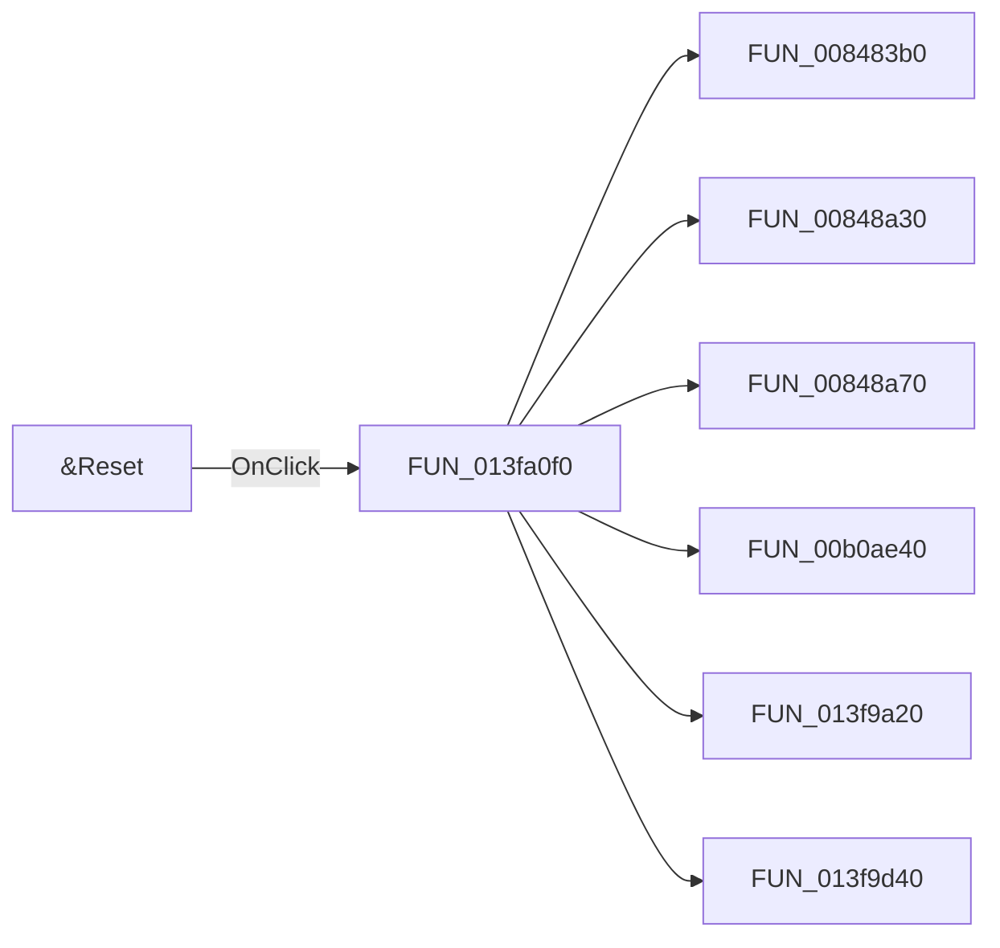

# &Reset

> Analysis status: Pending individual source review.

## Control

| Property | Recovered value |
| --- | --- |
| Form | FltForm |
| Component path | FltForm.bReset |
| Control class | TButton |
| Caption | &Reset |
| Hint | Not present in the recovered resource. |
| Text | Not present in the recovered resource. |
| Handler name | bResetClick |
| Handler address | 013fa0f0 |
| Graph node | `resource:dfm:FltForm/FltForm.bReset` |
| Handler node | `function:013fa0f0` |
| Graph layer | UI |

## What happens when clicked

Pending individual analysis. An agent must read the recovered handler source and its relevant callees before it replaces this text.

## Click flow

## Handler evidence

- Source: [DecompiledSources/Tina16/functions/00000000013FA0F0__FUN_013fa0f0.c](../../../DecompiledSources/Tina16/functions/00000000013FA0F0__FUN_013fa0f0.c)
- Recovered role: Not present in the recovered resource.
- Current graph summary: Handles 1 Delphi UI event: FltForm.bReset.OnClick.
- Current graph behavior: Not present in the recovered resource.
- Current graph evidence: Not present in the recovered resource.
- Complexity: complex
- Distinct outgoing calls: 11

## Direct calls

- `function:008483b0` — FUN_008483b0
- `function:00848a30` — FUN_00848a30
- `function:00848a70` — FUN_00848a70
- `function:00b0ae40` — FUN_00b0ae40
- `function:013f9a20` — FUN_013f9a20
- `function:013f9d40` — FUN_013f9d40
- `function:01d03160` — FUN_01d03160
- `function:01d3bfb0` — FUN_01d3bfb0
- `function:01d3c020` — FUN_01d3c020
- `function:01d3da40` — FUN_01d3da40
- `function:01d3e250` — FUN_01d3e250

## Resource evidence

- Kind: Not present in the recovered resource.
- Modal result: Not present in the recovered resource.
- Checked state: Not present in the recovered resource.
- List items: Not present in the recovered resource.
- Image reference: Not present in the recovered resource.
- Extracted glyph: None.

## Nearby label candidates

Nearby labels are layout candidates only. They are not proof of behavior.

- No same-parent label candidate is available.

## Analysis limits

- Do not infer behavior from the control class, caption, hint, glyph, or nearby label alone.
- Do not replace the pending status until the handler source and relevant call path provide enough evidence.
