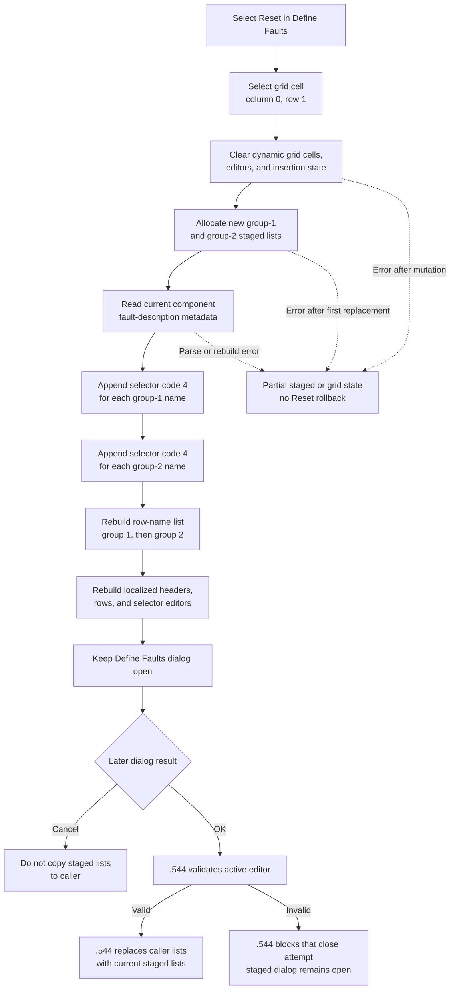

# Reset staged fault choices

> Analysis status: Complete. The recovered form resource, Reset handler, component-metadata parser, staged lists, and grid rebuild helpers support this explanation.

## Control

| Property | Recovered value |
| --- | --- |
| Form | FltForm |
| Form caption | Define Faults |
| Component path | FltForm.bReset |
| Control class | TButton |
| Caption | &Reset |
| Hint | Not present in the recovered resource. |
| Handler name | bResetClick |
| Handler address | 013fa0f0 |
| Graph node | `resource:dfm:FltForm/FltForm.bReset` |
| Handler node | `function:013fa0f0` |
| Graph layer | UI |

The button has no recovered image, glyph, action, or modal result. The handler and data flow, rather than the caption alone, establish what Reset changes.

## What happens when selected

`FUN_013fa0f0` replaces the fault choices staged in the open **Define Faults** dialog. It does not reload the values that the caller supplied when the dialog opened.

The handler first sets the current AttributeGrid cell to column `0`, row `1`. It then clears the grid's dynamic cells and attached editor objects, resets internal row-insertion state, and restores the row count saved at form creation.

Next, it allocates two new dialog-owned integer lists at form offsets `+0x708` and `+0x710`. These replace the staged lists that FormCreate originally copied from the caller. Reset does not write to the caller-owned lists at form field `+0x6F0`.

The handler reads the current component or model object stored at `+0x6E0` and builds its recovered fault-description record. It counts the names in metadata groups `1` and `2`. For each name in either group, it appends integer selector code `4` to the matching new staged list.

The five localized selector labels are loaded when the form is created. The grid editor uses those labels with the staged integer code. The recovered source proves that Reset selects code or index `4`, but it does not expose the displayed localized text for that code. This article therefore does not assign a meaning such as *none*, *default*, or a specific fault type to value `4`.

## Name-list rebuild

`FUN_013f9a20` rebuilds the row-name list at form offset `+0x720` from the same component metadata:

1. It clears the existing name list.
2. It obtains the current fault-description record from the object at `+0x6E0`.
3. It extracts every group-1 name in source order and appends it to the list.
4. It then extracts every group-2 name in source order and appends it.

The helper does not read the staged selector values and does not modify the caller's fault lists. Its output order matches the two staged lists: all group-1 rows first, followed by all group-2 rows.

## AttributeGrid rebuild

`FUN_013f9d40` reconstructs the visible grid from the row-name list and the two staged selector lists.

- It configures one fixed header row.
- It loads localized strings `0x474` and `0x475` for the two column headers.
- For each staged group-1 value, it creates a selector editor, gives it the form's five localized choice labels, reads the matching row name, and attaches both to the next grid row.
- It repeats the same work for group 2, using the name-list index after all group-1 rows.
- It fills the remaining configured grid rows with localized placeholder string `0x476` and the recovered static second-column value.

This is a full rebuild. Repeated Reset selections allocate new staged lists with the same number of group-1 and group-2 entries, fill every entry with code `4`, clear the old visible row editors, and reconstruct the grid. The handler does not append duplicate rows to the existing grid.

## OK and Cancel interaction

Reset does not set `ModalResult`, close the form, or commit the new lists to the caller. The user can inspect and edit the rebuilt grid before choosing OK or Cancel.

The `.544`-owned normal OK path validates the active grid editor. When validation succeeds, it clears the two caller-owned lists and copies the current dialog-staged lists into them. If validation fails, the `.544` CloseQuery flag prevents that close attempt. Reset itself neither invokes that validation function nor changes the CloseQuery flag.

`CancelBtn` is a standard `bkCancel` button with no custom click handler. It does not call the OK copy-back path. Therefore, choosing Cancel after Reset does not copy the code-4 staged lists to the caller.

## Errors and partial state

- Reset has no confirmation prompt, input guard, current-selection guard, return-value check, exception handler, or rollback branch.
- The handler clears the visible grid before it allocates and fills both new staged lists. It also replaces the first staged-list pointer before it allocates the second. An allocation, metadata, localization, editor-construction, or grid error can therefore leave a partly reset dialog.
- The handler assumes that form creation supplied a valid component object, AttributeGrid, localized-choice list, saved row count, and metadata with usable group names. It has no null or range check for those fields.
- Moving the current grid cell and rebuilding the grid can invoke grid-internal editor and redraw behavior. The Reset handler does not inspect a validation status from those operations.
- The metadata parser and list-count functions return values directly. The handler does not show a Reset-specific error when a source record is empty or malformed.

A failure before OK does not run the explicit caller-list copy-back in `FUN_013fa050`. The source does not provide a transaction that restores the earlier staged grid after a partial failure.

## State and persistence

Reset changes dialog-local list pointers, list values, row names, grid cells, editor objects, selection, and drawing state. It reads the caller's current component metadata to determine the row names and counts, but it does not change that metadata.

It does not change the caller-owned fault lists until the later `.544` OK path succeeds. It also does not change project dirty state, undo history, files, registry values, or application settings. No serializer or persistence call occurs in the Reset handler or its two rebuild helpers.

## Click flow

## Source evidence

- Reset handler: [FUN_013fa0f0](../../../DecompiledSources/Tina16/functions/00000000013FA0F0__FUN_013fa0f0.c)
- Fault-name list rebuild: [FUN_013f9a20](../../../DecompiledSources/Tina16/functions/00000000013F9A20__FUN_013f9a20.c)
- AttributeGrid row and editor rebuild: [FUN_013f9d40](../../../DecompiledSources/Tina16/functions/00000000013F9D40__FUN_013f9d40.c)
- Form creation, caller-list staging, five choice labels, and saved row count: [FUN_013f9ba0](../../../DecompiledSources/Tina16/functions/00000000013F9BA0__FUN_013f9ba0.c)
- Fault-description record construction, group counting, and name extraction: [FUN_01d3da40](../../../DecompiledSources/Tina16/functions/0000000001D3DA40__FUN_01d3da40.c), [FUN_01d3e250](../../../DecompiledSources/Tina16/functions/0000000001D3E250__FUN_01d3e250.c), and [FUN_01d3e000](../../../DecompiledSources/Tina16/functions/0000000001D3E000__FUN_01d3e000.c)
- Integer-list creation, append, and copy operations: [FUN_01d3bfb0](../../../DecompiledSources/Tina16/functions/0000000001D3BFB0__FUN_01d3bfb0.c), [FUN_01d3c020](../../../DecompiledSources/Tina16/functions/0000000001D3C020__FUN_01d3c020.c), and [FUN_01d3c090](../../../DecompiledSources/Tina16/functions/0000000001D3C090__FUN_01d3c090.c)
- `.544`-owned OK copy-back and CloseQuery guard: [FUN_013fa050](../../../DecompiledSources/Tina16/functions/00000000013FA050__FUN_013fa050.c) and [FUN_013fa030](../../../DecompiledSources/Tina16/functions/00000000013FA030__FUN_013fa030.c)
- Recovered Define Faults component tree and button kinds: [ui-evidence.json](../../../DecompiledSources/Tina16/resources/dfm/ui-evidence.json)

## Analysis limits and ownership

- Localization IDs `0x46F` through `0x473` supply the five selector labels, but their runtime text is not present in the recovered resource evidence. The semantic name of selector code `4` is unknown.
- The fault-description format contains two comma-delimited name groups. Their original domain names are not recovered, so this article calls them group 1 and group 2.
- The static value written to the second column of unused rows is not identified by recovered text. It is not used to describe active fault rows.
- `.545` owns `FUN_013fa0f0`, `FUN_013f9a20`, and `FUN_013f9d40`. `.544` owns `FUN_013fa050` and `FUN_013fa030`. Metadata parsers, typed-list primitives, grid controls, selector editors, and localization helpers remain evidence-only here.
