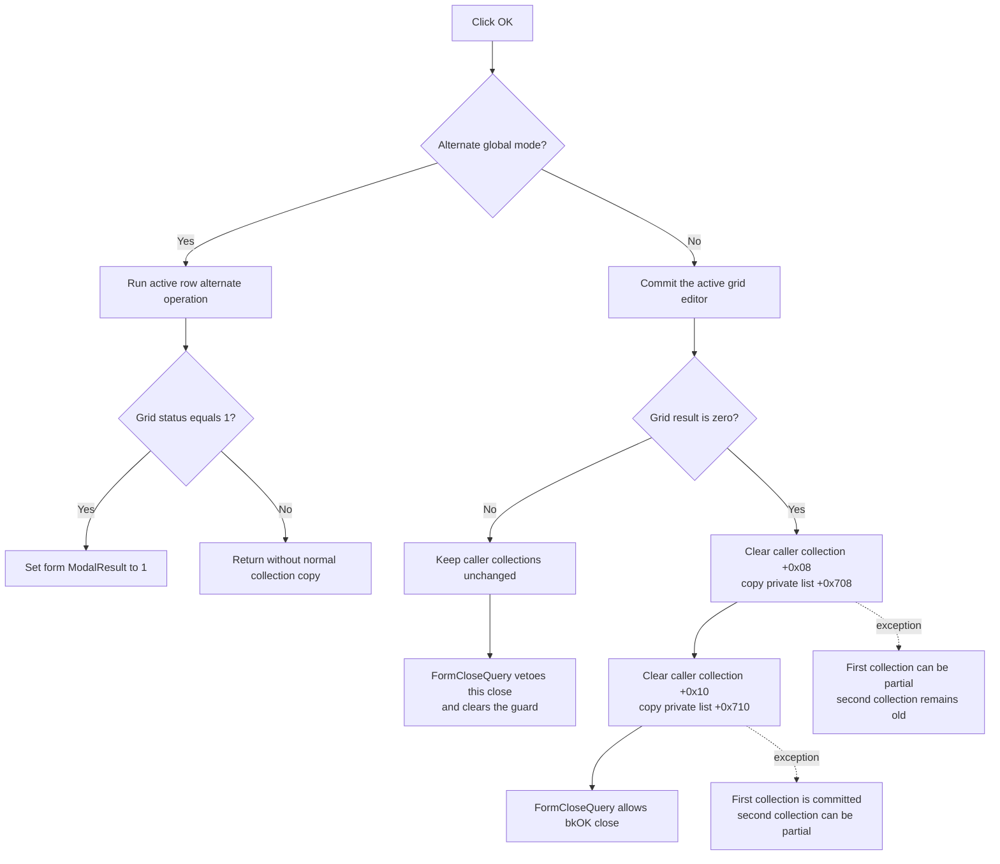

# Apply the fault-definition grid

> Analysis status: Complete. The recovered form setup, grid editors, OK handler, close-query guard, Reset path, and enclosing component-property editor establish the staging and copy-back boundaries.

## Control

| Property | Recovered value |
| --- | --- |
| Form | FltForm (`Define Faults`) |
| Component path | FltForm.OKBtn |
| Control class | TBitBtn |
| Button kind | bkOK |
| Handler name | OKBtnClick |
| Handler address | 013fa050 |
| Graph node | `resource:dfm:FltForm/FltForm.OKBtn` |
| Handler node | `function:013fa050` |
| Graph layer | UI |

The button has no separate caption in the recovered form resource. Its `bkOK` kind supplies the standard OK presentation. The inherited VCL click path writes modal result 1 before it dispatches this custom handler; the later close-query decision can still veto that close request.

## What is staged in the dialog

The caller supplies a component-like source object and a record selector. During form creation, `FUN_013f9ba0` asks that source for the selected fault-configuration record and stores the returned pointer at form `+0x6f0`.

That record owns two value collections at offsets `+0x08` and `+0x10`. The form creates private collections at `+0x708` and `+0x710` and copies every source value into them. The copy helper creates a new value item for each source item, so grid edits do not modify the source collections in place.

The form also derives two groups of row names from the source descriptor. `FUN_013f9d40` joins those names to the two private collections and gives every populated row a five-choice editor. The localized choice text is not present in the extracted DFM evidence, so the five numeric values cannot be named safely. Blank trailing rows are display padding and do not add values to either collection.

## Normal OK path

When global flag `PTR_DAT_020039a8` is clear, `FUN_013fa050` performs these operations in order:

1. Call `FUN_00b0a890` for the current AttributeGrid cell. If a cell exists, the helper transfers the active editor value to its row object and runs the grid change callback.
2. Store the helper result in form byte `+0x6f8`.
3. If the result is zero, clear the first caller-owned collection and append value copies from private collection `+0x708`.
4. Clear the second caller-owned collection and append value copies from private collection `+0x710`.
5. Return from the event while the inherited `bkOK` modal-result request is pending; `FormCloseQuery` then decides whether the form can close.

The active-cell helper does not scan every row. Its recovered failure result is nonzero when the current cell cannot be committed through valid grid coordinates. A row editor can also raise while it applies a value. The OK handler has no separate range check, all-row validation pass, or exception handler.

## Close veto

`TFltForm.FormCloseQuery` at `FUN_013fa030` reads byte `+0x6f8`. It allows the close only when that byte is zero, then always clears the byte.

- A successful active-cell commit leaves the byte clear. The two collection copies run, and the `bkOK` close is allowed.
- A nonzero grid result skips both collection copies. `FormCloseQuery` vetoes that OK attempt and resets the byte so the user can correct the grid or cancel.
- The handler does not close or destroy the form directly.

No dedicated error message is present in this handler or close-query function. Any editor-specific message or raised conversion error belongs to the active row editor or outer application handling.

## Reset and Cancel

The separate Reset handler replaces both private collections with one default value `4` for every derived row, then rebuilds the grid. It does not clear or refill the caller-owned collections. Therefore:

- Reset followed by OK copies the reset values to the selected fault-configuration record.
- Reset followed by Cancel leaves the caller-owned collections unchanged.

The Cancel button is a handler-free `bkCancel`. It does not run `OKBtnClick`, so ordinary grid edits and Reset values remain private and are discarded with the dialog. A Cancel attempt after a vetoed OK is also allowed because `FormCloseQuery` cleared the one-attempt veto byte.

## Caller and persistence boundary

The enclosing component-property editor creates this custom fault editor only when its recovered capability test finds a supported fault definition. It passes the current component and selector into the dialog adapter. Thus, a successful nested OK updates the two collections in the selected in-memory fault record.

The OK path does not open `noname.flt`, write a circuit file, update an INI value, or write the registry. Form creation initializes a `noname.flt` string, but `OKBtnClick` never reads it. Any later document save or outer property-dialog commit remains the caller's responsibility. The enclosing property editor also maintains its own model snapshot, so this nested OK must not be treated as durable file persistence.

## Alternate application mode

When `PTR_DAT_020039a8` is set, the handler skips the normal active-cell gate and both collection copies. It calls `FUN_00b0a960`, which invokes the active row object's alternate operation and stores its status at grid `+0x638`. Status `1` causes the handler to write modal result 1 at form `+0x508`; any other status returns without that write.

The recovered source does not give this global mode a domain name. It is therefore documented only as a distinct internal mode. It does not prove that the two private collections were copied back.

## Click flow

## Failure and partial-state behavior

The two destination collections are replaced sequentially. Each destination is cleared before its private values are appended. There is no temporary destination, transaction, rollback, or local exception catch.

- A nonzero active-grid result occurs before either destination is cleared and causes a clean no-copy veto.
- An exception while clearing or appending the first destination can leave that collection empty or partially rebuilt while the second destination is still unchanged.
- An exception in the second destination occurs after the first destination was replaced and can leave the second destination empty or partial.
- An exception bypasses the normal close-query result path. The recovered code does not prove how outer application handling presents it or whether the dialog stays usable.
- Repeated successful OK execution replaces both destination lists again; it does not append duplicate values to the existing lists.

## Evidence

- [OK handler `FUN_013fa050`](../../../DecompiledSources/Tina16/functions/00000000013FA050__FUN_013fa050.c) contains the normal active-grid gate, ordered clear-and-copy operations, and alternate-mode branch.
- [Close-query handler `FUN_013fa030`](../../../DecompiledSources/Tina16/functions/00000000013FA030__FUN_013fa030.c) derives `CanClose` from byte `+0x6f8` and then clears the byte.
- [Form creation `FUN_013f9ba0`](../../../DecompiledSources/Tina16/functions/00000000013F9BA0__FUN_013f9ba0.c) obtains the selected caller record, clones both collections, initializes five localized choices, and builds the rows.
- [Row-name builder `FUN_013f9a20`](../../../DecompiledSources/Tina16/functions/00000000013F9A20__FUN_013f9a20.c) derives the two groups of row names from the source descriptor. Its annotation is owned by `TIARA-diz.6.7.545`.
- [Grid builder `FUN_013f9d40`](../../../DecompiledSources/Tina16/functions/00000000013F9D40__FUN_013f9d40.c) binds each private value item to its named grid row. Its annotation is owned by `TIARA-diz.6.7.545`.
- [Reset handler `FUN_013fa0f0`](../../../DecompiledSources/Tina16/functions/00000000013FA0F0__FUN_013fa0f0.c) replaces only the private lists with default value `4` items and rebuilds the grid. Its annotation is owned by `TIARA-diz.6.7.545`.
- [Active-cell gate `FUN_00b0a890`](../../../DecompiledSources/Tina16/functions/0000000000B0A890__FUN_00b0a890.c) delegates the current grid cell to `FUN_00b0a150`; its canonical annotation is owned by `TIARA-diz.6.7.63`.
- [Destination clear `FUN_00b95290`](../../../DecompiledSources/Tina16/functions/0000000000B95290__FUN_00b95290.c) removes every current destination item before setting the count to zero.
- [Value-list copy `FUN_01d3c090`](../../../DecompiledSources/Tina16/functions/0000000001D3C090__FUN_01d3c090.c) appends a newly created value item for every source item.
- [Dialog adapter `FUN_01433880`](../../../DecompiledSources/Tina16/functions/0000000001433880__FUN_01433880.c) constructs FltForm with the current source object and record selector.
- [Enclosing component-property editor `FUN_013ae7b0`](../../../DecompiledSources/Tina16/functions/00000000013AE7B0__FUN_013ae7b0.c) conditionally creates the custom fault row, passes the current component into it, and manages a separate outer model snapshot.
- [Recovered Delphi resource evidence](../../../DecompiledSources/Tina16/resources/dfm/ui-evidence.json) binds `OKBtnClick` and `FormCloseQuery`, captions the form `Define Faults`, identifies OK as `bkOK`, Reset as `&Reset`, and Cancel as `bkCancel`.

## Analysis limits

- The localized strings for the five fault choices and the two column headings were not extracted. Numeric value `4` is proven as the Reset default, but its user-facing name is not.
- The original Delphi type names for the selected fault record, its two collections, and form fields `+0x6f0`, `+0x6f8`, `+0x708`, and `+0x710` are not recovered.
- The outer property editor proves a separate staging boundary, but this handler does not expose the eventual circuit-file save path.
