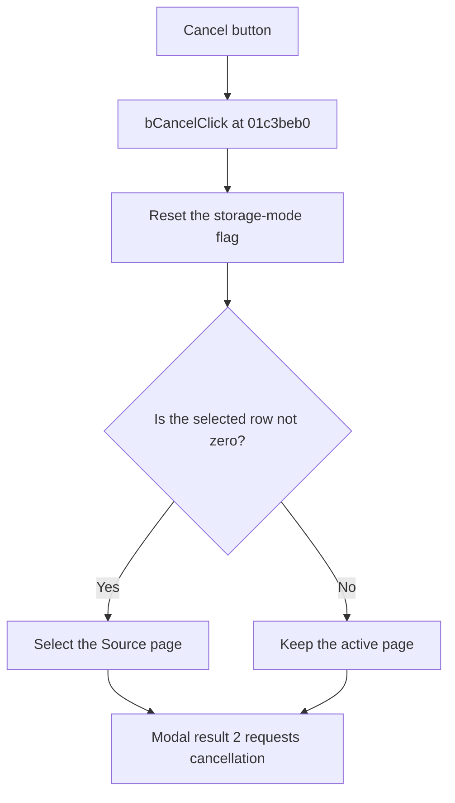

# Cancel

> Analysis status: Reviewed from recovered source and UI evidence.

## Control

| Property | Recovered value |
| --- | --- |
| Component path | `fMacroWiz.pBottom.bCancel` |
| Control class | `TButton` |
| Caption | `Cancel` |
| Modal result | `2` |
| Handler | `bCancelClick` at `01c3beb0` |

## What happens when clicked

The control has modal result 2, which requests cancellation of the wizard. Its handler also resets an internal storage-mode flag and reads the selected storage-mode row. If the row is not zero, the handler selects the Source page before the dialog closes. If the row is zero, it does not change the active page.

## Click flow

## Evidence

- [Recovered bCancelClick source](../../../DecompiledSources/Tina16/functions/0000000001C3BEB0__FUN_01c3beb0.c)
- [Recovered storage-mode reader](../../../DecompiledSources/Tina16/functions/0000000001C3C270__FUN_01c3c270.c)
- The DFM resource records modal result 2.

## Analysis limits

- The recovered field name for the reset flag is not available.
