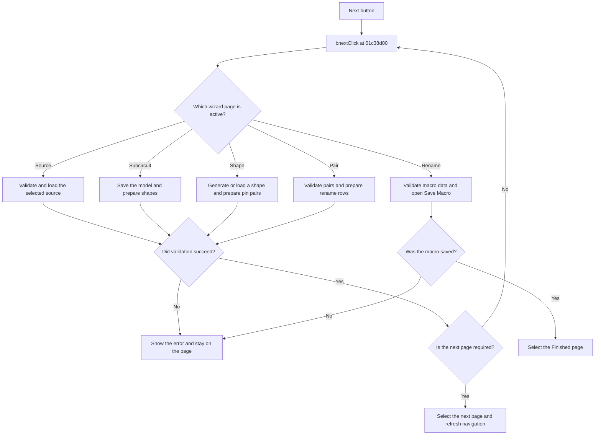

# Next >

> Analysis status: Reviewed from recovered source and UI evidence.

## Control

| Property | Recovered value |
| --- | --- |
| Component path | `fMacroWiz.pBottom.bnext` |
| Control class | `TButton` |
| Caption | `Next >` |
| Handler | `bnextClick` at `01c38d00` |

## What happens when clicked

This handler is the forward state machine for the New Macro Wizard. Its action depends on the active page.

- On Source, it validates the selected source. For a file or Web source, it loads the selected file, rejects a missing or empty file, and fills the model or subcircuit list.
- On Subcircuit, it saves the selected model and prepares the shape filters and shape list.
- On Shape, it generates a shape or loads the selected library shape. It then prepares the pin-pair data.
- On Pair, it validates the pin mapping and fills the rename grid with SPICE pin names, shape pin names, and orientations.
- On Rename, it prepares the macro data and opens the Save Macro dialog. A successful save creates the macro for the detected source type and opens the Finished page.

The handler calls itself to skip pages that do not apply to the selected source or shape. It refreshes the page layout and the Back and Next state after processing. Validation can stop navigation and show messages. Recovered messages include `File not found!`, an empty-file error, and macro or shape validation errors.

## Click flow

## Evidence

- [Recovered bnextClick source](../../../DecompiledSources/Tina16/functions/0000000001C38D00__FUN_01c38d00.c)
- [Recovered page-skip decision](../../../DecompiledSources/Tina16/functions/0000000001C38920__FUN_01c38920.c)
- [Recovered navigation-state refresh](../../../DecompiledSources/Tina16/functions/0000000001C38160__FUN_01c38160.c)
- [Recovered macro creation and save path](../../../DecompiledSources/Tina16/functions/0000000001C41AB0__FUN_01c41ab0.c)
- The DFM component tree supplies the Source, Subcircuit, Shape, Pair, Rename, and Finished page identities.

## Analysis limits

- Several model and shape object types have no recovered Delphi class name. The article describes only the data flow that their callers establish.
