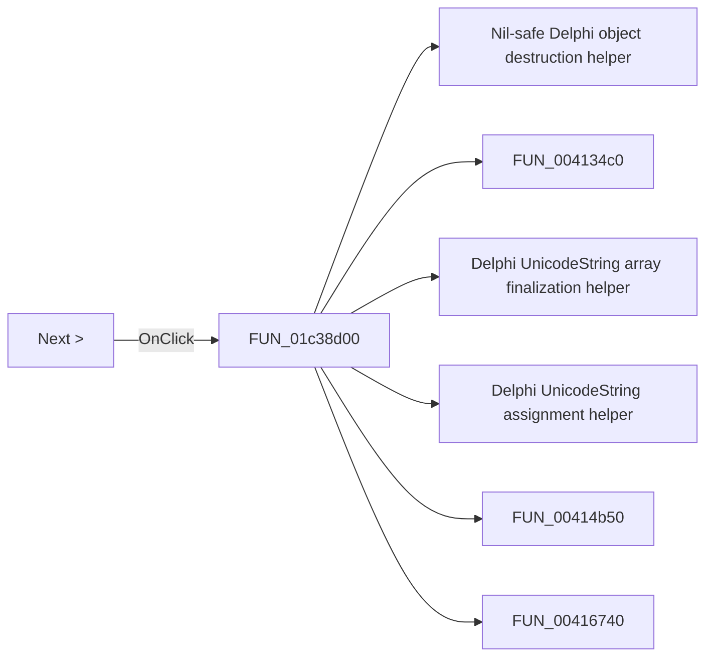

# Next >

> Analysis status: Pending individual source review.

## Control

| Property | Recovered value |
| --- | --- |
| Form | fMacroWiz |
| Component path | fMacroWiz.pBottom.bnext |
| Control class | TButton |
| Caption | Next > |
| Hint | Not present in the recovered resource. |
| Text | Not present in the recovered resource. |
| Handler name | bnextClick |
| Handler address | 01c38d00 |
| Graph node | `resource:dfm:fMacroWiz/fMacroWiz.pBottom.bnext` |
| Handler node | `function:01c38d00` |
| Graph layer | UI |

## What happens when clicked

Pending individual analysis. An agent must read the recovered handler source and its relevant callees before it replaces this text.

## Click flow

## Handler evidence

- Source: [DecompiledSources/Tina16/functions/0000000001C38D00__FUN_01c38d00.c](../../../DecompiledSources/Tina16/functions/0000000001C38D00__FUN_01c38d00.c)
- Recovered role: Not present in the recovered resource.
- Current graph summary: Handles 1 Delphi UI event: fMacroWiz.pBottom.bnext.OnClick.
- Current graph behavior: Not present in the recovered resource.
- Current graph evidence: Not present in the recovered resource.
- Complexity: complex
- Distinct outgoing calls: 92

## Direct calls

- `function:00410f20` — Nil-safe Delphi object destruction helper
- `function:004134c0` — FUN_004134c0
- `function:00414560` — Delphi UnicodeString array finalization helper
- `function:00414ad0` — Delphi UnicodeString assignment helper
- `function:00414b50` — FUN_00414b50
- `function:00416740` — FUN_00416740
- `function:004169a0` — FUN_004169a0
- `function:00416ad0` — FUN_00416ad0
- `function:00416db0` — FUN_00416db0
- `function:00416dc0` — FUN_00416dc0
- `function:00417580` — FUN_00417580
- `function:00417740` — FUN_00417740
- `function:00418590` — FUN_00418590
- `function:00419260` — FUN_00419260
- `function:0043e130` — FUN_0043e130
- `function:0043e420` — FUN_0043e420
- `function:0043f750` — FUN_0043f750
- `function:00440a20` — FUN_00440a20
- `function:00441a10` — FUN_00441a10
- `function:0044d490` — FUN_0044d490
- `function:00498310` — FUN_00498310
- `function:00498350` — FUN_00498350
- `function:004aeac0` — FUN_004aeac0
- `function:004b6930` — FUN_004b6930
- `function:0064c8e0` — FUN_0064c8e0
- `function:0064dbe0` — FUN_0064dbe0
- `function:0064dd90` — VCL control Unicode text reader
- `function:0064de00` — VCL control text setter with change suppression
- `function:0064fca0` — FUN_0064fca0
- `function:006d78a0` — FUN_006d78a0
- `function:006e7090` — FUN_006e7090
- `function:006e7230` — FUN_006e7230
- `function:0074b490` — FUN_0074b490
- `function:007fdf50` — FUN_007fdf50
- `function:008485d0` — FUN_008485d0
- `function:00848a70` — FUN_00848a70
- `function:0084e320` — FUN_0084e320
- `function:0084e3e0` — FUN_0084e3e0
- `function:00c3d330` — FUN_00c3d330
- `function:00c3f420` — FUN_00c3f420
- `function:014af1b0` — FUN_014af1b0
- `function:015ee870` — FUN_015ee870
- `function:015eedf0` — FUN_015eedf0
- `function:019a45d0` — FUN_019a45d0
- `function:019af120` — FUN_019af120
- `function:01c22b80` — FUN_01c22b80
- `function:01c230d0` — FUN_01c230d0
- `function:01c230e0` — FUN_01c230e0
- `function:01c23250` — FUN_01c23250
- `function:01c232b0` — FUN_01c232b0
- `function:01c232c0` — FUN_01c232c0
- `function:01c23370` — FUN_01c23370
- `function:01c233d0` — FUN_01c233d0
- `function:01c23570` — FUN_01c23570
- `function:01c26980` — FUN_01c26980
- `function:01c271f0` — FUN_01c271f0
- `function:01c273c0` — FUN_01c273c0
- `function:01c273d0` — FUN_01c273d0
- `function:01c27400` — FUN_01c27400
- `function:01c27630` — FUN_01c27630
- `function:01c276f0` — FUN_01c276f0
- `function:01c27840` — FUN_01c27840
- `function:01c284f0` — FUN_01c284f0
- `function:01c28500` — FUN_01c28500
- `function:01c28520` — FUN_01c28520
- `function:01c28540` — FUN_01c28540
- `function:01c28560` — FUN_01c28560
- `function:01c28600` — FUN_01c28600
- `function:01c370d0` — FUN_01c370d0
- `function:01c38160` — FUN_01c38160
- `function:01c38530` — FUN_01c38530
- `function:01c386b0` — FUN_01c386b0
- `function:01c38920` — FUN_01c38920
- `function:01c38bf0` — FUN_01c38bf0
- `function:01c38d00` — Handles 1 Delphi UI event: fMacroWiz.pBottom.bnext.OnClick.
- `function:01c3b7c0` — Handles 1 Delphi UI event: fMacroWiz.pBottom.bprev.OnClick.
- `function:01c3bc80` — FUN_01c3bc80
- `function:01c3bee0` — Handles 1 Delphi UI event: fMacroWiz.pcMWiz.OnChange.
- `function:01c3c010` — FUN_01c3c010
- `function:01c3c270` — FUN_01c3c270
- `function:01c3c530` — FUN_01c3c530
- `function:01c3cb30` — FUN_01c3cb30
- `function:01c3cbb0` — Handles 1 Delphi UI event: fMacroWiz.pcMWiz.tsSubCkt.cbSubCkt.OnChange.
- `function:01c3cd90` — FUN_01c3cd90
- `function:01c3d280` — FUN_01c3d280
- `function:01c3d390` — FUN_01c3d390
- `function:01c3d610` — Handles 2 Delphi UI events: fMacroWiz.pcMWiz.tsShape.rbAutoGen.OnClick, fMacroWiz.pcMWiz.tsShape.rbLoadFromLib.OnClick.
- `function:01c3d9c0` — FUN_01c3d9c0
- `function:01c3f800` — FUN_01c3f800
- `function:01c3fe00` — FUN_01c3fe00
- `function:01c41ab0` — FUN_01c41ab0
- `function:01c43750` — Handles 1 Delphi UI event: fMacroWiz.pcMWiz.tsShape.gbFilter.cbShapeSS.OnClick.
- `function:01d44920` — FUN_01d44920

## Resource evidence

- Kind: Not present in the recovered resource.
- Modal result: Not present in the recovered resource.
- Checked state: Not present in the recovered resource.
- List items: Not present in the recovered resource.
- Image reference: Not present in the recovered resource.
- Extracted glyph: None.

## Nearby label candidates

Nearby labels are layout candidates only. They are not proof of behavior.

- No same-parent label candidate is available.

## Analysis limits

- Do not infer behavior from the control class, caption, hint, glyph, or nearby label alone.
- Do not replace the pending status until the handler source and relevant call path provide enough evidence.
