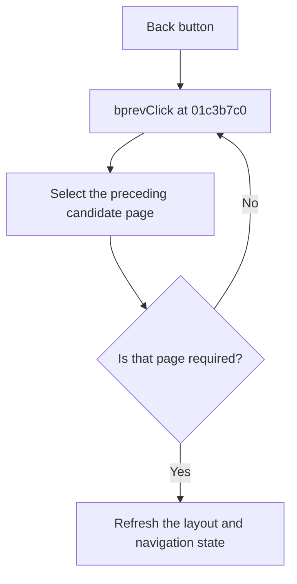

# < Back

> Analysis status: Reviewed from recovered source and UI evidence.

## Control

| Property | Recovered value |
| --- | --- |
| Component path | `fMacroWiz.pBottom.bprev` |
| Control class | `TButton` |
| Caption | `< Back` |
| Handler | `bprevClick` at `01c3b7c0` |

## What happens when clicked

The handler selects the preceding wizard page: Source from Subcircuit, Subcircuit from Shape, Shape from Pair, or Pair from Rename. It calls itself when a candidate page does not apply to the current source or shape, so the wizard can skip that page in reverse. It then refreshes the form layout and navigation buttons and clears one internal transition flag. It has no local error path.

## Click flow

## Evidence

- [Recovered bprevClick source](../../../DecompiledSources/Tina16/functions/0000000001C3B7C0__FUN_01c3b7c0.c)
- [Recovered page-skip decision](../../../DecompiledSources/Tina16/functions/0000000001C38920__FUN_01c38920.c)
- [Recovered navigation-state refresh](../../../DecompiledSources/Tina16/functions/0000000001C38160__FUN_01c38160.c)

## Analysis limits

- The recovered name of the cleared transition flag is not available.
