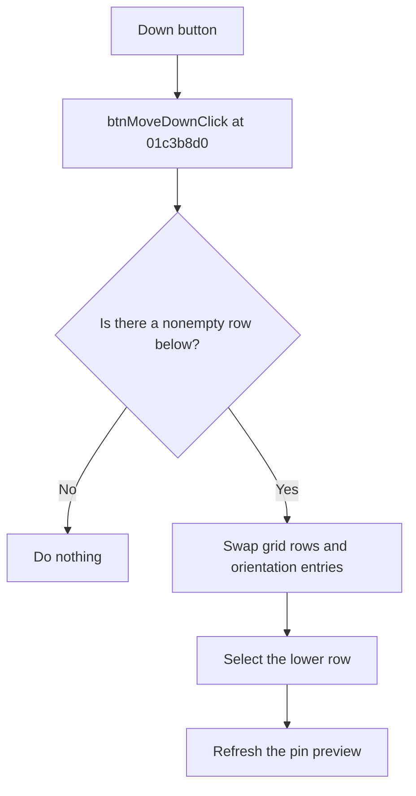

# Down

> Analysis status: Reviewed from recovered source and UI evidence.

## Control

| Property | Recovered value |
| --- | --- |
| Component path | `fMacroWiz.pcMWiz.tsRename.Panel2.btnMoveDown` |
| Control class | `TButton` |
| Caption | `Down` |
| Handler | `btnMoveDownClick` at `01c3b8d0` |

## What happens when clicked

The handler reads the selected rename-grid row. If the following row exists and has a nonempty pin name, it swaps all grid columns between the two rows. It also swaps the matching orientation entries, selects the moved row, and refreshes the pin preview. If there is no movable following row, the click has no effect.

## Click flow

## Evidence

- [Recovered btnMoveDownClick source](../../../DecompiledSources/Tina16/functions/0000000001C3B8D0__FUN_01c3b8d0.c)
- [Recovered rename-preview refresh](../../../DecompiledSources/Tina16/functions/0000000001C3BC80__FUN_01c3bc80.c)
- The Rename page resource supplies the grid and the `Down` control.

## Analysis limits

- The recovered source identifies orientation values by numeric codes, not by Delphi enum names.
