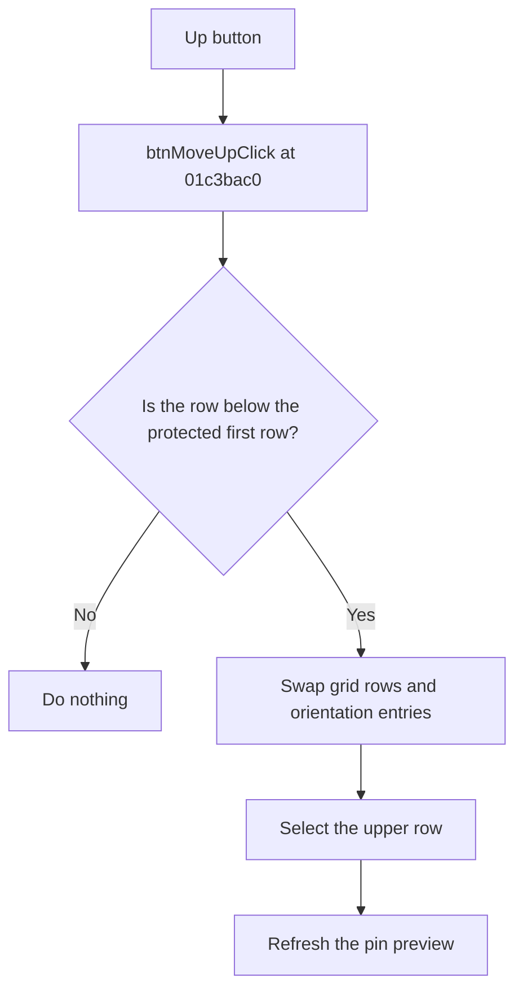

# Up

> Analysis status: Reviewed from recovered source and UI evidence.

## Control

| Property | Recovered value |
| --- | --- |
| Component path | `fMacroWiz.pcMWiz.tsRename.Panel2.btnMoveUp` |
| Control class | `TButton` |
| Caption | `Up` |
| Handler | `btnMoveUpClick` at `01c3bac0` |

## What happens when clicked

The handler reads the selected rename-grid row. If the selection is below the first data row, it swaps all grid columns with the preceding row. It also swaps the matching orientation entries, selects the moved row, and refreshes the pin preview. The header and first data row cannot move up, so those selections cause no change.

## Click flow

## Evidence

- [Recovered btnMoveUpClick source](../../../DecompiledSources/Tina16/functions/0000000001C3BAC0__FUN_01c3bac0.c)
- [Recovered rename-preview refresh](../../../DecompiledSources/Tina16/functions/0000000001C3BC80__FUN_01c3bc80.c)
- The Rename page resource supplies the grid and the `Up` control.

## Analysis limits

- The recovered source identifies orientation values by numeric codes, not by Delphi enum names.
