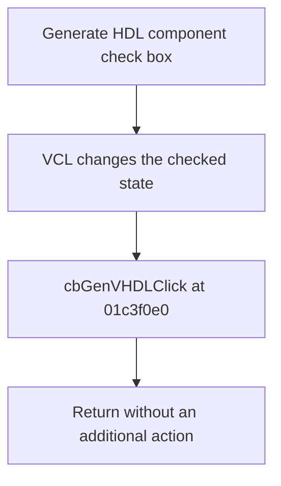

# Generate HDL component

> Analysis status: Reviewed from recovered source and UI evidence.

## Control

| Property | Recovered value |
| --- | --- |
| Component path | `fMacroWiz.pcMWiz.tsSource.pMacroName.gbSourceVHDL.cbGenVHDL` |
| Control class | `TCheckBox` |
| Caption | `Generate HDL component` |
| Handler | `cbGenVHDLClick` at `01c3f0e0` |

## What happens when clicked

The VCL check box changes its checked state. The recovered `OnClick` handler is one `RET` instruction and makes no calls. Therefore, the event adds no validation, message, or other immediate action. The recovered click path does not prove where the checked value is consumed later.

## Click flow

## Evidence

- [Recovered cbGenVHDLClick source](../../../DecompiledSources/Tina16/functions/0000000001C3F0E0__FUN_01c3f0e0.c)
- The source contains only a return instruction, and the graph has no outgoing call from this handler.

## Analysis limits

- This analysis proves only the immediate click behavior. It does not identify a later reader of the checked state.
