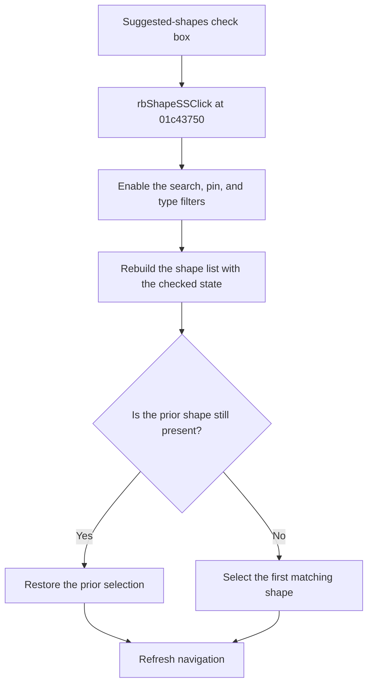

# Show suggested shapes only.

> Analysis status: Reviewed from recovered source and UI evidence.

## Control

| Property | Recovered value |
| --- | --- |
| Component path | `fMacroWiz.pcMWiz.tsShape.gbFilter.cbShapeSS` |
| Control class | `TCheckBox` |
| Caption | `Show suggested shapes only.` |
| Initial checked state | `true` |
| Handler | `rbShapeSSClick` at `01c43750` |

## What happens when clicked

The check box first changes its normal VCL checked state. The handler enables the shape-search editor, pin filter, and shape-type filter. It then rebuilds the available shape list. The rebuild reads this check box through the suggested-shape helper and applies its value with the other search and filter inputs. It tries to keep the prior shape selection; otherwise, it selects the first matching shape. The handler then refreshes the wizard navigation state.

## Click flow

## Evidence

- [Recovered click handler](../../../DecompiledSources/Tina16/functions/0000000001C43750__FUN_01c43750.c)
- [Recovered shape-list rebuild](../../../DecompiledSources/Tina16/functions/0000000001C3DC60__FUN_01c3dc60.c)
- [Recovered suggested-shape state reader](../../../DecompiledSources/Tina16/functions/0000000001C3D590__FUN_01c3d590.c)
- The nearby notice tells the user to clear this check box when a shape is not in the suggested results. The handler and filter code, not the notice alone, prove the behavior.

## Analysis limits

- The recovered predicate that marks an individual shape as suggested has no Delphi name.
