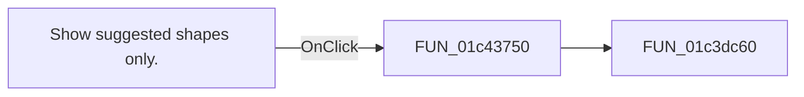

# Show suggested shapes only.

> Analysis status: Pending individual source review.

## Control

| Property | Recovered value |
| --- | --- |
| Form | fMacroWiz |
| Component path | fMacroWiz.pcMWiz.tsShape.gbFilter.cbShapeSS |
| Control class | TCheckBox |
| Caption | Show suggested shapes only. |
| Hint | Not present in the recovered resource. |
| Text | Not present in the recovered resource. |
| Handler name | rbShapeSSClick |
| Handler address | 01c43750 |
| Graph node | `resource:dfm:fMacroWiz/fMacroWiz.pcMWiz.tsShape.gbFilter.cbShapeSS` |
| Handler node | `function:01c43750` |
| Graph layer | UI |

## What happens when clicked

Pending individual analysis. An agent must read the recovered handler source and its relevant callees before it replaces this text.

## Click flow

## Handler evidence

- Source: [DecompiledSources/Tina16/functions/0000000001C43750__FUN_01c43750.c](../../../DecompiledSources/Tina16/functions/0000000001C43750__FUN_01c43750.c)
- Recovered role: Not present in the recovered resource.
- Current graph summary: Handles 1 Delphi UI event: fMacroWiz.pcMWiz.tsShape.gbFilter.cbShapeSS.OnClick.
- Current graph behavior: Not present in the recovered resource.
- Current graph evidence: Not present in the recovered resource.
- Complexity: simple
- Distinct outgoing calls: 1

## Direct calls

- `function:01c3dc60` — FUN_01c3dc60

## Resource evidence

- Kind: Not present in the recovered resource.
- Modal result: Not present in the recovered resource.
- Checked state: true
- List items: Not present in the recovered resource.
- Image reference: Not present in the recovered resource.
- Extracted glyph: None.

## Nearby label candidates

Nearby labels are layout candidates only. They are not proof of behavior.

- Rank 1: ( Notice: If you can't find the shape you are looking for, uncheck this checkbox. ) at distance 34.
- Rank 2: Search: at distance 64.
- Rank 3: Number of pins at distance 106.

## Analysis limits

- Do not infer behavior from the control class, caption, hint, glyph, or nearby label alone.
- Do not replace the pending status until the handler source and relevant call path provide enough evidence.
