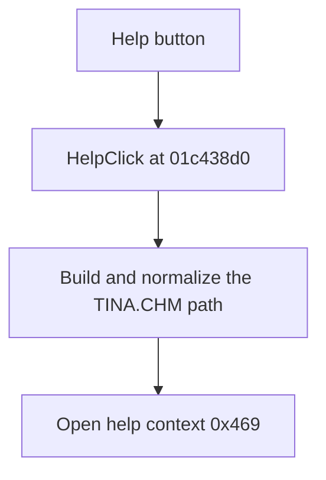

# Help

> Analysis status: Reviewed from recovered source and UI evidence.

## Control

| Property | Recovered value |
| --- | --- |
| Component path | `fMacroWiz.pBottom.Help` |
| Control class | `TButton` |
| Caption | `Help` |
| Handler | `HelpClick` at `01c438d0` |

## What happens when clicked

The handler builds the path to `TINA.CHM` from the application help directory. It normalizes that path and sends help context `0x469` to the application help service. The recovered path has no local success or error branch.

## Click flow

## Evidence

- [Recovered HelpClick source](../../../DecompiledSources/Tina16/functions/0000000001C438D0__FUN_01c438d0.c)
- The DFM resource supplies the caption and the `OnClick` binding.
- The handler supplies the `TINA.CHM` file name and help context `0x469`.

## Analysis limits

- The recovered handler does not show how the help service reports a missing help file.
