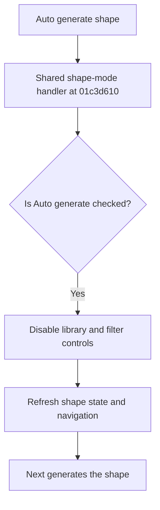

# Auto generate shape

> Analysis status: Reviewed from recovered source and UI evidence.

## Control

| Property | Recovered value |
| --- | --- |
| Component path | `fMacroWiz.pcMWiz.tsShape.rbAutoGen` |
| Control class | `TRadioButton` |
| Caption | `Auto generate shape` |
| Handler | `rbAutoGenClick` at `01c3d610` |

## What happens when clicked

Selecting this radio button makes `rbAutoGen` checked. The shared handler detects that state and disables the library selector, shape list, suggested-shape check box, search editor, pin filter, and shape-type filter. It then refreshes dependent shape state and wizard navigation. A later Next action generates the shape instead of loading one from the library.

## Click flow

## Evidence

- [Recovered shared shape-mode handler](../../../DecompiledSources/Tina16/functions/0000000001C3D610__FUN_01c3d610.c)
- [Recovered Next handler](../../../DecompiledSources/Tina16/functions/0000000001C38D00__FUN_01c38d00.c)
- The handler reads the `rbAutoGen` checked state. This separates this control from the library radio button that uses the same handler.

## Analysis limits

- The recovered generated-shape object has no Delphi class name.
