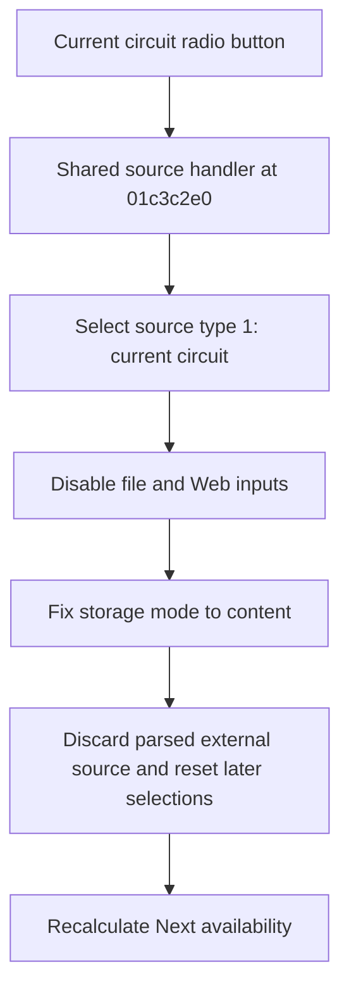

# Current circuit

> Analysis status: Reviewed from recovered source and UI evidence.

## Control

| Property | Recovered value |
| --- | --- |
| Component path | `fMacroWiz.pcMWiz.tsSource.pSourceEmpty.rbCurrentCircuit` |
| Control class | `TRadioButton` |
| Caption | `Current circuit` |
| Initial checked state | `true` |
| Handler | `rbSourceClick` at `01c3c2e0` |

## What happens when clicked

Selecting this radio button sets source type 1, the current circuit. The shared handler disables the local-file and Web inputs. It fixes `Store macro by` to the `content` row, discards any parsed external source, and resets downstream model and shape selections. It then recalculates whether Next is available. On the Source page, Next accepts this mode when the macro name is not empty.

## Click flow

## Evidence

- [Recovered shared source handler](../../../DecompiledSources/Tina16/functions/0000000001C3C2E0__FUN_01c3c2e0.c)
- [Recovered source-type reader](../../../DecompiledSources/Tina16/functions/0000000001C3C010__FUN_01c3c010.c)
- [Recovered storage-mode setter](../../../DecompiledSources/Tina16/functions/0000000001C3C2A0__FUN_01c3c2a0.c)
- [Recovered navigation-state refresh](../../../DecompiledSources/Tina16/functions/0000000001C38160__FUN_01c38160.c)

## Analysis limits

- The handler resets several downstream controls by field offset. Their purpose is confirmed by the shape-filter call path, but not all private field names are recovered.
