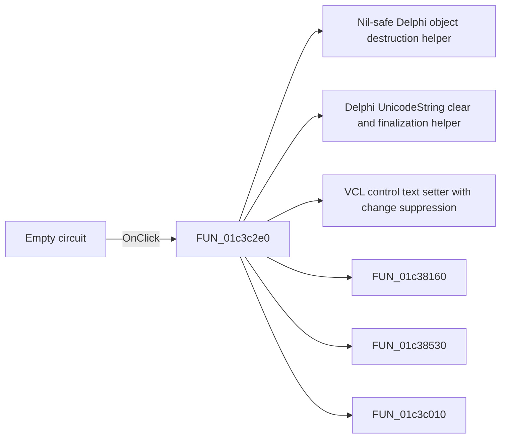

# Empty circuit

> Analysis status: Pending individual source review.

## Control

| Property | Recovered value |
| --- | --- |
| Form | fMacroWiz |
| Component path | fMacroWiz.pcMWiz.tsSource.pSourceEmpty.rbEmptyCircuit |
| Control class | TRadioButton |
| Caption | Empty circuit |
| Hint | Not present in the recovered resource. |
| Text | Not present in the recovered resource. |
| Handler name | rbSourceClick |
| Handler address | 01c3c2e0 |
| Graph node | `resource:dfm:fMacroWiz/fMacroWiz.pcMWiz.tsSource.pSourceEmpty.rbEmptyCircuit` |
| Handler node | `function:01c3c2e0` |
| Graph layer | UI |

## What happens when clicked

Pending individual analysis. An agent must read the recovered handler source and its relevant callees before it replaces this text.

## Click flow

## Handler evidence

- Source: [DecompiledSources/Tina16/functions/0000000001C3C2E0__FUN_01c3c2e0.c](../../../DecompiledSources/Tina16/functions/0000000001C3C2E0__FUN_01c3c2e0.c)
- Recovered role: Not present in the recovered resource.
- Current graph summary: Handles 4 Delphi UI events: fMacroWiz.pcMWiz.tsSource.pSourceEmpty.rbEmptyCircuit.OnClick, fMacroWiz.pcMWiz.tsSource.pSourceEmpty.rbCurrentCircuit.OnClick, fMacroWiz.pcMWiz.tsSource.pSourceEmpty.rbFromFile.OnClick.
- Current graph behavior: Not present in the recovered resource.
- Current graph evidence: Not present in the recovered resource.
- Complexity: complex
- Distinct outgoing calls: 9

## Direct calls

- `function:00410f20` — Nil-safe Delphi object destruction helper
- `function:00414480` — Delphi UnicodeString clear and finalization helper
- `function:0064de00` — VCL control text setter with change suppression
- `function:01c38160` — FUN_01c38160
- `function:01c38530` — FUN_01c38530
- `function:01c3c010` — FUN_01c3c010
- `function:01c3c2a0` — FUN_01c3c2a0
- `function:01c3c530` — FUN_01c3c530
- `function:01c3ff70` — FUN_01c3ff70

## Resource evidence

- Kind: Not present in the recovered resource.
- Modal result: Not present in the recovered resource.
- Checked state: Not present in the recovered resource.
- List items: Not present in the recovered resource.
- Image reference: Not present in the recovered resource.
- Extracted glyph: None.

## Nearby label candidates

Nearby labels are layout candidates only. They are not proof of behavior.

- Rank 1: File downloaded press Next at distance 229.

## Analysis limits

- Do not infer behavior from the control class, caption, hint, glyph, or nearby label alone.
- Do not replace the pending status until the handler source and relevant call path provide enough evidence.
