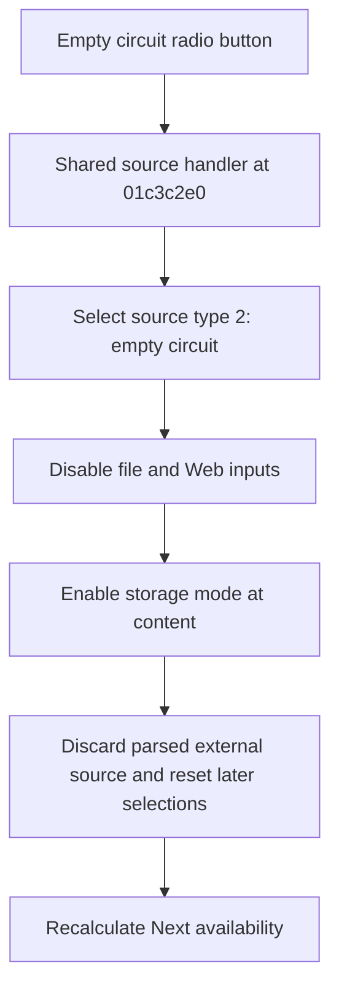

# Empty circuit

> Analysis status: Reviewed from recovered source and UI evidence.

## Control

| Property | Recovered value |
| --- | --- |
| Component path | `fMacroWiz.pcMWiz.tsSource.pSourceEmpty.rbEmptyCircuit` |
| Control class | `TRadioButton` |
| Caption | `Empty circuit` |
| Handler | `rbSourceClick` at `01c3c2e0` |

## What happens when clicked

Selecting this radio button sets source type 2, an empty circuit. The shared handler disables the local-file and Web inputs and enables the `Store macro by` radio group at the `content` row. It discards any parsed external source and resets downstream model and shape selections. It then recalculates whether Next is available. On the Source page, Next accepts this mode when the macro name is not empty.

## Click flow

## Evidence

- [Recovered shared source handler](../../../DecompiledSources/Tina16/functions/0000000001C3C2E0__FUN_01c3c2e0.c)
- [Recovered source-type reader](../../../DecompiledSources/Tina16/functions/0000000001C3C010__FUN_01c3c010.c)
- [Recovered storage-mode setter](../../../DecompiledSources/Tina16/functions/0000000001C3C2A0__FUN_01c3c2a0.c)
- The DFM resource lists the `content` and `reference` storage rows.

## Analysis limits

- The recovered code does not name the internal parsed-source class.
