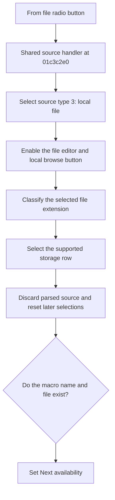

# From file

> Analysis status: Reviewed from recovered source and UI evidence.

## Control

| Property | Recovered value |
| --- | --- |
| Component path | `fMacroWiz.pcMWiz.tsSource.pSourceEmpty.rbFromFile` |
| Control class | `TRadioButton` |
| Caption | `From file` |
| Handler | `rbSourceClick` at `01c3c2e0` |

## What happens when clicked

Selecting this radio button sets source type 3. The shared handler enables the file-name editor and its local browse button and disables the Web browse button. It checks the current file extension and selects the supported storage row for that source format. It also discards any previously parsed source and resets later model and shape selections. Next is available only when the macro name is not empty and the selected file exists.

## Click flow

## Evidence

- [Recovered shared source handler](../../../DecompiledSources/Tina16/functions/0000000001C3C2E0__FUN_01c3c2e0.c)
- [Recovered source-type reader](../../../DecompiledSources/Tina16/functions/0000000001C3C010__FUN_01c3c010.c)
- [Recovered extension classifier](../../../DecompiledSources/Tina16/functions/0000000001C3FF70__FUN_01c3ff70.c)
- [Recovered navigation-state refresh](../../../DecompiledSources/Tina16/functions/0000000001C38160__FUN_01c38160.c)

## Analysis limits

- Some supported extensions use recovered numeric source-type values whose Delphi enum names are not available.
